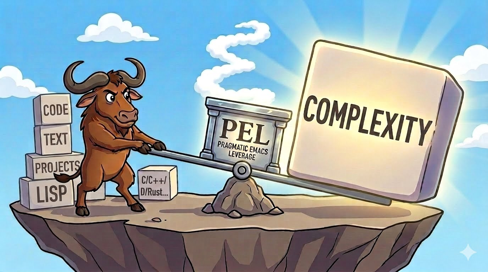

===============================
PEL -- Pragmatic Emacs Leverage
===============================

.. image:: https://img.shields.io/:License-gpl3-blue.svg
   :alt: License
   :target: https://www.gnu.org/licenses/gpl-3.0.html

.. image:: https://img.shields.io/badge/Version-V0_4_2-teal
   :alt: Version
   :target: https://github.com/pierre-rouleau/pel/blob/master/NEWS

.. image:: https://img.shields.io/badge/Fast-startup-green
   :alt: Fast Startup
   :target: https://github.com/pierre-rouleau/pel?tab=readme-ov-file#-emacs-fast-startup

.. image:: https://img.shields.io/badge/package_quickstart-Compatible-green
   :alt: Package Quickstart
   :target: https://github.com/pierre-rouleau/pel#quickst

.. image:: https://img.shields.io/badge/PEL_Managed_Packages-377-teal
   :alt: Managed Packages
   :target: `➣ Automatic Download, Installation and Setup of External Packages`_

.. image:: https://img.shields.io/badge/PEL_User_Options-422-teal
   :alt: User Options
   :target: `➣ Customization Driven Package Management & Configuration`_

.. image:: https://img.shields.io/badge/PEL_Commands-729-teal
   :alt: PEL Commands
   :target: https://github.com/pierre-rouleau/pel#pel-convenience-commands

.. image:: https://img.shields.io/badge/PEL_Key_Hydras-12-teal
   :alt: PEL Hydras
   :target: https://github.com/pierre-rouleau/pel#pel-convenience-commands

.. image:: https://img.shields.io/badge/PDF_Files-221-blue
   :alt: PDF Files
   :target: https://pierre-rouleau.github.io/pel/pel-table-based-documentation1/-index.pdf

.. image:: https://img.shields.io/badge/PEL_Manual-Αlpha_state-blue
   :alt: Manual Status
   :target: https://github.com/pierre-rouleau/pel/blob/master/doc/pel-manual.rst

.. image:: https://github.com/pierre-rouleau/pel/workflows/Build/badge.svg
   :alt: Build State
   :target: https://github.com/pierre-rouleau/pel/actions

- Tired of writing Emacs configuration code? `🤯`_
- Afraid of or ever declared `.emacs bankruptcy`_? 😰
- Don't want to spend your time writing Emacs Lisp code? 😳 [#elispfun]_
- Need to quickly access help now and later on specific topic? `🤔`_
- Want to learn Emacs and try several built-in and external packages? `😇`_
- Want to run independent Emacs sessions with **fast** startup even with a large number of external packages installed?
  `😃`_
- And *also* want to `run Emacs daemon(s) with text and graphics clients`_ on
  Linux and macOS like a pro? `🥳`_

PEL might be for you!  Then go ahead, `install it`_ [#install]_
or `update it`_ [#update]_ ! Leave `feedback in the discussion`_ if you wish.

Essentially PEL extends plain vanilla Emacs and provides:

- **Unified, Cohesive Command Interface**: with 729 additional key bound
  commands, several of which provide glue logic between features to increase
  cohesion and simplify usage.
- **Extended Vanilla Emacs Key Bindings** keeps the vanilla Emacs key bindings
  with a large set of extra key bindings using function key prefixes and
  instructions on how to activate them on macOS and several Linux distros.

  - Supports Emacs in terminal mode, providing terminal key bindings for
    commands that normally do not have them.
  - Supports Emacs in graphical mode with some extensions specific to macOS and
    Linux.
  - Attempts to provide a globally unified keyboard experience for a large set of
    commands across multiple major modes.

- **Useful Hydras** enhance keyboard navigation and editing efficiency
  further.

  - See `➣ PEL Convenience Commands`_ below.

- **Zero-Code Configuration** via customization that identifies used packages and
  their settings.

  - No Emacs Lisp coding required — all PEL and Emacs features, package
    activation, and configuration are driven entirely by Emacs' built-in
    customization UI.
  - Allow independent configuration of terminal-based and GUI-based Emacs
    customization to prevent slowing down terminal mode with logic that is only
    available in graphical mode.
  - This makes it trivial to maintain various specialized workspace setups.
  - The customization files can be stored in directories under **VCS** control
    to easily keep track of changes and share them across machines.
  - No ``.emacs`` bankruptcy risk: your init.el file won't grow over time as
    information is stored in PEL's logic and inside your customization files.

- **Feature Integration/Gradual Use** PEL controls installation and
  configuration of external packages through the various ``pel-use-...``
  customizable user-options.

  - PEL provides coordination logic that no individual package provides on its own.
  - You can start small by activating only what you need and add more later,
    or remove something you no longer need, all done
    through customization; you do not need to write code for that.

- **Broad language / major-mode coverage** as PEL explicitly supports over 80
  programming, markup, hardware description and data description languages as
  well as build control languages and various other major modes.

  - PEL provides specialized programming language templates to ease file
    creation like C, C++ and Erlang for example.
  - PEL provides copyright notice and time stamp management.
  - To help you edit files with narrow indentation schemes such as Dart and Gleam
    files that must use a 2-space indent; PEL integrates my stand-alone
    `tbindent`_ package that provides a minor mode that automatically converts
    the indentation to tabs-based indentation in the buffer so you can see the
    code better the way *you* want 😎.

- **Cross-platform Portability** supports Linux, macOS and Windows, Emacs 26.3
  and later, running under a terminal or GUI as an independent Emacs process
  or under the Emacs daemon.

  - PEL provides `POSIX-compliant shell scripts to launch Emacs`_ within a shell
    context (with all its environment variables) in the following modes:

    - single process terminal mode: the `e command`_,
    - single process GUI mode: the `ge command`_,
    - daemon Emacs server and clients: the `ec command`_.

- **Non-invasive/Safe Design** PEL does not monkey patch Emacs.

  - All PEL Emacs Lisp code (including the early-init.el and init.el) is byte and
    native compiled on all supported Emacs versions on macOS and Linux, and
    no compilation error or warning is allowed.

- **Integrates external packages, control their installation** by
  customization. Supports 377 external packages from multiple sources:

  - `GNU Elpa`_ and `MELPA`_ elpa-compliant sites, `quelpa`_ installs from
    source,
  - GitHub, Gitlab or web-site hosted files not setup as Emacs packages,
  - and you can still install packages with Emacs package management commands,
    and manually configure them by adding extra logic in the PEL init.el file.

- **Emacs Startup Optimization** with carefully crafted, byte/native compiled
  `early-init.el`_, `init.el`_ and `control logic`_ with aggressive lazy-loading,
  macro-based deferred execution to maximize speed of independent Emacs processes.

  - See the `PEL installation`_ for details.

- **Fast Startup Mode**: Beyond general startup optimization, PEL provides
  ahead-of-time pre-compilation and physical directory restructuring system
  that squashes Emacs ``load-path``. This speeds up Emacs boot time even more,
  allowing:

  - sub 0.1 second startups on Linux, and
  - under 0.2 seconds on macOS, even with over 300 packages.

  PEL provides commands to toggle from normal mode to fast startup and back.

- **Extensive Code Validation** of all Emacs Lisp code through byte and native
  compilation controlled by GNU Make script which also performs **specialized
  linting**, ERT-based **unit testing**.

  - All executed on GitHub CI on several supported Emacs versions on Linux
    and macOS environments (see `PEL's GitHub workflow build YAML file`_).
  - Builds and test pass only when no error and no warning is detected.
  - PEL has an increasing amount of Ert based test code.
  - PEL has several specialized linting programs that parse elisp code and
    detect errors that would only be detected at run time under specific
    conditions.
  - All PEL code is built by a GNU Make script that I use in my systems and on
    GitHub CI systems under all platforms and supported Emacs versions.

- **Dynamic Feature Selection** allows selection of minor modes or command
  behaviour like selecting whether search command uses the standard iSearch,
  or features from `Anzu`_ or `Swiper`_.  Same for input and auto completion,
  cross reference, etc...
- **Extensive Introspection** with contextual help commands that describe
  major mode and minor modes, indentation and hard-tab control,
  cross-reference control, etc...  These contextual commands open specialized
  help buffers that assemble everything relevant in one place with buttons to
  quickly access the relevant customizable user-options.
- **Flexible Tree-sitter Support**

  - Customization-specified selection of  whether the Tree-sitter or classic
    major mode is used for each major mode that supports both.
  - Dynamically switch from classic to Tree-sitter based major mode and back
    at any time and without any impact on your original selection.
  - See the `🚦 Tree-sitter PDF`_; it provides information on the tree-sitter
    language grammars and major modes supporting it.
  - Also see the document titled `Using tree-sitter with Emacs and PEL`_ which
    describes how to setup your environment to use the tree-sitter based modes,

- **221 Extensive Topic-organized Reference PDFs** The heavily hyperlinked
  tables serve as visual, topic-organized key-binding and feature reference
  sheets, an unusual approach in the Emacs ecosystem which complements Emacs
  excellent documentation system.

  - Use the `PEL Index PDF`_ to quickly locate a topic.
  - See the `Tramp PDF`_ to learn how to use and troubleshoot it.
  - See the `Mode Line PDF`_ to see the command that describes Emacs cryptic
    mode line process and buffer type.
  - See the `➣ Extends Emacs Documentation`_ section for more information.

- **Many Command Line Tools** comes with PEL: the `shell scripts`_ to start
  Emacs in various ways, build CTags tables, the `awk scripts`_ for text
  filtering and transformation.

  - You may also be interested by my separate `USRHOME project`_ to setup
    your POSIX compliant shells; it is not part nor required to use PEL but
    provides several useful commands and setup shells for system that you can
    access with Emacs Tramp.

PEL keeps evolving.  I use it to  maintain my Emacs configuration on
several macOS and Linux systems and also under Windows (whenever I have to use
it).

And, using PEL, I can still use other Emacs packages installed under Emacs
package management and if I need to use them often in multiple systems I
integrate their management under PEL.

If you find PEL useful please drop me a comment, and if you'd like some new
features don't hesitate to ask.  And if you like what you see why not give
this project a star to encourage me further?

Again any feedback is welcome. Thanks!

➣ Supports Launching Emacs from GUI and Shell
---------------------------------------------

- PEL supports terminal Emacs launched from a shell and graphics Emacs
  launched from a shell or a GUI program like Windows Explorer, macOS Finder,
  Linux file managers, etc...

➣ Short Emacs and Emacs Client Launcher Scripts
------------------------------------------------

- Want to start Emacs as an independent process or a text or GUI client to the
  Emacs daemon?  PEL provides simple shell scripts for all of that (for macOS
  and Linux).
  See `Using the Emacs daemon and clients`_ for more info and the related
  `quick shortcut installation script`_.

.. _Using the Emacs daemon and clients: doc/emacs-daemon.rst.txt
.. _quick shortcut installation script: doc/install_e_ge_ec.rst.txt

➣ Emacs Fast Startup
--------------------

..
  On a 2023 Apple Silicon Mac Studio computer, PEL starts Emacs with **303 elpa packages and 108 other
  single file packages in 0.16 seconds** and **sub 0.1 seconds** on Linux!

- With PEL, Emacs will start faster than with several other systems; PEL
  Emacs initialization is heavily optimized to auto-load and defer execution
  as much as possible.  Emacs startup time under a second for a large number
  of activated package is easily achieved, even on old computers.

  - PEL provides examples of `early-init.el`_ and `init.el`_ files that must be used
    to achieve these performances (and faster when fast startup is used).
  - Take a look at some numbers and screen shots in the startup directory:

    - A 0.65 second startup with 433 loaded files on terminal based Emacs 30.2
      running on a 2023 macStudio computer and 0.81 seconds for 422 loaded files
      in graphical Emacs on the same computer.  In normal mode that has 333
      directories in the load path with 267 elpa packages and 77 Emacs Lisp
      files stored in the PEL utils directory.  The fast startup squashes the
      load path to 77 directories.
    - A 0.5 seconds startup with 223 packages by PEL
      `on a 2014 imac running Emacs 26.3 terminal`_ (in normal mode),
    - And a 0.1 seconds startup with the same settings
      `on a 2014 imac running Emacs 26.3 terminal in fast-startup mode`_,
    - `On Emacs 30.1 in terminal mode under Rocky Linux 8.10 VM running in a 2014 iMac`_,
      accessed via ssh with a GNU screen session.
      Note this one: it has 412 loaded features, yet the Emacs startup time is 0.5 seconds
      even if PEL fast startup mode is not used!  Emacs is using native compilation mode here,
      and Emacs also runs faster on Linux than under macOS.
    - `On a 2023 macStudio running Emacs 30.1 in terminal`_ (in normal mode,
      without native compilation), starts in 0.58 seconds while providing 612
      features (with 634 loaded files).
    - `On a 2023 macStudio running Emacs 30.1 in Graphics mode`_ (in normal-mode,
      without native compilation).

- You can **speed Emacs startup much more** with PEL `fast startup mode`_ command
  (see also `⅀ Fast Startup PDF`_ .
  PEL supports 2 different Emacs startup operation modes:

  - The **normal startup** mode, using Emacs' standard package.el
    package manager with PEL's extensions that provide **customization-driven
    package management** built on `Emacs easy customization`_ to pick and
    chose packages and behaviours, all without having to write Emacs Lisp
    code.  PEL enhances Emacs customization system: PEL provides keys to
    quickly access customization groups of Emacs built-in and external Emacs
    Lisp libraries even if they are not even loaded.

  - The **fast startup** mode. It can achieve

    - sub 0.1 second startups on Linux, and
    - under 0.2 seconds on macOS, even with over 300 packages, see [#quick]_.

    In fast startup you can use all external packages you have already
    installed in normal startup mode but now Emacs starts much faster.  In
    fast startup PEL does not support download and installation of new
    external packages but just return to normal mode to do so.  PEL provides 2
    commands to switch modes:

    - The **pel-setup-fast** (``<f11> M-S f``) activates the fast startup
      mode. It bundles all external packages that use a single directory
      inside a single directory to reduce Emacs ``load-path`` and sets up your
      Elpa directory for a fast startup.
    - The **pel-setup-normal** (``<f11> M-S n``) restores the normal Emacs
      setup with package management capabilities and PEL's automatic package
      installation via customization.

  - With PEL you can see a quick report with relevant information by executing
    the `pel-emacs-load-stats` command.

    - On a 2023 macStudio with Geekbench 6.7.1 rate of 2490 single-code/13076
      multicore, with **303 elpa packages and 108 other non-elpa single file
      packages** installed from their repos, Emacs 30.2 takes about 0.67 seconds to
      start in normal mode but takes just about **0.17 seconds** in terminal mode
      and **0.23 seconds** in graphics mode.

      More details:

      - 303 Elpa packages stored in: ~/.emacs.d/elpa-complete/
      - 108 Utils files   stored in: ~/.emacs.d/utils/
      - size of load-path          : 333 directories
      - # pel-use-... user-options : 422 (343 are active)

      In normal mode::

         GNU Emacs 30.2.50 (build 2, aarch64-apple-darwin23.6.0, NS appkit-2487.70 Version 14.8.2 (Build 23J126)) of 2025-11-26
         Emacs 30.2.50 startup time: 0.677794 seconds   (in normal mode, with package quickstart, with native compilation, in terminal mode.)
         # loaded files         : 433
         # load-path length     : 332
         # features             : 720
         # package-alist        : 303
         # packages activated   : 303
         # packages selected    : 190

      With PEL fast startup mode activated::

         GNU Emacs 30.2.50 (build 2, aarch64-apple-darwin23.6.0, NS appkit-2487.70 Version 14.8.2 (Build 23J126)) of 2025-11-26
         Emacs 30.2.50 startup time: 0.164187 seconds   (in fast mode, with package quickstart, with native compilation, in terminal mode.)
         # loaded files         : 421
         # load-path length     : 71
         # features             : 445
         # package-alist        : 41
         # packages activated   : 41
         # packages selected    : 190

  - Here's what I get on other systems with other versions of Emacs using the
    PEL fast startup mode:

    - On a Ubuntu 16 running inside a VM hosted by a **2014** iMac computer::

        GNU Emacs 28.2 (build 1, x86_64-pc-Linux-gnu, GTK+ Version 3.18.9, cairo version 1.14.6) of 2023-01-06
        Emacs 28.2 startup time: 0.067179 seconds   (in fast mode, without package quickstart, without native compilation, in terminal mode.)
        # loaded files         : 316
        # load-path length     : 37
        # features             : 296
        # package-alist        : 9
        # packages activated   : 9
        # packages selected    : 152

    - On a Rocky Linux 8 VM hosted on a **2014** iMac computer, PEL achieves this
      in normal mode::

          GNU Emacs 30.1.90 (build 2, x86_64-pc-Linux-gnu) of 2025-06-03
          Emacs 30.1.90 startup time: 0.313209 seconds   (in normal mode, without package quickstart, with native compilation, in terminal mode.)
          # loaded files         : 452
          # load-path length     : 131
          # features             : 432
          # package-alist        : 102
          # packages activated   : 102
          # packages selected    : 66

    - And this is fast startup mode::

          GNU Emacs 30.1.90 (build 2, x86_64-pc-Linux-gnu) of 2025-06-03
          Emacs 30.1.90 startup time: 0.075374 seconds   (in fast mode, without package quickstart, with native compilation, in terminal mode.)
          # loaded files         : 361
          # load-path length     : 38
          # features             : 340
          # package-alist        : 9
          # packages activated   : 9
          # packages selected    : 66

    - And with package quickstart and fast startup mode::

          GNU Emacs 30.1.90 (build 2, x86_64-pc-Linux-gnu) of 2025-06-03
          Emacs 30.1.90 startup time: 0.068962 seconds   (in fast mode, with package quickstart, with native compilation, in terminal mode.)
          # loaded files         : 352
          # load-path length     : 39
          # features             : 339
          # package-alist        : 9
          # packages activated   : 9
          # packages selected    : 66

- PEL supports Emacs 26.3 and later.

  - For Emacs 27 and later the ``pel-early-init-template`` user-option (which
    defaults to `example/init/early-init.el`_) allows you to identify a
    PEL-compatible early-init.el file that PEL edits to control whether fast
    startup and `package-quickstart feature`_ are used.

    - PEL provides the **pel-setup-with-quickstart** command (``<f11> M-S q``)
      to create and refresh all the package-quickstart files [#quickst]_ and
      **pel-setup-no-quickstart** (``<f11> M-S M-q``) to disable it.

➣ Customization Driven Package Management & Configuration
---------------------------------------------------------

- PEL uses Emacs customization facility to control everything:

  - the selection,
  - installation and
  - configuration of packages,
  - the activation of various major and minor modes,
  - the improvement of behaviour of several major and minor modes,
  - the use of the features provided by PEL.

- PEL provides a large number (422) of customizable user options to control all
  this and provides several commands to access the customization buffers and
  help commands that generate reports in ``*Help*`` like buffers listing
  relevant user-options and providing quick access to their customization.

- PEL saves your customization data inside a file separate from your
  ``init.el`` file, providing an extra degree of freedom and control. This
  also gives you the ability to easily revision and clone your Emacs
  environment to other computers.

- PEL provides enhanced and easy access to relevant customization buffers for
  your specific context.  Each supported topic or major mode context has a PEL
  prefix key and each supported major mode uses the ``<f12>`` key as the main
  prefix key.  For instance in a C buffer, use ``<f12> <f1>`` to access the
  C-specific PEL PDF, ``<f12> <f2>`` to access the PEL customization buffer to
  activate C features, and ``<f12> <f3>`` to access the customization buffers
  controlling the major mode and related features.

  - Unlike default Emacs behaviour, PEL can open customization buffer for a
    group even if it is not yet loaded. If they are not loaded PEL will load
    them for you after prompting.  Even if the package's code was not written to
    support auto-loading of customization variables.

- The classical way to control Emacs behaviour has been to write Emacs Lisp
  code to set variables.  Although you can still do it with PEL you will
  benefit from PEL's integration better if you control all via the
  customization buffers and customization files.
  You can modify the behaviour by applying
  customization modification to test your changes and then save them to a file
  once you are happy with it.

- PEL supports the ability to have 2 independent customization files: one for
  Emacs running in terminal mode and another for Emacs running in graphics
  mode. PEL supports two sets of elpa directories to store the packages used
  for each mode when this independent dual customization mode is used.  PEL
  provides the **pel-setup-dual-environment** command to activate this.
  Follow the installation instructions and see the `⅀ Customize PDF`_ for more
  details.

  - A `PEL compatible Emacs init.el`_ is available for you to use right from the
    beginning.  `Instructions are inside`_.  You can use it as is or modify some
    of the options.
  - For Emacs ≥ 27, PEL also provides a `PEL compatible early-init.el`_.
    Instructions are inside.  PEL will automatically install it if you want to
    use Emacs package quickstart feature available on Emacs ≥ 27.  You can
    also modify it and add your own code.  Instructions are located in the
    file.
  - PEL comes with `samples of Emacs custom files`_ you can use with PEL to
    quickly activate features.  After following the PEL installation steps,
    Copy one of these files into your ``~/.emacs.d/emacs-customization.el``
    file then start Emacs and watch PEL download, install and activates the
    packages identified in the file you selected.
  - If you want to manage 2 set of customization files and package directory,
    one for Emacs in terminal mode and another for Emacs in graphics mode, use the
    **pel-setup-dual-environment** command (or ``<f11> <f2> M-d``) to
    activate dual independent customization.  It will create the required
    customization files.

➣ PEL Package Integration and Enhancements
------------------------------------------

Emacs gets its power from the large set of built-in and external packages
available for it.  A large number of external packages are available from
package repositories like `GNU Elpa`_, MELPA_.  There are also Emacs Lisp
files available on Github and Gitlab.  PEL provides access to a growing number
of these packages as described in the next section.

One of PEL's goals is to enhance the cohesion and the integration of the
packages it supports and keep everything easily customizable.

PEL also implements template-driven text insertion for a set of
programming and markup languages.

As PEL evolves the goal is to support for programming languages will increase
and each fully supported programming language will come with a topic-oriented
help PDF, enhanced electric key behaviours, enhanced navigation integrating
packages, etc...

➣ Automatic Download, Installation and Setup of External Packages
-----------------------------------------------------------------

- In normal mode, PEL controls the download, installation, configuration and
  activation of **377** *top-level* [#externp]_ external packages through the
  use of easy-to-setup customization user-options that have a name that start
  with the "``pel-use-``" prefix.

  - Once activated by a PEL user option, PEL installs the newly activated
    packages on initialization (or when Emacs starts) from `GNU Elpa`_,
    MELPA_, and simple GitHub or Gitlab repositories even when the files
    have not been setup as an elpa-compliant package.  PEL provides
    configuration logic and hooks where needed.

  - Use the **pel-cleanup** command to **remove** deactivated packages not
    requested by PEL user-options, moving those packages from the ``elpa``
    or ``utils`` directory to the corresponding *attic* directories for
    backup and later re-activation.

  - PEL controls the activation and loading of selected packages, with
    emphasis on:

    - reducing Emacs initialization time to a minimum [#quick]_ in all modes,
    - providing key bindings when Emacs is running in both graphics mode and
      terminal mode,
    - adding extra commands that complement Emacs and external packages.

- PEL integrates these packages and adds a large number of key bindings.
  The PEL key-bindings **do not interfere with the Emacs standard key bindings**
  (except for a small number of documented ones).

➣ Extends Emacs Documentation
-----------------------------

- PEL provides **221** `topic oriented PDF tables`_ [#doc]_ each heavily hyperlinked
  to each other and to public resources.  The top-level `PEL Index PDF`_  is a
  table listing the table for each Emacs feature, major and minor mode
  described in other tables.  Each table attempts to provide quickly accessible
  concise information about the features, commands, function signatures, key
  bindings and is packed with symbol annotated and colour coded information.
  It includes hyperlinks to Emacs manuals, external packages, articles and other
  useful references.

    - The PDF tables use colour codes and icons (see the `➢Legend PDF`_ for their
      meaning) to speed identification of commands, identify if they are
      available globally, for major mode, minor mode or under special
      circumstances to help you understand Emacs.
    - Some major modes also support the opening of a language-specific PDF.
      This is done by using a key prefix: ``C-u <f12> <f1>``.  For example
      this now opens a PDF on zsh when the command is issued from a buffer
      editing a zsh script, or a GNU Make PDF from a buffer editing a make file
      in GNU Make mode.
    - Some tables describe tools like `GNU make`_ or languages (like `Perl 5`_).

- `PEL's Manual`_ describes PEL features in more details. See:

  - `How to install PEL`_,
  - `How to setup GUI Emacs environment`_ to control GUI launched Emacs PATH
    and other environment variables easily with a fast starting Emacs,
  - `PEL setup commands`_ for `dual customization`_ and `fast startup mode`_,
  - `PEL initialization command`_ and `PEL cleanup command`_,
  - `PEL Customization`_,
  - `PEL Key Bindings`_,
  - `PEL convenience features`_ with PEL commands that extend several aspects
    of Emacs.

- `Several Documentation Pages on various Emacs Topics`_, including:

  - `How to build Emacs from source`_
  - `How to recompile all Emacs Lisp files after upgrading Emacs`_
  - `How to use Emacs stand-alone processes, daemon and clients`_
  - `Install the Emacs launcher shortcut scripts`_

  ..
     .. warning:: GitHub presently fails to render several reStructuredText files
                  to HTML.  They are currently working to resolve `this issue`_.

   .. _this issue: https://github.com/orgs/community/discussions/86715

➣ PEL Convenience Commands
--------------------------

- PEL provides 729 extra commands or more.  PEL commands extend the packages
  it supports and provides some of its own features.  Some commands are only
  available for a given OS, most are accessible in every OS.
- When the ``pel-use-hydra`` user-option is turned on, PEL provides 12
  specialized key Hydra_  and provides access to one from an external package.
  From the 12 PEL Hydras, 10 are global and invoked by typing the ``<f7>``
  prefix key followed by one selection key.

  - The global key Hydras are:

    ===================== ========================= ================
    PEL Global Hydra Name Description               Hydra Head
    ===================== ========================= ================
    **pel-∑buffer**       Buffer Navigation Hydra   ``<f7> b``
    **pel-∑dumb-jump**    Dumb-jump commands        ``<f7> j``
    **pel-∑greek**        Greek Letters Hydra       ``<f7> G``
    **pel-∑hideshow**     Hide/Show Management      ``<f7> H``
    **pel-∑say**          macOS Narrator Hydra      ``<f7> S``
    **pel-∑scroll**       Window scrolling          ``<f7> |``
    **pel-∑sel-display**  Selective Display         ``<f7> M-h``
    **pel-∑winInfo**      Window/Buffer purpose     ``<f7> W``
    **pel-∑window**       Window management Hydra   ``<f7> w``
    ===================== ========================= ================

  - PEL also provides language-specific Hydras for C and C++ major modes; both
    are accessed via the ``<f12> <f7>`` key sequence, a key sequence PEL uses
    for major-mode specific commands.
  - And PEL provides a key binding (``<f7> <TAB>``) to the indent-tool-hydra.

- The key bindings of several commands are the same in several major-modes but
  they perform actions that are specialized to the major mode of the current
  buffer.  This helps simplify using Emacs.
- All commands, PEL commands, standard Emacs commands and the commands
  provided by external packages are described in the various PDF quicksheets
  that you can access through the `PEL Topic Index PDF`_.

➣ How to Update Emacs with PEL
------------------------------

When changing Emacs from a major version to another you have to recompile all
Emacs Lisp files with the version of Emacs you are now using.  It is simple to
do it with PEL.  Read the document titled
`How to recompile all Emacs Lisp files after updating Emacs to a different
version`_; it describes a simple procedure.

➣ Credits
---------

PEL would not exist without the great software available for Emacs.  Some of
them are listed in the `Credits`_ section of the manual_ but the list is
unfortunately incomplete as it grows continuously when PEL supports new
packages.  The external packages are identified in the PDF tables with the box
symbol: 📦 with hyper-links to the author's project.

➣ What's New
------------

PEL is still evolving, with new packages being integrated, new documentation
created and new features developed.  The evolution is described in the `NEWS file`_.

Questions, comments, constructive criticism, suggestions and requests are always welcome.
Drop me a note in the wiki_ or in the `discussion board`_!

Notes
-----

.. [#elispfun] Writing Emacs Lisp code is actually quite fun and rewarding.
               Lisp is a powerful programming language and Emacs opens up the door to
               that world if it's foreign to you.  PEL should ease the
               introduction and you may decide to go your own way later.
               For those that prefer to stay away from Emacs Lisp and
               concentrate on other tasks you can use PEL and configure Emacs
               using its powerful customization system.

.. [#install] Unfortunately PEL installation is manual but it's not difficult.
              Detailed instructions for installing PEL are located inside `section
              2`_ of `PEL manual`_.

              - You essentially have to clone PEL's repo,
                start with a fresh ``~/.emacs.d`` directory, open Emacs twice
                and run make in the PEL directory to byte compile PEL's
                files.  You will have to update the init.el and early-init.el
                if you want to modify some options.  And you may want to use
                some canned customization files.  PEL installs and configure
                what you activate through customization.

              - See `PEL manual table of contents`_ to move around the manual.

.. [#update]  The instructions for updating PEL are located inside the
              `Updating PEL`_ section of the `PEL manual`_.

              - Essentially what's required is to get the latest changes using
                Git (with ``git pull``) and then run ``make`` again.

.. [#externp] An external package may have dependencies.  The dependencies are also
              installed. PEL currently provides access to 377 top-level external packages.
              The actual number of packages is larger when counting their
              dependencies (currently 48 extra packages installed as dependencies).
              From within PEL execute the **pel-package-info**
              command with prefix argument to get a full report (or just type
              ``C-u <f11> ? e ?``).  Also notice the short report printed at
              the end the make-driven build of PEL.

.. [#doc]     The source of the `PEL PDF files`_ is a single macOS Number
              spreadsheet file.  It's also available in the Git
              `pel-pdf-spreadsheet repo`_.  I would have liked  to find a way
              to create this with a markup flexible enough but I did not find
              one. Let me know if you know one that can build the same output.

.. [#quick] **Fast initialization**:  PEL code uses all the techniques to
            improve initialization speed.  By default it starts quickly,
            delaying code as much as possible.

            On my 2014 iMac running macOS Mojave in terminal mode running
            Emacs 26.3 I get the following startup time in normal startup
            mode (and without package-quickstart):

            - with 182 packages, `benchmark-init`_ reports about 0.4 second startup-time,
            - with 239 packages, benchmark-init reports about 0.6 second
              startup-time, see the `benchmark-init report for it
              <doc/res/normal-startup-001.png>`_

            Activate PEL **fast startup mode** to experience **much faster**
            initialization times:

            - with 239 packages, in **fast startup** operation mode, benchmark-init
              reports about **0.1 second startup-time**, see the
              `benchmark-init report for that
              <doc/res/fast-startup-001.png>`_.
            - The time reduction of fast startup mode depends on the number of
              packages that can be bundled by PEL.  Those that have all their files
              in the same directory can be bundled.

            With PEL it's possible to reduce this further by removing packages
            you do not need, without loosing their configuration:

            - go to normal startup mode,
            - disable un-required packages by setting their corresponding
              ``pel-use-`` user-option to nil,
            - run the `pel-cleanup command`_ (with ``M-x pel-cleanup``).  It
              will disable those packages by putting their packages inside an
              *attic* directory where you can retrieve them later.

              - If the removed packages are multi-directory package their
                removal will speed-up initialization in normal and
                fast-startup mode, otherwise it will only speed it up in
                normal mode.

.. [#quickst] **Package Quickstart Support**:

              The **pel-setup-with-quickstart** command creates the package
              quickstart files and the early-init.el file if it's not already
              present.

              Emacs ``package-quickstart-file`` user-option identifies the
              name of your package quickstart file.
              When using PEL's independent customization for terminal/TTY and graphics
              Emacs PEL manages 2 package quickstart files: one for the
              terminal/TTY mode with that name and one for the graphics mode
              which has "-graphics" appended to its name.

.. [#commands] **PEL Commands**:

              PEL implements its own commands.  These complements the packages
              PEL supports and also provide a layer that unifies mechanisms
              implemented by several built-in and external packages.

              Some PEL commands act according to the key sequences that
              invoked them.  For example, the **pel-help-pdf** command is
              bound to  ``<f11> a <f1>``, ``<f11> b <f1>`` and several others
              and the ``<f12> <f1>`` key sequences of several major modes.
              The command detects the key sequence and the context to
              identify which PEL PDF to open.

              PEL currently implements 729 interactive commands.  Some are
              always loaded.  Several are auto-loaded when needed.  This count
              excludes the number of template commands that are dynamically constructed
              and loaded only for major modes, such as Erlang, that support
              extensive tempo skeleton templates.

              Navigate the PDF files starting from the `PEL Index PDF`_ to get more
              information.

.. links

.. _😇: `➣ PEL Package Integration and Enhancements`_
.. _🤯: `➣ Customization Driven Package Management & Configuration`_
.. _😃: `➣ Emacs Fast Startup`_
.. _PEL Key Maps PDF:   https://pierre-rouleau.github.io/pel/pel-table-based-documentation1/-pel-key-maps.pdf
.. _🤔: `➣ Extends Emacs Documentation`_
.. _🥳: doc/emacs-daemon.rst.txt
.. _➢Index PDF:
.. _PEL Topic Index PDF:
.. _PEL Index PDF:      https://pierre-rouleau.github.io/pel/pel-table-based-documentation1/-index.pdf
.. _Emacs easy customization:
.. _Emacs customization:       https://www.gnu.org/software/emacs/manual/html_node/emacs/Easy-Customization.html#Easy-Customization
.. _Emacs initialization file: https://www.gnu.org/software/emacs/manual/html_node/emacs/Init-File.html#Init-File
.. _manual:
.. _PEL manual:
.. _PEL's Manual:               doc/pel-manual.rst
.. _PEL Key Bindings:           doc/pel-manual.rst#pel-key-bindings
.. _PEL convenience features:   doc/pel-manual.rst#pel-convenience-features
.. _PEL Customization:          doc/pel-manual.rst#pel-customization
.. _Credits:                    doc/pel-manual.rst#credits
.. _PEL key bindings:           doc/pel-manual.rst#pel-key-bindings
.. _PEL Function Keys Bindings: doc/pel-manual.rst#pel-function-keys-bindings
.. _auto-complete:              https://melpa.org/#/auto-complete
.. _company:                    https://melpa.org/#/company
.. _visible bookmarks:          https://melpa.org/#/bm
.. _which-key:                  https://elpa.gnu.org/packages/which-key.html
.. _.emacs bankruptcy:          https://www.emacswiki.org/emacs/DotEmacsBankruptcy
.. _wiki:                       https://github.com/pierre-rouleau/pel/wiki
.. _PEL installation:
.. _install it:
.. _section 2:
.. _How to install PEL:         doc/pel-manual.rst#how-to-install-pel
.. _Updating PEL:
.. _update it:                  doc/pel-manual.rst#updating-pel
.. _NEWS file:                  NEWS
.. _discussion board:           https://github.com/pierre-rouleau/pel/discussions
.. _GNU Elpa:                   https://elpa.gnu.org
.. _MELPA:                      https://melpa.org/#/
.. _PEL manual table of contents: doc/pel-manual.rst
.. _pel-pdf-spreadsheet repo:   https://github.com/pierre-rouleau/pel-pdf-spreadsheet#readme
.. _PEL PDF files:
.. _PDF topic-oriented reference sheets: doc/pdf
.. _PEL setup commands:        doc/pel-manual.rst#pel-setup-commands
.. _PEL initialization command: doc/pel-manual.rst#pel-initialization-command
.. _PEL cleanup command:        doc/pel-manual.rst#pel-cleanup-command
.. _PEL Customization:          doc/pel-manual.rst#pel-customization
.. _dual customization:         doc/pel-manual.rst#independent-customization-for-terminal-and-graphics-modes
.. _fast startup mode:          doc/pel-manual.rst#normal-startup-and-fast-startup-modes
.. _⅀ Fast Startup PDF:         https://pierre-rouleau.github.io/pel/pel-table-based-documentation1/fast-startup.pdf
.. _⅀ Customize PDF:            https://pierre-rouleau.github.io/pel/pel-table-based-documentation1/customize.pdf
.. _🚦 Tree-sitter PDF:         https://pierre-rouleau.github.io/pel/pel-table-based-documentation1/tree-sitter-parsers.pdf
.. _How to setup GUI Emacs environment: doc/pel-manual.rst#prepare-using-gui-launched-emacs-running-in-graphics-mode
.. _init.el:
.. _PEL compatible Emacs init.el: example/init/init.el
.. _PEL compatible early-init.el:
.. _early-init.el:
.. _early-init.el file template:
.. _example/init/early-init.el: example/init/early-init.el
.. _package-quickstart feature: https://git.savannah.gnu.org/cgit/emacs.git/commit/etc/NEWS?id=6dfdf0c9e8e4aca77b148db8d009c862389c64d3
.. _benchmark-init:             https://github.com/dholm/benchmark-init-el#readme
.. _pel-cleanup command:        doc/pel-manual.rst#pel-cleanup-command
.. _fast startup mode:          doc/pel-manual.rst#normal-startup-and-fast-startup-modes
.. _samples of Emacs custom files: sample/emacs-customization
.. _Instructions are inside:    doc/pel-manual.rst#further-configure-the-init-el-file
.. _Hydra:                      https://github.com/abo-abo/hydra?tab=readme-ov-file#readme
.. _How to recompile all Emacs Lisp files after updating Emacs to a different version: doc/upgrading-emacs.rst.txt
.. _run Emacs daemon(s) with text and graphics clients: doc/emacs-daemon.rst.txt
.. _feedback in the discussion: https://github.com/pierre-rouleau/pel/discussions
.. _Emacs < 30: https://github.com/pierre-rouleau/pel/issues/33
.. _on a 2014 imac running Emacs 26.3 terminal: doc/res/startup/startup-imac-2014-terminal.png
.. _on a 2014 imac running Emacs 26.3 terminal in fast-startup mode: doc/res/startup/startup-imac-2014-terminal-fast-startup.png
.. _On Emacs 30.1 in terminal mode under Rocky Linux 8.10 VM running in a 2014 iMac: doc/res/startup/startup-imac-rockylinux-terminal.png
.. _On a 2023 macStudio running Emacs 30.1 in terminal: doc/res/startup/startup-macstudio-terminal-01.png
.. _On a 2023 macStudio running Emacs 30.1 in Graphics mode: doc/res/startup/startup-macstudio-gui-01.png
.. _Several Documentation Pages on various Emacs Topics: https://github.com/pierre-rouleau/pel/tree/master/doc
.. _How to build Emacs from source: https://github.com/pierre-rouleau/pel/blob/master/doc/build-emacs-from-source.rst.txt
.. _How to recompile all Emacs Lisp files after upgrading Emacs: https://github.com/pierre-rouleau/pel/blob/master/doc/upgrading-emacs.rst.txt
.. _How to use Emacs stand-alone processes, daemon and clients: https://github.com/pierre-rouleau/pel/blob/master/doc/emacs-daemon.rst.txt
.. _Install the Emacs launcher shortcut scripts: https://github.com/pierre-rouleau/pel/blob/master/doc/install_e_ge_ec.rst.txt
.. _➢Legend PDF: https://pierre-rouleau.github.io/pel/pel-table-based-documentation1/-legend.pdf
.. _GNU make: https://pierre-rouleau.github.io/pel/pel-table-based-documentation1/lang/gmake.pdf
.. _Perl 5: https://pierre-rouleau.github.io/pel/pel-table-based-documentation1/lang/perl5.pdf
.. _shell scripts: https://github.com/pierre-rouleau/pel/tree/master/bin
.. _awk scripts: https://github.com/pierre-rouleau/pel/tree/master/awk
.. _USRHOME project: https://github.com/pierre-rouleau/usrhome?tab=readme-ov-file#readme
.. _Using tree-sitter with Emacs and PEL: https://github.com/pierre-rouleau/pel/blob/master/doc/using-tree-sitter.rst.txt
.. _tbindent: https://github.com/pierre-rouleau/tab-based-indent
.. _topic oriented PDF tables: https://pierre-rouleau.github.io/pel/
.. _quelpa: https://github.com/quelpa/quelpa
.. _Swiper: https://github.com/abo-abo/swiper?tab=readme-ov-file#readme
.. _Anzu: https://github.com/emacsorphanage/anzu?tab=readme-ov-file#readme
.. _e command: https://github.com/pierre-rouleau/pel/blob/master/bin/e
.. _ge command: https://github.com/pierre-rouleau/pel/blob/master/bin/ge
.. _ec command: https://github.com/pierre-rouleau/pel/blob/master/bin/ec
.. _POSIX-compliant shell scripts to launch Emacs: https://github.com/pierre-rouleau/pel/blob/master/doc/emacs-daemon.rst.txt
.. _PEL's GitHub workflow build YAML file: https://github.com/pierre-rouleau/pel/blob/master/.github/workflows/build.yml
.. _Tramp PDF: https://pierre-rouleau.github.io/pel/pel-table-based-documentation1/tramp.pdf
.. _Mode Line PDF: https://pierre-rouleau.github.io/pel/pel-table-based-documentation1/mode-line.pdf
.. _control logic: https://github.com/pierre-rouleau/pel/blob/master/pel_keys.el

..
   -----------------------------------------------------------------------------
