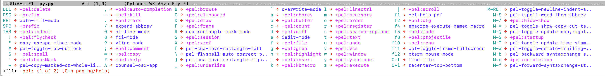

==============================================
PEL -- Pragmatic Environment Library for Emacs
==============================================

:URL: https://github.com/pierre-rouleau/pel/blob/master/doc/pel-manual.rst
:Project:  `PEL Project home page`_
:Last Modified Time-stamp: <2020-09-01 09:12:39, updated by Pierre Rouleau>
:License:
    Copyright (c) 2020 Pierre Rouleau <prouleau001@gmail.com>


    You can redistribute this document and/or modify it under the terms of the GNU
    General Public License as published by the Free Software Foundation, either
    version 3 of the License, or (at your option) any later version.


    This document is distributed in the hope that it will be useful, but WITHOUT ANY
    WARRANTY; without even the implied warranty of MERCHANTABILITY or FITNESS FOR A
    PARTICULAR PURPOSE. See the GNU General Public License for more details.


.. _PEL Project home page:  https://github.com/pierre-rouleau/pel


.. contents::  **Table Of Contents**
.. sectnum::


-----------------------------------------------------------------------------

Overview
========

PEL is an hybrid package. It is:

- an Emacs key binding documentation project
  (see `Key Bindings Documentation`_),
- a collection of `PEL convenience features`_ which:

  - are implemented in several mostly independent files,
  - have key bindings mostly using the function keys to provide
    key map trees that do not interfere with standard Emacs key bindings,
  - provide access to several other external Emacs packages
    (see `Credits`_)
    but via
    `PEL Customization`_ to selectively configure, enable and activate
    these features.

    - This conforms to the
      `Emacs easy customization`_ system and reduces your need
      to write custom Emacs Lisp configuration code.

.. _Emacs easy customization:
.. _Emacs customization:       https://www.gnu.org/software/emacs/manual/html_node/emacs/Easy-Customization.html#Easy-Customization


PEL provides:

- A set of already-written configuration for fast loading of several
  useful Emacs packages with:

  - Package activation done through  `Emacs easy customization`_ system,
    see `PEL customization`_.  No extra Emacs Lisp code needed.
  - Extensive use of auto-loading and deferred loading techniques to speed
    up Emacs initialization time.

- Dynamic control of several packages and their commands.
  For example, PEL support both `auto-complete`_ and `company`_ auto-completion
  packages, providing commands to activate one mode in a buffer and
  another mode inside another and while preventing dual use in a buffer.
- `PEL key bindings`_ avoid modification of most Emacs keys, instead
  PEL uses several function keys (**F2**, **F5**, **F6**, **F11** and **F12**)
  as described in the section titled `PEL Function Keys Bindings`_.
- `PEL convenience features`_ include:

  - The key-bindings under **F6**, **F11** and **F12** function keys.
  - A set of small Emacs Lisp files that implement
    PEL's features that deal with several
    aspects of Emacs like windows and frame, scrolling control,  buffer,
    navigation, opening files
    or web pages from file name or URL at point, numeric keypad handling,
    etc...

    - Note that these files can be used as *mostly*
      independent Emacs Lisp *libraries* if you prefer to use a specific
      PEL features without PEL's key bindings.

- Several `PDF Document Tables`_ that describe the key bindings for
  specific topics.
  Each table provides an overview, related Emacs,
  external packages and PEL command descriptions and key bindings
  and links to related on-line documents.

You can either start PEL during Emacs initialization by including the
following Emacs Lisp code inside your `Emacs initialization file`_ :

.. code:: elisp

      (require 'pel)
      (pel-init)

You can place you own customization after the call to ``pel-init``.
This way you can overwrite specific PEL's key bindings if needed.

You can also can start or re-start PEL interactively by typing::

  M-x pel-init


.. _Emacs initialization file: https://www.gnu.org/software/emacs/manual/html_node/emacs/Init-File.html#Init-File


The reason for PEL
------------------

PEL attempts to make Emacs easier for new users by providing already made
configuration that is controlled by Emacs customization system.  It reduces the
need for writing Emacs Lisp configuration code for the packages it supports and
incorporates the knowledge inside files that can be byte-compiled for further
speed enhancements.

There are several great packages for Emacs. Some are easy to install, others
require more knowledge, knowledge that is often not readily available to new
users and will require a time investment you may not be willing to make.

Instead of having to write Emacs Lisp code inside an Emacs init file for each
new package you want to use, you can use PEL, select the features you want
via `PEL Customization`_ and then execute ``pel-init`` to activate them.
PEL has the logic for configuring the packages it supports.  In
some cases it also contains the logic to install the package if it is not
already installed.

PEL essentially came out as a desire to be able to use an Emacs
configuration on several systems, both in terminal (TTY) mode and in Graphics
mode while trying to keep  Emacs initialization as fast as possible and reducing
the repetitive writing of package initialization code.

I started writing PEL while learning Emacs, Emacs Lisp and various packages.
PEL encapsulates some knowledge about various
tweaks to use and configure several built-in Emacs features and
third party packages.

I also created a set of tables
that each list and describe a specific topic, the commands and key bindings
related to that topic.
There are several topics; Emacs navigation, Emacs
buffers, windows and frames, how to undo, redo, work with Emacs Lisp, etc...
See the `Key Bindings Documentation`_ section.
The commands and key bindings described in those table include what is provided
by the plain vanilla GNU Emacs, the third party packages PEL integrates and the
PEL commands.


PEL Goals
---------

- Ease introduction to Emacs.
- Simplify and speed up Emacs initialization and configuration.

  - Minimize Emacs initialization time even when a large number of packages are
    present on the computer.
  - Minimize the amount of Emacs Lisp code to write inside Emacs init file to
    support various external Emacs packages.
  - Provide all logic necessary to install and configure external Emacs
    packages.

- Provide easy to remember key bindings via a key binding tree, key prefixes and
  the use of key choice visualization with package such as which-key_, especially
  for commands that are seldom used.

  - Keep as many standard Emacs key bindings as possible.

- Document what's available: the key bindings, the special considerations, the
  documents to read for further learning.
- Allow use of PEL even when someone has an extensive Emacs init file.
- Add support for several programming languages integrating many packages that
  support these programming languages.  Support for C, C++, Rust, Go,
  Python, Erlang, Elixir, Haskell, OCaml and several are planned
  (but... no schedule yet!).

**Note**:
   This is the first release of PEL, and my first contribution to Emacs,
   written as I learned Emacs.
   It will grow with time, incorporating more documentation,
   support for more Emacs packages related to editing and
   programming tasks.  Don't hesitate to report problems and
   recommend better ways!


Using Portions of PEL Manually
------------------------------

If you prefer not using PEL's key bindings you can `override them`_.
You can also just use the `PEL features`_ you want and create your own key
bindings. In that case, don't call ``pel-init``, require the respective PEL
source code file and create your own key bindings.
The PEL files are listed in each of the corresponding
`PEL Convenience Features`_ section.

.. _override them: `To override or change PEL key bindings`_
.. _PEL features:  `PEL Convenience Features`_


..
   -----------------------------------------------------------------------------


How to Install PEL
==================

PEL is not yet available through MELPA_ (Milkypostman's Emacs Lisp Package
Archive) or any Elpa-compatible Emacs package archive. It might be on day,
although the nature of the PEL project might not be compatible with
MELPA_ or ELPA_.

Therefore semi-automated installation instruction are detailed in the
following sections.


Essentially you need to:

#. `Install Emacs 26.1 or later`_. Ideally use the latest stable release: Emacs 26.3.
#. `Clone the PEL Git repository`_ on your computer.
#. `Prepare Emacs Initialization directory`_ where lots of Emacs files will go.
#. `Create a "~/.emacs.d/utils" directory`_ for files from the EmacsAttics_ and
   EmacsMirror_ that PEL uses.
#. `Create or Update your Emacs Initialization file`_.
#. `Build PEL using make`_ to byte-compile Emacs Lisp files, download and
   install the required external libraries.
#. `Activate PEL in your init.el file`_.
#. `Activate PEL Features - Customize PEL`_.


Detailed instructions for the above steps are written in the following sections.

If you wish you can also customize PEL and Emacs further.  See the following
sections:

- `Further PEL Customization`_
- `Emacs and PEL Optimizations`_
- `Generic Tips`_, specially `Running Emacs Graphics Mode`_.


.. _Emacs Lisp Packages: https://www.gnu.org/software/emacs/manual/html_node/emacs/Packages.html#Packages

Install Emacs 26.1 or later
---------------------------

Install a version of Emacs you can run from the command line.
It will be used to build PEL later.
Once PEL is built on your system you can use either a terminal based (tercap)
version of Emacs or a graphical version of Emacs with PEL.

To check if you have Emacs on your system, open a shell and execute the
following commands:

- ``which emacs`` to see if Emacs is available.

  - On macOS, if this is ``/usr/bin/emacs``, you most probably have
    the old version of Emacs that Apple installed.

- Check the version of Emacs you have with the following command line:

  ``emacs --version``

Make sure you have Emacs version 26.1 or later.  If not, install
Emacs 26.3 or later.

For macOS
~~~~~~~~~

You can use Homebrew_, a command line utility, to install a command line
version of Emacs.

- See Homebrew_ home page for how to install Homebrew.
- Once homebrew is installed, you can use the following commands:

  - ``brew search emacs`` to list Homebrew package names that include "emacs".
  - ``brew info emacs`` to see what version of emacs is available.
  - ``brew install emacs`` to download and install Emacs.

.. _Homebrew: https://brew.sh/

Clone the PEL Git repository
----------------------------

Clone the `PEL's Github repo`_ somewhere in your home directory but outside your
"~/.emacs.d" directory.  This instruction assumes that you store it inside
"~/projects" to create "~/projects/pel" by executing the following commands in a
shell:

.. code:: shell

          cd
          mkdir projects
          cd projects
          git clone https://github.com/pierre-rouleau/pel.git

This will create the "``~/projects/pel``" directory tree with all
PEL's files inside it, including all `PDF document tables`_
that document the key bindings of Emacs and the libraries you can activate with
PEL.


.. _PEL's Github repo: https://github.com/pierre-rouleau/pel


Prepare Emacs Initialization directory
--------------------------------------

There are several ways to set up `Emacs initialization file`_.

You will have to store several Emacs-related files in your system:

- PEL itself,
- Emacs init file,
- Emacs customization file,
- Emacs bookmarks file,
- Emacs abbreviation files,
- External Emacs Lisp libraries downloaded from Elpa-compliant sites like
  ELPA_, MELPA_ or MELPA-STABLE_,
- External Emacs Lisp libraries from the EmacsAttics_ or EmacsMirror_ that are
  not Elpa-protocol compliant and must be stored into a *utils* directory,
- etc...


It is best to  create the "``~/.emacs.d``" directory and store
Emacs configuration file inside "``~/.emacs.d/init.el``".

The following instructions assume that your Emacs initialization file is
"~/.emacs.d/init.el".


Windows users:
  Under Windows, your ".emacs.d" directory should be stored inside your HOME
  directory. See `Emacs Windows init location FAQ`_ for more information.

.. _Emacs Windows init location FAQ: https://www.gnu.org/software/emacs/manual/html_node/efaq-w32/Location-of-init-file.html

Create a "~/.emacs.d/utils" directory
-------------------------------------

The name of the directory could be anything, *utils* is what this example uses.
Create the "~/.emacs.d/utils"  directory.  This is where you need to store the
single file external packages that PEL uses and which are not supported by the
Elpa-compliant sites.

An easy way to do this from a shell is:

.. code:: shell

          mkdir -p ~/.emacs.p/utils


Create or Update your Emacs Initialization file
-----------------------------------------------

Add the following code inside your "``~/.emacs.d/init.el``" file:

.. code:: elisp

          ;; 1: Setup package sources: MELPA, MELPA-STABLE and a local mypelpa
          (when (>= emacs-major-version 24)
            (require 'package)
            (setq package-enable-at-startup nil)
            (if (version=  emacs-version "26.2")
                (setq gnutls-algorithm-priority "NORMAL:-VERS-TLS1.3"))
            (let* ((no-ssl (and (memq system-type '(windows-nt ms-dos))
                                (not (gnutls-available-p))))
                   (proto (if no-ssl "http" "https")))
              (add-to-list 'package-archives (cons "melpa" (concat proto "://melpa.org/packages/")) t)
              (add-to-list 'package-archives (cons "melpa-stable" (concat proto "://stable.melpa.org/packages/")) t)
              (add-to-list 'package-archives (cons "mypelpa"      (expand-file-name "~/projects/pel/pelpa/")) t))
            (package-initialize))

          ;; 2: Add pel to Emacs load-path
          ;;    Identify the directory where you stored pel.
          (add-to-list 'load-path (expand-file-name "~/projects/pel"))

          ;; 3: Add utils to Emacs load-path
          (add-to-list 'load-path (expand-file-name "~/.emacs.d/utils"))

          ;; 4: Store Emacs customization inside a separate file
          ;;    If you already have a (custom-set-variables ...) form
          ;;    in your init.el, move it into this new file.
          (setq custom-file "~/.emacs.d/emacs-customization.el")
          (load custom-file)

          ;; 5: Start PEL
          ;; - At first leave this commented out.
          ;; - Activate the code Once you have successfully built PEL once
          ;; (require 'pel)
          ;; (pel-init)


- Section 1 of the code adds the following URLS of Elpa-compliant Emacs package
  archives:

  - MELPA_
  - MELPA-STABLE_
  - "~/projects/pel/pelpa"

  The last one is the location of the "pelpa" directory inside the pel project, in
  the location you selected when you `cloned PEL`_

- Section 2 adds the location of the *pel* directory to Emacs ``load-path``
  to allow Emacs to find all PEL Emacs Lisp files.  This should be the
  directory where you downloaded PEL.
- Section 3 adds the location of the *utils* directory to Emacs ``load-path`` to
  allow Emacs to find the single file Emacs libraries PEL uses.
- Section 4 tells Emacs to store its customization form inside a file called
  "~./emacs.d/emacs-customization.el".  If you already have Emacs customization
  inside your current init.el file, copy it inside that new file.
  Emacs customization is the full content of the ``(custom-set-variables ...)`` form.
- Section 5 load and initializes PEL.  The code is commented out.
  Do not activate the code until later in the installation steps, after
  your first successful build of PEL.

.. _cloned PEL: `Clone PEL repository on your drive`_

**Note**

If you work inside several projects and each project requires different
Emacs settings, you could use several customization files and activate them
for each project, reducing the load time further.
That provides another degree of freedom, along with Emacs directory local
and file local variables.

Build PEL using make
--------------------

The Makefile_ in the PEL repository byte-compile all PEL's Emacs Lisp files.  By
doing so it will download and install a large number of external Emacs Lisp
libraries and run some regression tests.
It will also create a PEL Elpa-compliant Elpa-compliant package
archive tar file and store it into your "``~/project/pel/pelpa``" directory.

This makefile uses a terminal version of Emacs 26.1 or later.

All you have to do is open a shell and execute the following commands:

.. code:: shell

          cd ~/projects/pel
          make clean
          make

Activate PEL in your init.el file
---------------------------------

To activate PEL when Emacs starts, un-comment the 2 lines of Emacs Lisp code (identified as
*section 5* in the init.el file example) in your "``~/.emacs.d/init.el``" file,
remove the leading semi-colons from the last 2 lines:

.. code:: elisp

          (require 'pel)
          (pel-init)

Save the file and restart Emacs.

You're done installing PEL 😅!

The next steps is to use Emacs customization system to activate the features you
want.

Activate PEL Features - Customize PEL
-------------------------------------

Once PEL is built, you can run Emacs and select the packages you want to use by
customizing Emacs and setting the PEL user options to activate the packages you
want to use.

One way to quickly gain access to PEL customization group inside Emacs is to
execute the ``pel-cfg`` command by typing the ``<f11> <f1> !`` key sequence.
When running Emacs in graphics mode, you'll see something like this:


.. image:: res/pel-cfg.png

Emacs opens a buffer in ``Custom-mode`` and shows the top level of PEL
configuration.  PEL has a large tree of customization groups, each holding
several customization user options variables.

All PEL package control user options have a name that starts with ``pel-use-``
and they are part of the ``pel-package-use`` customization group.  If you select
that group Emacs will open it and you will see something like this:


It shows the top level group for different types of packages, grouped by
functionality type.

If you want to see all ``pel-use-`` variables, you can also type ``pel-use-`` in
the field to the right of the **Search** button and press that button.  Emacs
will list all ``pel-use-`` user option variables by alphabetical order, as shown
below.  Set the ones you want to activate.  Then save your configuration and
restart Emacs.

The following show a lot of options **on**.  Most of them are turned
off by default when you first get PEL.  Turned them on, save the customization
and restart Emacs to activate them.  When you restart Emacs, some more packages
might be automatically downloaded when required.

Note:  In Emacs Lisp the value **t**, is the symbol for truth and **nil** is
used for the empty list and represent falsehood.

.. image:: res/pel-cfg-all-use.png

Now you are done! 😀

You can repeat the operation several times.  If you saved the customization, you
can exit Emacs: the new features will be available the next time you start it.

You can also see the following sections for some extra customization and
optimizations.

See `Key Binding Help`_ for a quick trick to see what's available at the
keyboard.

Further PEL Customization
-------------------------

The following sections describe optional optimizations or modifications.


Delay Loading of Abbreviation Definition File
~~~~~~~~~~~~~~~~~~~~~~~~~~~~~~~~~~~~~~~~~~~~~

Emacs automatic abbreviation control provided by the ``abbrev-mode`` described
in `PEL Abbreviation Management Support`_ store all abbreviations in a file
identified by the ``abbrev-file-name`` user option variable.  By default
its value is "~/.emacs.d/abbrev_defs``.  Emacs load the content of this file
during its initialization time.  When the file contains a large number of
abbreviations, the loading time can become annoyingly significant.

PEL provides a mechanism to delay the loading to speed up the Emacs
initialization time.  A change in the init.el file is required: read and cache
the content of ``abbrev-file-name`` user option variable and rest it to the name
of an non-existing file as early as possible in your init.el file.  Then pass
the cached value to ``pel-init`` optional argument.  By doing this you prevent
Emacs from reading the abbreviation file and let PEL load it later silently when
there is some idle time.

Write code similar to the following early at the beginning of your init.el file:

.. code:: elisp
    (setq pel--abbrev-file-name abbrev-file-name)

   (setq abbrev-file-name "~/abbrev_defs-invalid") ; use a non-existing file name

Then pass the information when you call ``pel-init``:

.. code:: elisp

    (pel-init pel--abbrev-file-name)


Identify the location of your Ispell local dictionary
~~~~~~~~~~~~~~~~~~~~~~~~~~~~~~~~~~~~~~~~~~~~~~~~~~~~~

With the current version of PEL, when you want to select the spell check
program used by
Ispell or Flyspell and the location of your personal dictionary you need to
write Emacs Lisp code in your Emacs init file that calls the ``pel-spell-init``
function.

The following is an example. It selects the ``aspell`` program
and identifies the path for the personal dictionary.

.. code:: elisp

          (eval-after-load "ispell"
            '(when (fboundp 'pel-spell-init)
                 (pel-spell-init “aspell" "~/.emacs.d/.ispell")))

In future versions of PEL, this code may not be necessary.

More information on PEL support of spell checking is available
in the `PEL Spell Checking Support`_ section.


Emacs and PEL Optimizations
---------------------------

The following sections describe optimizations you can use anywhere, with or
without PEL.

Tricks to Speed-up your Emacs init time
~~~~~~~~~~~~~~~~~~~~~~~~~~~~~~~~~~~~~~~

PEL itself loads quickly. You can use the following tricks to speed it up further.

Holding Garbage Collection during startup
^^^^^^^^^^^^^^^^^^^^^^^^^^^^^^^^^^^^^^^^^

Use the following code to postpone Emacs Lisp garbage collection during Emacs startup.
Enclose the entire code of your init.el file inside the following let form:

.. code:: elisp

          (let ((file-name-handler-alist nil)
                (gc-cons-threshold most-positive-fixnum))

            ;; all your initialization code goes here

          )

What the above does is to disable special file association handling and garbage
collection while Emacs processes your initialization code.  This has nothing to
do with PEL though.

Disable Emacs Startup splash screen and echo area message
^^^^^^^^^^^^^^^^^^^^^^^^^^^^^^^^^^^^^^^^^^^^^^^^^^^^^^^^^

By default Emacs displays its splash screen on startup and displays a message on
the echo area telling you about Emacs in general and the concept of free
software. Once you have read this information, you can disable them with the
following code:

.. code:: elisp

  ;; Do not display the splash screen.  Same as emacs -Q
  (setq inhibit-startup-screen t)
  ;; Don't display the start help in minibuffer, at least for me.
  (setq inhibit-startup-echo-area-message "YOUR-USER_NAME_HERE")

Replace "YOUR_USER_NAME_HERE" by a string containing your user name.
Emacs was written to allow multiple users from having access to the same
configuration, and this identifies the user that will not be reminded of Emacs
concepts and principles every time Emacs starts.  So, to take advantage of that
small speed up make sure you put your user name there.


Convenience Tricks
~~~~~~~~~~~~~~~~~~

Simpler Prompts
^^^^^^^^^^^^^^^

Emacs prompts that require you to type ``yes`` or ``no`` might be annoying.  If
you would prefer being able to just type ``y`` or ``n`` instead add the
following to your init.el file:

.. code:: elisp

  ;; Use 'y'/'n' or SPC/DEL instead of 'yes'/'no'
  (fset 'yes-or-no-p 'y-or-n-p)
  ;; Don't request [confirm] on non-existing file by C-x C-f or C-x b.
  (setq confirm-nonexistent-file-or-buffer nil)


Generic Tips
------------

The following sections contain information related to Emacs and the OS environment.

Running Emacs Graphics Mode
~~~~~~~~~~~~~~~~~~~~~~~~~~~

Under Unix-like Operating Systems like Linux and macOS when you run Emacs in
graphics mode, Emacs may not get the complete environment variables that you get
in your shell.  That happens quite often in macOS as explained by
`Steve Purcel in the readme file of his exec-path-from-shell`_ package.
His package provides a way to fix the problem.

Currently PEL does not integrate that package.

To avoid the problem, I recommend using a small script that allows you to start
your graphics copy of Emacs from a shell.  There are several advantages:

- the graphical Emacs inherits the complete environment of the shell from which
  it is launched, without having to add the package written by Steve Purcell,
- you can launch several instances of graphics Emacs, from the same or different
  shells, where different shells may have different values for important
  environment variables, and that might include different versions of important
  programming languages related yo your project.


On my system I have 2 commands that launch Emacs:

- ``e`` which launches a Termcap (TTY) character-only version of Emacs, and
- ``ge`` which launches the GUI version of Emacs.

The ``e`` command is just a symlink to the Termcap Emacs version I am currently
using.  I use this short symlink for its size also because I never use the `1970s E
editor`_.

And ``ge`` is a script to launch the graphical Emacs, providing access to the
current directory and the complete environment:

.. code:: shell

          #!/bin/sh
          # Abstract: open Cocoa-based GUI Emacs in the background
          #           (so we can continue using the shell).
          # Pass to emacs:
          #   - --chdir to the current working directory so we open the same files
          #     as what is specified on the command line. If we don't do that the GUI
          #     based Emacs might use a different directory (I saw that it uses the home
          #     directory) and if you specify files that are not in that directory they
          #     will not be opened, another file file open which will most likely be
          #     in an empty buffer (if the file does not exists in the home directory).
          #   - All script command line arguments.
          #
          # Note: The current Emacs for macOS graphical dumps an error when it starts.
          #       This is annoying; it's noise on the shell.
          #       Just mask it by dumping it in the bit bucket.
          #
          /Applications/Emacs.app/Contents/MacOS/Emacs --chdir=$(pwd) "$@" 2>/dev/null &


.. _Steve Purcel in the readme file of his exec-path-from-shell: https://github.com/purcell/exec-path-from-shell#setting-up-your-shell-startup-files-correctly
.. _1970s E editor: https://en.wikipedia.org/wiki/E_(1970s_text_editor)


To override or change PEL key bindings
~~~~~~~~~~~~~~~~~~~~~~~~~~~~~~~~~~~~~~

As of this release PEL key bindings and key prefixes are hard coded.
If you want to change a key binding that PEL uses, you can define your own
key bindings after the execution of ``pel-init``.  You can also change
PEL prefix keys.

The following code re-assign the F6 key to ``undo`` and uses the F7 key
to be used as what PEL normally uses for F6:

.. code:: elisp

          (global-set-key (kbd "<f6>") 'undo)
          (global-set-key (kbd ("<f7>") pel:f6)


.. -----------------------------------------------------------------------------


Key Binding Help
================


By default, PEL configuration activates the which-key_ external package so that
when you hit a key prefix, like **F11** the list of comments and their key
bindings will show up at the bottom of the Emacs screen, in what is called the
echo area.  This, like everything PEL uses, can be turned off by customization
(in this case it's the user option called ``pel-use-which-key``.

You can also see the list of commands without it. For example,
you can see PEL's use of the **F11** function key by hitting in sequence the
**F11** key quickly followed by the **F1** key.  Emacs will list PEL's **F11**
key bindings inside the ``*Help*`` buffer.

..
   -----------------------------------------------------------------------------

PEL Convenience Features
========================

PEL implements a set of small utilities that complement what's already available
in standard GNU Emacs and some other packages. The code is spread into several
small files.  Each of those file is described in the following subsections.
PEL comes with a set of PDF files that describe key bindings , including the
standard GNU Emacs bindings, the bindings of the external packages integrated
by PEL and the bindings for PEL commands.  The sections below contain link to
the relevant PDF files.  The complete list of PDF files is shown in the
`Key Bindings Documentation`_ section.


PEL Abbreviation Management Support
-----------------------------------

:PDF Docs: `Abbreviations`_.
:PEL Customization: ``pel-use-hippie-expand``.
:PEL Key Prefix: **pel:abbrev** : ``<f11> a``

PEL provides automatic activation of Hippie expansion when the
``pel-use-hippie-expand`` `user option`_ is set to **t**.  Otherwise
it defaults to Dabbrev_ expansion.
PEL also provides the **pel:abbrev** key map which provides access to some
abbreviation related commands.  PEL binds it to ``<f11> a``.

All code provided by PEL about
abbreviations
is located inside the file `pel.el`_.


.. _user option: https://www.gnu.org/software/emacs/manual/html_node/emacs/Easy-Customization.html
.. _Dabbrev:     https://www.gnu.org/software/emacs/manual/html_node/emacs/Dynamic-Abbrevs.html#Dynamic-Abbrevs


PEL Auto-Completion Support
---------------------------

:PDF Docs: `Auto-completion`_.
:PEL Customization: ``pel-use-auto-complete``, ``pel-use-company``.
:PEL Key Prefix: **pel:auto-completion** : ``<f11> ,``

The file `pel-autocomplete.el`_ manages the activation and enabling of
auto-completion systems globally and per buffer so that you can install several
auto-completion packages and then select one of them either globally or per
buffer. The selection logic does not allow more than one auto-completion
mechanism to be used for a single buffer.

This version of PEL currently supports the following auto-completion packages:

- `Auto Complete`_
- `Company`_

It provides the following commands:

- ``pel-global-auto-complete-mode`` toggles the global Auto Complete mode
  on/off if it can.  Activation is not allowed when Company Mode is active.
- ``pel-auto-complete-mode`` toggles the Auto Complete mode for the current
  buffer if it can.  Activation is not allowed when Company mode is active
  for the current buffer.
- ``pel-global-company-mode`` toggles the global Company mode on/off if it
  can. Activation is not allowed when Auto Complete mode is active.
- ``pel-company-mode`` toggles the Company mode on/off for the current buffer if
  it can.  Activation is not allowed when Auto Complete mode is active for the
  current buffer.
- ``pel-completion-help`` shows the state of the auto completion global and
  buffer specific modes.  It displays if the packages are available and whether
  they are enabled on not.
- ``pel-complete`` performs an explicit completion using the completion mode
  enabled in the current buffer.

PEL Autosave & Backup Documentation
-----------------------------------

:PDF Docs: `Autosave & Backups`_.
:PEL Customization: *none*
:PEL Key Prefix: *none*

PEL provides a table describing the autosave and backup commands in the
`Autosave & Backups`_ PDF file.

PEL Bookmark Management Utilities
---------------------------------

:PDF Docs: `Bookmarks`_.
:PEL Customization: ``pel-use-bm``.
:PEL Key Prefix: **pel:bookmark** : ``<f11> '``

The file `pel-bookmark.el`_ does not contain much.  It only provides the
utility function `pel-bookmark-in-current-file-p`` which checks if a bookmark of
a given name is present in the currently edited file.  This is used in other
parts of PEL.

For supporting bookmarks PEL provides the following:

- PEL provides a set of key bindings under the
  **pel:bookmark** key prefix set to ``<f11> '`` by default.
- If the ``pel-use-bm`` user option is set to **t** PEL add bindings to
  the visible bookmark commands and binds the **F2** key to ``bm-next`` which
  moves point to the next visible bookmark. PEL sets it to support bookmarks in
  several files and moving across files.
- Also, the project provides the `Bookmarks`_ PDF table which lists several
  bookmark related functions from various sources and their key bindings.

PEL Comments Utilities
----------------------

:PDF Docs: `Comments`_, `Cut, Delete, Copy and Paste`_, `Narrowing`_.
:PEL Customization: ``pel-use-hide-comnt``
:PEL Key Prefix: **pel:comment** : ``<f11> ;``

The `pel-comment`_ file provides a collection of commands to help manage file
comment management.

- The following commands allow you to display the strings used to control comments
  in the current buffer and change them:

  - ``pel-comment-start``  display/set the string used to start a comment.
  - ``pel-comment-middle`` display/set the string used to continue a comment.
  - ``pel-comment-end``    display/set the string used to end a comment.

- With ``pel-toggle-comment-auto-fill-only-comments``  you control whether
  automatic filling is done inside source code comments.
- The ``pel-delete-all-comments`` deletes all comments in current buffer.
  Use `narrowing`_ to reduce the area where comments are deleted.
- The ``pel-kill-all-comments`` kills all comments in current buffer.
  Each killed comment group is retained in the kill ring, as a separate kill
  ring entry.  That allows selective restoration of comments later with yank
  operations.  See the `Cut, Delete, Copy and Paste`_ document.
- When ``pel-use-hide-cmnt`` user option is **t** the `hide-comnt.el`_ file,
  written by `Drew Adams`_ is used and provides 2 commands to hide the comments
  in the buffer or just in a marked region.


.. _Drew Adams:    https://www.emacswiki.org/emacs/DrewAdams
.. _hide-comnt.el: https://github.com/emacsmirror/hide-comnt


PEL Closing and Suspending Table
--------------------------------

:PDF Docs: `Closing and Suspending`_
:PEL Customization: *none*
:PEL Key Prefix: *none*

PEL provides the `Closing and Suspending`_ PDF table listing the Emacs commands
to close and suspend.

PEL (Input) Completion Mode Control
-----------------------------------

:PDF Docs: - `Input Completion`_
           - `User Option Customization`_.
:PEL Key Prefix: *none*

Emacs has one native input completion mechanism that kicks into action whenever you
use a command that prompts for something like a file name, a buffer name, a
command name, etc...  Several other completion modes exist.  The IDO completion
mode is shipped with Emacs.  The Ivy, Counsel and Helm are other popular
completion modes.  They can be installed via PEL and activated by PEL
customization and the mode that should be used when Emacs starts is identified
by the ``pel-initial-completion-mode`` user option.

Once more than one completion mechanism is activated, PEL provides a command
to select another completion mode: ``pel-select-completion-mode``.  PEL maps this to
``<f11> M-c``.  To see which input completion is currently active use ``<f11> ? c``.

With this you can start with Ido mode, then quickly switch to using Ivy mode for
a while and return to Ido mode when you're done. Or use whatever you want at the
moment you want without having to change and reload your Emacs initialization code.

The management of completion mode is provided by the `pel-completion`_ file.

See the `Customization <https://raw.githubusercontent.com/pierre-rouleau/pel/master/doc/pdf/customize.pdf>`_ PDF file for more information.


PEL Configuration/Customization Support
---------------------------------------

:PDF Docs: `User Option Customization`_.
:PEL Key Prefix: - **pel:cfg** : ``<f11> <f1>``
                 - **pel:cfg-pl** : ``<f11> <f1> SPC``


PEL is designed to help you control Emacs through Emacs Easy Customization
system instead of explicit Emacs Lisp code.  You can always write more Emacs
Lisp code to specialize it further but in most cases it might not even be necessary.
PEL controls what package is activated and how the features are configured
through the Emacs Customization interface.  The information is stored in a file
and if you followed the instructions inside the section `How to Install PEL`_,
your selections will be stored inside the file
"~/.emacs.d/emacs-customization.el".  You can even copy that file and keep
multiple revision around.

Since customization is central to PEL, PEL also provides a set of key bindings
that you can use to quickly open a buffer to customize a specific user option or
a group or all of Emacs.  These key bindings use
the **pel:cfg** prefix, which by default is bound to the ``<f11> <f1>`` key sequence.

PEL customization user options are organized in Emacs customization groups with
several general groups but also groups for each programming language and markup
languages supported by PEL.  When point is inside the buffer editing a file in
one of the programming or markup language mode supported by PEL you can quickly
open the customization buffer for the group of that language by using the
``<f12> <f1>`` key.

You can also use the global prefix **pel:cfg-pl** bound to
``<f11> <f1> SPC`` followed by the character identifying the language to open
the customization group for a specific language.
For example, if you want to change the indentation style and width for your C++
files, use the command associated to the ``<f11> <f1> SPC C`` key sequence.  This
will open the PEL customization group for configuring C++ editing.  If point is
already inside a buffer in C++ mode, then ``<f12> <f1>`` does the same.

After customizing something, you can type the ``q`` key to close  the
customization buffer and come back where you were.  And to activate your changes
then run ``pel-init`` by issuing the ``M-x pel-init`` command.

See the `User Option Customization`_ PDF document for more details.

PEL Counting Support
--------------------

:PDF Docs: `Counting`_.
:PEL Customization: *none*
:PEL Key Prefix: **pel:count** : ``<f11> c``

PEL provides the **pel:count** key prefix (``<f11> c``) to Emacs commands that
count text and display results in the echo area.


PEL Cross Reference Support
---------------------------

:PDF Docs: `Etags-Based Cross-Reference`_
:PEL Customization: *none*
:PEL Key Prefix: **pel:xref**

**Note:**
   🚧  This file is under early development.

The file `pel-tags.el`_ holds utilities related to Etags based cross-reference support.


PEL CUA Mode Extension Utilities - *experimental*
-------------------------------------------------

:PDF Docs: *none*
:PEL Customization: *none*
:PEL Key Prefix: *none*

**Note:**
   🚧  This file is under early development.

I'd like to find ways to easily manage rectangles of text without having to
activate the CUA mode and
the file `pel-cua.el`_ holds some experimental and unfinished code for going in
that direction.  Some of the commands are bound to PEL keys and described in the
PDF tables. But this work is in very early stage.


PEL Cursor Management Support
-----------------------------

:PDF Docs: `Cursor`_
:PEL Customization: - ``pel-cursor-overwrite-mode-color``
                    - ``pel-cursor-type-when-mark``
                    - ``pel-use-multiple-cursors``
                    - ``pel-use-visual-regexp-steroids``
                    - ``pel-use-visual-regexp``

:PEL Key Prefix: *none*

The `pel-cursor.el`_ file the logic required to control the cursor color and
type when Emacs is running in graphical mode.

- With the ``pel-cursor-overwrite-mode-color`` user option, you can select a color
  different than what is normally used by the cursor to change cursor color when
  the overwrite-mode is active.
- With ``pel-cursor-type-when-mark`` you can set a different cursor type
  (shape) used when the mark is active.

When ``pel-use-multiple-cursors`` is set to **t** the popular
`multiple-cursors`_ mode is made available and PEL provides a set of key
bindings for this.  The ``pel-use-visual-regexp`` and
``pel-use-visual-regexp-steroids`` activate the ability to perform a search
which yields to multiple cursors activated at the match locations.

See the PDF `Cursor`_ document for more information.


PEL Cut, Delete, Kill, Copy, Paste and Yank Utilities
-----------------------------------------------------

:PDF Docs: `Cut, Delete, Copy and Paste`_, `Marking`_.
:PEL Customization: ``pel-use-popup-kill-ring``.
:PEL Key Prefix: - **pel:clipboard** : ``<f11> C``
                 - **pel:copy** : ``<f11> =``
                 - **pel:kill** : ``<f11> -``
                 - **pel:text-whitespace** : ``<f11> t w``

The `pel-ccp.el`_ file provides a collection of commands to perform Emacs
style kill/yank and otherwise copy/cut/paste operations on various parts of the
text, targeting specific syntax entities or other simpler parts.

- The following commands copy the specified syntax entities at point into the
  kill ring:

  - ``pel-copy-word-at-point``
  - ``pel-copy-symbol-at-point``
  - ``pel-copy-sentence-at-point``
  - ``pel-copy-function-at-point``
  - ``pel-copy-sexp-at-point``
  - ``pel-copy-whitespace-at-point``
  - ``pel-copy-filename-at-point``
  - ``pel-copy-url-at-point``
  - ``pel-copy-list-at-point``
  - ``pel-copy-paragraph-at-point``
  - ``pel-copy-paragraph-start``
  - ``pel-copy-paragraph-end``
  - ``pel-copy-line-start``
  - ``pel-copy-line-end``
  - ``pel-copy-char-at-point``
  - The command ``pel-copy-marked-or-whole-line`` copy a marked region if any or
    the entire line (including the line termination) into the kill ring.

- The following commands kill the specified syntax entities at point:

  - ``pel-kill-word-at-point``
  - ``pel-kill-symbol-at-point``
  - ``pel-kill-sentence-at-point``
  - ``pel-kill-function-at-point``
  - ``pel-kill-sexp-at-point``
  - ``pel-kill-whitespace-at-point``
  - ``pel-kill-filename-at-point``
  - ``pel-kill-url-at-point``
  - ``pel-kill-list-at-point``
  - ``pel-kill-paragraph-at-point``
  - ``pel-kill-char-at-point``
  - ``pel-kill-from-beginning-of-line``
  - The command ``pel-kill-or-delete-marked-or-whole-line`` is a flexible command
    that can kill or delete the current line, multiple lines or the currently marked
    region.

- The following commands delete text at point and don't store the text in the
  kill ring:

  - The ``pel-delete-whole-line`` command delete the current line, including the
    line termination.
  - The ``pel-delete-to-next-visible`` delete all whitespace characters between
    point and the next non-whitespace character.

- The ``pel-mark-whole-line`` marks the complete current line excluding the line
  termination.


PEL Diff and Merge
------------------

:PDF Docs: `Diff and Merge`_.
:PEL Customization: *none*
:PEL Key Prefix: - **pel:diff** : ``<f11> d``
                 - **pel:ediff** : ``<f11> e``

                   - **pel:ediff-buffer**  : ``<f11> e b``
                   - **pel:ediff-dirs**    : ``<f11> e d``
                   - **pel:ediff-files**   : ``<f11> e f``
                   - **pel:ediff-merge**   : ``<f11> e m``
                   - **pel:ediff-patch**   : ``<f11> e p``
                   - **pel:ediff-regions** : ``<f11> e r``

PEL provides key bindings to Emacs diff end ediff commands.

PEL Drawing Support
-------------------

:PDF Docs: `Drawing`_, `PlantUML-Mode`_.
:PEL Customization: - ``pel-use-plantuml``,
                    - ``pel-use-flycheck-plantuml``.
:PEL Key Prefix: - **pel:draw** : ``<f11> D``
                 - **pel:plantuml**: ``<f11> D u``

PEL provides key bindings to enter the Emacs text drawing modes:

- ``<f11> D a``: toggle artist mode.
- ``<f11> D p``: enter picture-mode.

☝️  The picture-mode can be quite useful to edit tabular data as well as editing
tables for markup languages like reStructuredText or even for lining text
vertically in any other type of file; for example lining up text vertically.

Drawing with PlantUML
~~~~~~~~~~~~~~~~~~~~~

If you need to draw UML diagram, you can use the plantuml-mode to write the
diagram in PLantUML syntax and then generate the diagram.  If Emacs is running
in graphics mode, the preview shown is an image. If Emacs is running in text
mode the preview is a text-based drawing that can easily be inserted inside a
source code file.  PEL defines the **pel:plantuml** key prefix (``<f11> D u``)
for the PlantUML-mode commands.  See the `PlantUML-Mode`_ PDF document for more
information.

PEL activates support for PlantUML with the plantuml-mode when the
``pel-use-plantuml`` user options is either set to **t** or to **server**.
When set to **t** you use a local instance of the PlantUML Java application.
You need to install PlantUML.  If set to **server** Emacs communicates with a
remote PlantUML server to crete the image.  Your data is sent to that external
server, so make sure you set this to what you need and do not sent proprietary
information across the Internet by mistake!


PEL Enriched Text Support
-------------------------

:PDF Docs: `Enriched Text`_.
:PEL Customization: *none*
:PEL Key Prefix: **pel:textmodes** : ``<f11> t m``

PEL `Enriched Text`_ PDF table shows the Emacs commands available for
enriched text.


PEL File Management Utilities
-----------------------------

:PDF Docs: `File Management`_, `Dired`_.
:PEL Customization: - **pel-pkg-for-completion**:

                      - ``pel-use-ido-mode``.

                    - **pel-pkg-for-filemng**:

                      - ``pel-use-ffap``
                      - ``pel-use-neotree``
                      - **pel-pkg-for-ztree**:

                        - ``pel-use-ztree``
                        - ``pel-ztree-dir-move-focus``
                        - ``pel-ztree-dir-filter-list``
                        - ``pel-ztree-dir-show-filtered-files``

:PEL Key Prefix: - **pel:file** : ``<f11> f``

                   - **pel:ffap**:         ``<f11> f a``
                   - **pel:file-revert** : ``<f11> f r``
                   - **pel:filevar** :     ``<f11> f v``


The `pel-file.el`_ file provides logic to extra the name of a file or a URL from
text at point and visit (open) that file inside an Emacs buffer or launch a web
browser to load the specified URL.

- The main command is ``pel-find-file-at-point-in-window`` which opens the file
  or URL. When opening a file, the command accepts a
  wide range of numeric arguments to specify the window to use.
  When the file name is followed by a line number the point is moved at that
  line.  If the line number is followed by a column number point is moved to
  that column.  The command supports several formats.
- Two other utility commands are provided:

  - ``pel-show-filename-at-point`` which simply shows the name of the file
    extracted from point.
  - ``pel-show-filename-parts-at-point`` which displays the components extracted
    from point. It's mainly used for debugging when unexpected formats are
    encountered.

PEL also provides the ability to use the ffap (find file at
point) standard library which complements the PEL command that can also open a file or
URL at point (but can also specify a window by coordinates and handle line and
column numbers). PEL activates the special ``pel:ffap`` binding when
``pel-use-ffap`` user option is set to **t**. If you prefer the standard ffap binding, then
set ``pel-use-ffap`` user option to **ffap-bindings**.

When the ``pel-use-ido-mode`` user option is set to **t** ``pel-init``
activates IDO-mode_ everywhere, enables flex matching and prevents prompt when
creating new buffers with ``C-x b``.

.. _IDO-mode: https://www.gnu.org/software/emacs/manual/html_node/ido/index.html

In Dired mode, for macOS only (in the current implementation), the normally
unassigned 'z'  key is mapped to the ``pel-dired-open`` function.  It opens the
file or directory at point with the OS-registered application.  The macOS
implementation uses the `macOS open`_ application which does the application
launching.

Thanks to Jason Blevins for the idea taken from `his blog <https://jblevins.org/log/dired-open>`_.

To see a textual representation of a directory tree, PEL provides access to the
neotree and z-tree packages.  They are activated by the ``pel-use-neotree`` and
``pel-use-ztree`` user option respectively.

PEL provides the ``<f11> <1> f`` key binding to quickly access the
**pel-pkg-for-filemng** customization group editing buffer to modify the
relevant user options.


.. _macOS open: https://ss64.com/osx/open.html


PEL Font Management Utilities
-----------------------------

:PDF Docs: `Faces and Fonts`_.
:PEL Customization: *none*
:PEL Key Prefix: *none*

The file `pel-font.el`_ provides utilities to control the font size of all
windows when Emacs runs in graphics mode, to complement what already exists in
standard GNU Emacs.  The available commands are:

- ``pel-font-increase-size-all-buffers``, bound to ``<s-kp-add>``.
  On the macOS keyboard: ``⌘-+``, using the ``+`` on the keypad.
- ``pel-font-decrease-size-all-buffers``, bound to ``<s-kp-subtract>``
  On the macOS keyboard: ``⌘--``, using the ``-`` on the keypad.
- ``pel-font-reset-size-all-buffers``, bound to ``<s-kp-0>``.
  On the macOS keyboard: ``⌘-0``.

The key binding selected correspond to what is used on macOS for
manipulating the font size of the Terminal.app application when the
*super* modifier key is set to the macOS command (⌘ ) key.


PEL File and Directory Local Variable Control Support
-----------------------------------------------------

:PDF Docs: `File and Directory Local Variables`_
:PEL Customization: *none*
:PEL Key Prefix: - **pel:filevar** : ``<f11> f v``
                 - **pel:dirvar**  : ``<f11> f v d``

PEL provides a set of key bindings to manage local file variables and local
directory variables.

See the `File and Directory Local Variables`_ PDF table.


PEL Frame Management Utilities
------------------------------

:PDF Docs: `Frames`_.
:PEL Customization: ``pel-use-framemove``
:PEL Key Prefix: **pel:frame** : ``<f11> F``

The file `pel-frame-control.el`_ provides a set of utilities to manage Emacs
frames.  Emacs supports frames both when it operates in graphics mode and in
terminal (TTY) mode.  In terminal mode, you can only see one frame at a time;
all frames of one instance of Emacs running in terminal mode share the same
terminal OS window (called a frame in Emacs nomenclature).

This PEL file provides the following commands:

- ``pel-toggle-frame-fullscreen`` toggles the frame to and back full screen mode
  when Emacs is running in graphics mode.  If Emacs is running in terminal mode
  the command prints a message.  For some environments the message describes
  what must be done to toggle the terminal window to full-screen and back.
  At the moment PEL is able to describe what must be done on macOS with the
  Terminal.app and iTerm.app.
- ``pel-show-frame-count``  displays the total number of frames used by this
  instance of Emacs and the number of those frames that are currently visible.
- The following two commands work when several frames are used by Emacs whether
  it is running in graphics mode or terminal mode:

  - ``pel-next-frame`` moves point to the next frame.
  - ``pel-previous-frame`` moves point to the previous frame.


PEL Function Keys Bindings
--------------------------

:PDF Docs: `Function Keys`_, `F11 Keys`_.
:PEL Customization: *none*
:PEL Key Prefix: *N/A*

PEL avoids remapping most standard GNU Emacs key bindings.
Instead PEL uses the following function keys:

- **F2**, bound to ``bm-next`` (from `visible bookmarks`_)
  to quickly move to next visible bookmark
  when the ``pel-use-bm`` user option is **t**.
- **F5**, bound to ``repeat``.
- **F6**, the ``pel:f6`` prefix, which provides quick access to some
  often used commands.
- **F11**, the ``pel:`` prefix , is the main prefix key for PEL, providing
  access to a large set of key bindings and second-level key prefixes.
-  **F12** is a mode-sensitive key prefix with quick access bindings for the
   current major mode.

The use of function keys and Emacs modifier keys is shown in the `Function
Keys`_ PDF table, reproduced here:

.. image:: res/fn-keys.png


The **F11** acts as a the main prefix for PEL: the prefix ``pel:``.
Several sub-prefixes are available after ``<f11>`` but also some command
bindings using other keys, like cursor keys with or without modifiers.

To easily see what's available it's best to activate the
`which-key`_ package to show the available keys following a prefix key, like the
**F11** key.  Here's what the echo area looks like after pressing the **F11**
key when `which-key`_ is installed and activated:



To install and activate it, you must set the ``pel-use-which-key`` customize
variable to **t**.  Use the ``M-x customize`` command and search
for ``pel-use-which-key``.  Set it to **t**.  The restart PEL by using
``M-x pel-init``.  PEL will download and install the `which-key`_ package
and will activate it.

PEL Grep Support
----------------

:PDF Docs: `Grep`_, `Projectile Project Interaction Manager`_.
:PEL Customization: - ``pel-use-ripgrep``
                    - ``pel-use-ag``
                    - ``pel-use-projectile``

:PEL Key Prefix: **pel:grep** : ``<f11> g``

PEL provides the **pel:grep** (``<f11> g``) key map to regroup grep commands.
If the ``pel-use-ripgrep`` user option is **t** that includes access to
the ``rg`` command that uses the fast ripgrep_ executable.

When ``pel-use-projectile`` is set to **t**, the `ripgrep.el`_ package is also
used because `projectile`_ uses `ripgrep.el`_ instead of the `rg`_ package.
Both provide access to the ripgrep_ executable.

When ``pel-use-ag`` is set to **t**, the `ag`_ (`ag, the silver searcher`_)  is also
available.  This is another fast grep alternative that requires the ag command
line.

You must install the ripgrep and ag command line utilities separately.


.. _ripgrep: https://github.com/BurntSushi/ripgrep
.. _ag, the silver searcher: https://github.com/ggreer/the_silver_searcher


PEL Help Support
----------------

:PDF Docs: `Help`_
:PEL Customization: - ``pel-use-ascii-table``
                    - ``pel-use-free-keys``
                    - ``pel-use-which-key``

:PEL Key Prefix: - **pel:help** : ``<f11> ?``

                   - **pel:apropos** : ``<f11> ? a``
                   - **pel:describe** : ``<f11> ? d``
                   - **pel:emacs** : ``<f11> ? e``
                   - **pel:info** : ``<f11> ? i``
                   - **pel:keys** : ``<f11> ? k``

PEL provides a set of key bindings to request help information, bound to the
**pel:help** key prefix (``<f11> ?``) and it sub-prefixes.  Several of these
commands are accessible via standard Emacs bindings of the ``<f1>`` and the
``C-h`` keys.  There are also some other, as shown in the `Help`_ PDF table.
The customization include the ``pel-use-free-keys`` and ``pel-use-which-key``
variables.  The latter is enabled by default; it help see the available bindings
following key prefixes.

PEL Hide/Show Code Block Support
--------------------------------

:PDF Docs: `Hide/Show Code Block`_
:PEL Customization: *none*
:PEL Key Prefix: **pel:hideShow** : ``<f11> /``

Emacs provides the `Hide/Show minor mode`_ to collapse and expand blocks of
source code.  To use its commands it you have to activate the minor mode first.
PEL provides commands that automatically activates the Hide/Show minor mode and
provides easy to use key-bindings provided by the **pel:hideShow** ``<f11> /``
key-map.  The `Hide/Show Code Block`_ PDF document describes the keys and
commands provided by PEL as well as the standard Emacs commands and key bindings.


.. _Hide/Show minor mode: https://www.gnu.org/software/emacs/manual/html_node/emacs/Hideshow.html#Hideshow


PEL Highlight and Whitespace Management Support
-----------------------------------------------

:PDF Docs: `Highlight`_ , `Whitespaces`_.
:PEL Customization: ``pel-use-rainbow-delimiters``, ``pel-use-vline``.
:PEL Key Prefix: - **pel:highlight** : ``<f11> b h``
                 - **pel:whitespace** : ``f11> t w``
                 - **pel:align** : ``<f11> t a``

The file `pel-highlight.el`_ provides the following simple utility commands.

- The following help manage current line background highlighting, useful to
  quickly identify the location of the cursor on a large display:

  - With ``pel-set-highlight-color`` you can select the color of the highlight
    line by name. Use the ``list-colors-display`` command
    (bound to ``<f11> ? d c`` in PEL)
    to list all colours and their names.
  - The ``pel-toggle-hl-line-sticky`` command toggles line highlighting
    of only the current window or all windows that hold the current buffer.

- It also provides the following whitespace management commands:

  - ``pel-toggle-show-trailing-whitespace`` toggles the highlight of trailing
    whitespaces in the current buffer.
  - ``pel-toggle-indicate-empty-lines`` toggles highlighting of empty lines.
  - ``pel-toggle-indent-tabs-mode`` toggles the use of hard tabs and whitespace
    for indentation inside the current buffer (but does *not* tabify or untabify
    existing content.) It displays what's being used now.

- When ``pel-use-vline`` user option is **t** the ``<f11> b h v`` key is bound
  to vline-mode_ which toggles a vertical bar across the current window at
  the cursor location.

.. _vline-mode: https://www.emacswiki.org/emacs/VlineMode


PEL Indentation Support Utilities
---------------------------------

:PDF Docs: `Indentation`_.
:PEL Customization: *none*
:PEL Key Prefix: **pel:tab** : ``<f11> <tab>``

The file `pel-indent.el`_ includes some very basic utilities for simple
indentation control, complementing what is available in Emacs.
The available commands are:

- ``pel-insert-c-indent`` inserts spaces to indent the current line.
- ``pel-unindent`` removes spaces to un-indent the current line.
- ``pel-indent-rigidly`` indents the current line or marked region, this command
  extends the Emacs indent-rigidly command.

The PEL support for indentation will evolve as support form various types of
files, programming languages and markup languages evolves.


PEL Input Method Control
------------------------

:PDF Docs: `Input Method`_.
:PEL Customization: *none*
:PEL Key Prefix: **pel:text** : ``<f11> t``

PEL rebinds the ``C-\`` prime key, normally bound to ``toggle-input-method``,
used to select another `Emacs input method`_, to ``pel-kill-from-beginning-of-line``.
PEL binds ``toggle-input-method`` to ``<f11> t i`` instead.  And to change the
alternate input method, it binds ``set-input-method`` to ``<f11> t I``.
To lists all input methods, PEL provides ``<f11> ? d i`` bound to ``list-input-methods``.


.. _Emacs input method: https://www.gnu.org/software/emacs/manual/html_node/emacs/Input-Methods.html#Input-Methods

PEL Key Chords Support
----------------------

:PDF Docs: `Key Chords`_
:PEL Customization: **pel-pkg-for-key-chord**:

                    - ``pel-use-key-chord``
                    - ``pel-use-key-seq``
                    - ``pel-key-chords``
                    - ``pel-key-chord-two-keys-delay``
                    - ``pel-key-chord-one-key-delay``
                    - ``pel-key-chord-in-macros``

:PEL Key Prefix: *none*

PEL provides access to the `key-chord`_ external library when the
``pel-use-key-chord`` user option is set to either **t** (to activate key-chords
when the key-chord-mode is ttuned on) or to **use-from-start** (to activate the
key-chord mode and all defined global key-chords when Emacs starts).

If you set the ``pel-use-key-seq`` suer option to **t**, PEL also
provides access to the `key-seq`_ external library and allow you to identify
your *key-chord* to be a *key-seq* instead.

A *key-chord* is two characters typed simultaneously quickly or the same key
typed twice quickly that trigger a specified action.  The action may be
inserting some other text, moving the piint, executing a specified function or
executing a specified Emacs command expressed as an Emacs Lisp lambda
expression.  The *key-chord* can be made of any ASCII printable characters and
ASCII control characters.  These keys must be type quickly; the order into
which they are typed does not matter.

For some fast typist using two keys that might be inside normal words in one
order but not the other, it might be interesting to be able to specify the key
order for a special action.  This is what `key-seq`_ does: it imposes an oorder
for the 2 characters tyoped quickly.  Different order is not triggerring the
special action.  Note that *key-seq* only accepts ASCII printable characters
(ie. in the range decimal 32 to 26 inclusive.)

Both *key-chord* and *key-seq* can be global, where they are always accessible
in Emacs, and mode-specific.  A mode specific *key-chord* or *key-seq* is only
available in buffers where the specific mode is active. For mode-specific
*key-chord* or *key-seq*, PEL schedule the loading of the definitions when the
file identifying the mode is loaded in Emacs.

With PEL, you define the *key-chord* and *key-seq* via customization.
They are stored inside the ``pel-key-chords`` user option.

PEL provides a set of key-chords by default which you can modify via the Emacs
customize buffer for the **pel-pkg-for-key-chord** customize group.  These also
provide examples of how to specify your own key-chords or key-seqs.

PEL provides the ``<f11> <f1> K`` key binding to quickly access this customize
group and the ``<f11> M-K`` binding to toggle the key-chord-mode on and off.

PEL defines several default key-chords that use Emacs Lisp lambda form. This is
the most flexible way to define a key-chord. It allows you to perform anything
with you command, just as if you were writing Emacs Lisp code in your
initialization file.  It also allows the use of keyboard prefix argument keys,
just like any other Emacs command.  With this you can prevent the execution of
code associated with a key-chord in read-only buffer, or pass numeric arguments
that modify the behaviour of the code.  You have the full flexibility of Emacs
Lisp at your disposal.

Be careful with this if you do not know Emacs Lisp: if you
change a setting that refer to a symbol that is not known when you open Emacs's
customize UI, Emacs customize UI will report a mismatch error and you will not
be able to make any modification.  If this happens to you, edit your
customization file and delete the entry for ``pel-key-chords`` from the file,
save the file back and restart Emacs.  If you followed the instructions in
section titled `Update your Emacs Initialization file`_, this name of this file
is "~/.emacs.d/emacs-customization.el".

The logic for managing key-chord definitions stored in customization user option
is stored in the file `pel-key-chord.el`_.  The default values for the
``pel-key-chords`` user option is in the `pel--options.el`_ file.

For more information see the `Key Chords`_ PDF Documentation.


PEL Keyboard Macro Utilities
----------------------------

:PDF Docs: `Keyboard Macros`_.
:PEL Customization: ``pel-kmacro-prompts``.
:PEL Key Prefix: *none*

The file `pel-kbmacros.el`_ implements ``pel-kmacro-start-macro-or-insert-counter``
used to replace the standard ``kmacro-start-macro-or-insert-counter`` to record
a keyboard macro.  If the user option ``pel-kmacro-prompts`` is set to
**t**, the PEL function checks if the macro is already defined and if it is,
prompts before allowing to replace the existing keyboard macro with a new one.
It just offer a little protection.  And this protection can be reset by
executing the second command: ``pel-forget-recorded-keyboard-macro``.  In some
case that level of protection might be annoying, to disable it completely and
restore the normal Emacs keyboard macro recording without any protective
prompting, just set the ``pel-kmacro-prompts`` to *nil*.


PEL Line Control Utilities
--------------------------

:PDF Docs: `Display Lines`_.
:PEL Customization: *none*
:PEL Key Prefix: **pel:linectrl** : ``<f11> l``

The file `pel-line-control.el`_ contains:

- 2 commands that move the cursor to the previous and next logical lines, lines
  that when wider than the current window, wrap around:

  - ``pel-lc-previous-logical-line`` and
  - ``pel-lc-next-logical-line``.

- 1 command to toggle the display of the current line and column on the mode
  line.  In some cases the mode line is too short to display all information,
  removing the display of point's line and column frees real-estate to allow
  seeing more of the remainder of the mode line.

PEL provides a set of commands under the **pel:linectrl** key prefix, ``<f11>
l``, which deal with those commands and other Emacs line control related commands.


PEL Mark Management Utilities
-----------------------------

:PDF Docs: `Marking`_.
:PEL Customization: ``pel-use-expand-region``.
:PEL Key Prefix: **pel:mark** : ``<f11> .``

The file `pel-mark.el`_ provides utilities to help manage the mark and the mark
ring buffer.

- ``pel-mark-ring-stats`` displays information on global and buffer local mark
  and mark rings.
- ``pel-popoff-mark-ring`` removes the top  entry from the buffer's mark ring.
- The following 2 commands allow marking lines quickly and PEL binds these
  commands to keys that include cursor to make the operation natural.  Being
  able to mark lines this way helps on various types of operations on regions,
  like commenting lines, kill, copy, etc...  The following two commands are
  provided:

  - ``pel-mark-line-up`` mark the current line: it places point at the beginning of
    the line and the mark at the end.  If the mark is already active, the command
    extends the region one more line up.  One of the PEL key bindings for this command
    is ``M-S-<up>``.
  - ``pel-mark-line-down`` mark the current line: it places the mark at the
    beginning of the line and point at the end.  If the mark is already active,
    the command extends the region on more line down.  One of the PEL key
    bindings for this command is ``M-S-<down>``.

- The following commands correspond to code provided by Mickey Petersen in his
  great web site in the page
  `Fixing the mark commands in transient mark mode`_.
  These are:

  - ``pel-push-mark-no-activate`` pushes point to the buffer's mark-ring without
    activating the region. PEL binds ``<f11> . SPC`` to this command.
  - ``pel-jump-to-mark`` jumps to the next mark in the buffer's mark-ring and
    then rotate the ring.  PEL binds ``<f11> . ``` to this command.
  - ``pel-exchange-point-and-mark-no-activate`` does the same thing as the
    Emacs command ``exchange-point-and-mark`` but without activating the region.
    PEL binds ``<f11> . ,`` to this command.

.. _Fixing the mark commands in transient mark mode: https://www.masteringemacs.org/article/fixing-mark-commands-transient-mark-mode


PEL Markup Language Support
---------------------------

PEL markup language support assigns the **F12** key as the prefix key for
PEL markup-specific commands.  The prefix key is the same for other markup
languages (or programming languages) but the key bindings after the prefix differ,
while keeping them as similar as possible.

PEL reStructuredText Support Utilities
~~~~~~~~~~~~~~~~~~~~~~~~~~~~~~~~~~~~~~

:PDF Docs: `reStructuredText mode`_.
:PEL Customization: - ``pel-use-rst-mode``,
                    - ``pel-rst-adornment-style``,
                    - ``rst-preferred-adornments``.
:PEL Key Prefix: - Globally: **pel:for-reST** : ``<f11> SPC r``
                 - For buffers in rst-mode: ``<f12>``

                   - Sub-keys: **pel:rst-adorn-style** : ``<f12> A``

The file `pel-rst.el`_ provides features that complement the
support for reStructuredText_ markup provided by the rst.el, which implements
the ``rst-mode`` and which is
distributed with standard GNU Emacs.

The following 3 commands simplify the creation of reStructuredText hyperlinks
and where their `external hyperlink targets`_ are located:

- First you identify a location inside the file where the next external hyperlink
  target reference will be written by using the ``pel-rst-set-ref-bookmark`` which puts an
  actual Emacs bookmark to that location.
- Then to create a hyperlink inside the text, use the ``pel-rst-makelink``.  It
  adds the relevant markup around the word or marked region at
  point, move point to the location where the
  explicit hyperlink target references are located
  (using the location you previously set)
  and enters the first portion of the hyperlink markup.
  You can then type or yank/paste the required URI to complete the statement.
  After that you  can use ``pel-jump-to-mark``
  (normally bounded to ``M-```) to jump back to where you were typing the text.
- The ``pel-rst-goto-ref-bookmark`` moves point to where the external hyperlink
  target references are located.

Note that ``pel-rst-set-ref-bookmark`` sets an Emacs bookmark to the location,
so it is retained across sessions like other bookmarks.  The bookmark has a
special name which uses the "RST-" prefix followed by the name of the current
file.
This means that only one explicit hyperlink target reference location can be
remembered per file.  You can set any number of them, but only the last one will
be retained inside the bookmark across Emacs sessions.

Section Adornment Support
^^^^^^^^^^^^^^^^^^^^^^^^^

The default support for line title adornments done by the ``rst-adjust``
function does not always work and fails when some markup is used.
PEL provides a set of simple commands that adorn the current line with the
character supported by the specified level.  The ``pel-rst-adorn`` command takes
a numeric argument to add the adornment specified by the customization
list of adornments stored in the ``rst-preferred-adornments`` variable. To make
life simple PEL also defines 10 commands to adorn the current line with the
adornment level specified by the command name and binds these commands to easy
to use keys listed in the table below.  For example, to adorn a line with the
level 2 adornment just type ``<f12> 2`` in a buffer in rst-mode.
For other buffers it's still possible to use the commands, but the key sequence
is longer, in this case it would be ``<f11> SPC r 2``, as explained here.

For all styles:

- level 0 is created with the key ``<f12> t``,
- level 1 to level 9 use ``<f12> 1`` to ``<f12> 9``,
- level 10 is using the ``<f12> 0`` key.

The following commands allow creating line adornments for sections at levels
relative to the previous section or change the section level of the current
line:

- ``pel-rst-adorn-same-level`` adorn the line at the same level as the previous
  section. If an adornment already exists it replaces it.
- ``pel-rst-adorn-increase-level`` adorn the line with a level higher than the
  previous section level (creating a sub-section) if the line has no section
  underlining adornment.  If it has one, it increases the level.
- ``pel-rst-adorn-decrease-level`` adorn the line with a level lower than the
  previous section level (creating a sub-section) if the line has no section
  underlining adornment.  If it has one, it decreases the level.
- ``pel-rst-adorn-refresh`` refreshes the adornment length of the current
  line. This is useful when changing the text of the line.

PEL supports 3 types of section adornment styles:

- rst-mode default, a style with a title (level 0) and 7 other levels
- Sphinx-Python style, a style with 6 levels supported by Sphinx.
- CRiSPer style, a style with a title level (level 0) and 10 other levels.

The default style is selected by the ``pel-rst-adornment-style`` user option.
It can be changed for the current buffer using the following commands:

- ``pel-rst-adorn-default`` selects the default style,
- ``pel-rst-adorn-Sphinx-Python`` selects the Sphinx-Python style,
- ``pel-rst-adorn-CRiSPer`` selects the CRiSPer style.


When editing a buffer that uses the rst-mode, PEL sets the mode sensitive
**F12** prefix to **pel:for-reST** so the above commands can be accessed using
the following key strokes:

=============================== ===========================================
key                             binding
=============================== ===========================================
**Hyperlink control**
``<f12> .``                     ``pel-rst-makelink``
``<f12> g``                     ``pel-rst-goto-ref-bookmark``
``<f12> s``                     ``pel-rst-set-ref-bookmark``
**Section Level Adornment**
``<f12> t``                     ``pel-rst-adorn-title``
``<f12> 1``                     ``pel-rst-adorn-1``
``<f12> 2``                     ``pel-rst-adorn-2``
``<f12> 3``                     ``pel-rst-adorn-3``
``<f12> 4``                     ``pel-rst-adorn-4``
``<f12> 5``                     ``pel-rst-adorn-5``
``<f12> 6``                     ``pel-rst-adorn-6``
``<f12> 7``                     ``pel-rst-adorn-7``
``<f12> 8``                     ``pel-rst-adorn-8``
``<f12> 9``                     ``pel-rst-adorn-9``
``<f12> 0``                     ``pel-rst-adorn-10``
**Select Adornment Style**
``<f12> A d``                   ``pel-rst-adorn-default``
``<f12> A S``                   ``pel-rst-adorn-Sphinx-Python``
``<f12> A C``                   ``pel-rst-adorn-CRiSPer``
=============================== ===========================================

The longer to type global prefix is always available: ``<f11> SPC r``.

All of the above is activated by ``pel-init`` only when the
``pel-use-rst-mode`` user option is set to **t**.

.. _reStructuredText: https://en.wikipedia.org/wiki/ReStructuredText
.. _external hyperlink targets: https://docutils.sourceforge.io/docs/user/rst/quickref.html#hyperlink-targets

Text Emphasis
^^^^^^^^^^^^^

PEL provides four commands to put emphasis markup aound the current word or
marked area. The following commands are available for reStructuredText:

============== ====================
key            Emphasis
============== ====================
``<f12> b``    Bold
``<f12> i``    Italic
``<f12> l``    Literal
``<f12> ```    Interpreted text
============== ====================


PEL Mouse Support
-----------------

:PDF Docs: `Mouse`_.
:PEL Customization: *none*
:PEL Key Prefix: *none*

When Emacs runs in graphcsi mode it supports the mouse seemlessly.
When Emacs runs in Terminal (TTY) mode, however, the mouse events are normally
used by the terminal emulator, not Emacs.
The mouse support is available by activating the **xterm-mouse-mode**.
The PEL system
binds the ``<f11><f12>`` key sequence for this command and also activates
mouse-driven scrolling.  Turn the xterm-mouse-mode off if you want to copy and
paste text in or out of the terminal/Emacs session from/to another process.

See the `Mouse`_ PDF document for more information.


PEL Menu Index Utilities
------------------------

:PDF Docs: `Menus`_.
:PEL Customization: *none*
:PEL Key Prefix: **pel:menu** : ``<f11><f10>``

The file `pel-imenu.el`_ provides code that changes the order of entries of the
MenuBar Index entries so that they are easier to use with source code files and
markup files.  The entries are ordered in the order of appearance inside the
file instead of placing all sub-menus at the top the way Emacs normally does it.

When ``pel-init`` is called it calls ``pel-imenu-init`` which installs the
``pel-imenu-outline--split-menu`` utility function.  That function holds the
code to change the menu entry order.

**Credit**:
  The code of that utility function is based on pdf-tools/pdf-outline
  code mentioned here_.

It is possible to restore Emacs original behaviour by executing the
command ``pel-toggle-imenu-index-follows-order`` **and then forcing a menu entry
re-scan**.

PEL provides other key bindings to manage the MenuBar but also accessing the
menu via the mini-buffer.  The key prefix for these command bindings is ``<f11><f10>``.

.. _here: http://emacs.stackexchange.com/questions/31791/order-of-items-in-imenu?noredirect=1#comment48799_31791


PEL Narrowing Documentation
---------------------------

:PDF Docs: `Narrowing`_.
:PEL Customization: *none*
:PEL Key Prefix: *none*


PEL provides the  `Narrowing`_ PDF table listing Emacs commands dealing with
the powerful concept of narrowing.


PEL Navigation Support
----------------------

:PDF Docs: `Navigation`_.
:PEL Customization: - Group: ``pel-pkg-for-navigation`` (``<f11> <f1> n``):

                      - ``pel-use-any``
                      - ``pel-use-ace-link``

:PEL Key Prefix: *none*

The `pel-navigate`_ file provides a collection of navigation commands that
complement the standard Emacs navigation commands.

- ``pel-beginning-of-line`` is meant to replace ``beginning-of-line`` as it does
  the same and extends it: if point is already at the beginning of the line
  then it moves it to the first non-whitespace character.
- ``pel-end-of-line`` is also replacing ``end-of-line``. If the point is
  already at the end of the line, then point moves to beginning of trailing
  whitespace if there is any (otherwise point does not move).
- ``pel-newline-and-indent-below`` is useful as a variant of the return key.
- ``pel-find-thing-at-point`` provides a search capability without the need for
  a tag database but it is limited in what it can find.  It's a poor man
  cross reference.
- ``pel-show-char-syntax`` shows the character syntax of the character at
  point.
- ``pel-forward-token-start`` and ``pel-backward-to-start`` move forward
  or backward to the beginning of a text semantic token as defined by Emacs
  character syntax for the current buffer.
- ``pel-forward-word-start`` moves point to the beginning of next word.
  This complements what's already available in standard Emacs:
  ``forward-word`` and ``backward-word``.
- ``pel-forward-syntaxchange-start`` and ``pel-backward-syntaxchange-start``
  move point forward or backward to the character syntax change character.
  This can be useful to debug syntax characters for a specific mode.
- ``pel-next-visible`` and ``pel-previous-visible`` move point to the next or
  previous visible (non whitespace) character.
- ``pel-home`` and ``pel-end`` implement a quick, multi-hit movement to the
  beginning or end of the current field, line, window and buffer.
  These commands are similar to the home and end CRiSP/Brief commands.
  They also support the multiple window scroll sync provided by the
  ``pel-scroll`` commands.
- ``pel-beginning-of-next-defun`` move point to the beginning of the
  next function definition. This complements ``beginning-of-defun`` which
  only reaches the same location by moving backwards.

PEL also provides ability to use the `avy`_ and `ace-link`_ external packages to
provide super efficient navigation inside windows and *across* windows using the
keyboard home row!

The details are available in the `Navigation`_ PDF table.

PEL Number Keypad Support
-------------------------

:PDF Docs: `Number Keypad`_.
:PEL Customization: *none*
:PEL Key Prefix: *none*

The file `pel-numkpad.el`_ implements the PEL number keypad support.

The number keypad available on various keyboard differ in behaviour.
Some keyboard have a NumLock key, others, like Apple keyboards do not have it.
PEL support different keyboards thta have a number keypad, and provides its own
management of the Numlock, with the ``<f11> #`` key mapped to
``pel-toggle-mac-numlock`` to provide two set of commands: one when in Numlock
mode and another when Numlock mode is off.  In that latter mode, the commands
normally associated to cursor keys are provided, but also the ``pel-home`` and
``pel-end`` as well as several copy and kill commands.

Refer to the `Number Keypad`_ PDF document for more information.

PEL Package Management Documentation
------------------------------------

:PDF Docs: `Packages`_.
:PEL Customization: *none*
:PEL Key Prefix: *none*

PEL provides the  `Packages`_ PDF table listing Emacs commands dealing with
Emacs package management.

PEL Programming Language Support
--------------------------------

PEL programming language support assigns the **F12** key as the prefix key for
the programming language.  The prefix key is the same for other programming
languages (or markup languages) but the key bindings after the prefix differ,
while keeping as similar keys as possible.

Note:
  PEL support for programming languages is currently embryonic in this early
  version of PEL.
  It will be enhanced with upcoming versions.

PEL Apple-Script and Audio Narration Support
~~~~~~~~~~~~~~~~~~~~~~~~~~~~~~~~~~~~~~~~~~~~

:PDF Docs: `Apple-Script`_.
:PEL Customization: - Group: ``pel-pkg-for-programming``

                      - Activation:

                        - ``pel-use-applescript``
                        - ``pel-use-hydra``

                      - Configuration:

                        - ``pel-mac-voice-name``

:PEL Key Prefix: **pel:narrate** : ``<f8>``

PEL provides basic Apple-Script support via the apples-mode_ external package:
that does basic syntax colouring and provides a scratch-pad to write some
Apple-Script code to copy somewhere else.

If your Emacs is running a=on a macOS computer PEL also provides a set of
commands that read text from a buffer and uses the Apples system voice synthesis
to say the text out-loud.  Essentially providing a text-to-speech system.
By default the code uses the voice that is selected by default on the system but
you can also change it by setting the ``pel-mac-voice-name`` user option
variable.  Normally this would only work on the Cocoa-based (Graphics mode)
Emacs, but PEL also implements basic support for Emacs running in Terminal (TTY)
mode.

A couple of other functions are provided to issue Apple-Script commands from Emacs.

More information is available in the `Apple-Script`_ PDF table.


PEL Support For LISP-based Languages
~~~~~~~~~~~~~~~~~~~~~~~~~~~~~~~~~~~~

PEL provides explicit support for the following
`LISP-based programming languages`_:

- `Common Lisp <https://en.wikipedia.org/wiki/Common_Lisp>`_
- `Emacs Lisp <https://en.wikipedia.org/wiki/Emacs_Lisp>`_

.. _LISP-based programming languages: https://en.wikipedia.org/wiki/Lisp_(programming_language)

PEL Support for Common Lisp
^^^^^^^^^^^^^^^^^^^^^^^^^^^

:PDF Docs: `Common Lisp <https://raw.githubusercontent.com/pierre-rouleau/pel/master/doc/pdf/pl-common-lisp.pdf>`_.
:PEL Customization: - Group: ``pel-pkg-for-clisp``

                      - Activation:    ``pel-use-common-lisp``.

:PEL Key Prefix: - Globally: **pel:for-lisp** : ``<f11> SPC L``
                 - From a buffer in lisp-mode: ``<f12>`` and ``<M-f12>``


The file `pel-commonlisp.el`_ is in a very early stage.
It only provides the ``pel-cl-init`` function that is used by ``pel-init`` to
initialize support for Common Lisp when the ``pel-use-common-lisp`` customize
variable is set to **t**.
The ``pel-use-common-lisp`` function sets the indentation rule to the Common
Lisp indentation style.
The ``pel-init`` function also set the variable ``common-lisp-hyperspec-root``
to the directory "~/docs/HyperSpec/".  You can then copy the HyperSpec_ files
inside this directory and Emacs can access them locally.


.. _HyperSpec: http://www.lispworks.com/documentation/HyperSpec/Front/index.htm


PEL Support for Emacs Lisp
^^^^^^^^^^^^^^^^^^^^^^^^^^

:PDF Docs: `Emacs Lisp <https://raw.githubusercontent.com/pierre-rouleau/pel/master/doc/pdf/pl-emacs-lisp.pdf>`_, `ERT <https://raw.githubusercontent.com/pierre-rouleau/pel/master/doc/pdf/ert.pdf>`_ .
:PEL Customization: - Group: ``pel-pkg-for-elisp``

                      - Activation: (*none* to use Emacs Lisp), but there are
                        for other packages:

                        - ``pel-use-macrostep``
                        - ``pel-use-esup``
                        - ``pel-use-re-builder``
                        - ``pel-use-highlight-defined``

:PEL Key Prefix: - Globally: **pel:for-elisp** : ``<f11> SPC l``
                 - From a buffer in elisp-mode: ``<f12>`` and ``<M-f12>``


The file `pel-lisp.el`_ contains command utilities that help edit Emacs Lisp
code.  Some of them can also be used for other types of Lisp as well.

- ``pel-toggle-lisp-modes`` toggles between ``lisp-interaction-mode`` and
  ``emacs-lisp-mode``.
- ``pel-byte-compile-file-and-load`` byte compiles the file in the current
  buffer and then load it.
- ``pel-lint-elisp-file`` runs Emacs Lisp lint on the current file.


PEL Support for BEAM-VM Programming Languages
~~~~~~~~~~~~~~~~~~~~~~~~~~~~~~~~~~~~~~~~~~~~~

**Note:**
   🚧  This file is under early development.

PEL will support several BEAM programming languages, starting with:

- Erlang
- Elixir
- LFE (Lisp Flavoured Erlang)

For the moment support for Erlang is the most evolved of those but more work is
required..  Support for the others is minimal for the moment.


PEL Support for Erlang
^^^^^^^^^^^^^^^^^^^^^^

:PDF Docs: `Erlang <https://raw.githubusercontent.com/pierre-rouleau/pel/master/doc/pdf/pl-erlang.pdf>`_
:PEL Customization: - Group: ``pel-pkg-for-erlang``.  Use ``<f21> <f1>`` from and erlang mode buffer.

                      - Activation:

                        - ``pel-use-erlang``
                        - ``pel-use-erlang-start``
                        - ``pel-use-edts``
                        - ``pel-use-erlang-flycheck``
                        - ``pel-use-erlang-flymake``

:PEL Key Prefix: - Globally: **pel:for-erlang** : ``<f11> SPC e``
                 - From a buffer in erlang-mode: ``<f12>`` and ``<M-f12>``

PEL provides support for the Erlang Programming Language via the Erlang official
Emacs support, the integration of several Emacs library supporting Erlang and
some PEL code.  PEL provides access to the Tempo skeleton and yasnippet_
template text insertion systems.  PEL adds functionality to several of the
Erlang skeletons, provides the ability to select several commenting styles via
user option variables that can be customized (use the ``<f12> <f1>`` key from a
buffer in erlang major mode to quickly gain access to the buffer to see and/or
change those variables).
Refer to the `PEL Erlang PDF`_ document for more information.

.. _PEL Erlang PDF: https://raw.githubusercontent.com/pierre-rouleau/pel/master/doc/pdf/pl-erlang.pdf

PEL Support for Elixir
^^^^^^^^^^^^^^^^^^^^^

:PDF Docs: `Elixir <https://raw.githubusercontent.com/pierre-rouleau/pel/master/doc/pdf/pl-elixir.pdf>`_
:PEL Customization: - Group: ``pel-pkg-for-elixir``

                      - Activation: ``pel-use-elixir``

:PEL Key Prefix: - Globally: **pel:for-elixir** : ``<f11> SPC x``
                 - From a buffer in elixir-mode: ``<f12>`` and ``<M-f12>``

PEL provides basic support for the `Elixir programming language`_ via the
elixir-mode_ package.  With it the file extensions ``.exs``, ``.ex``, and
``.elixir`` are automatically recognized as being Elixir files.

.. _Elixir programming language: https://en.wikipedia.org/wiki/Elixir_(programming_language)

PEL Support for Curly-Bracket Programming Languages
~~~~~~~~~~~~~~~~~~~~~~~~~~~~~~~~~~~~~~~~~~~~~~~~~~~

PEL provides explicit support for the following
`curly-bracket programming languages`_:

- `C <https://en.wikipedia.org/wiki/C_(programming_language)>`_
- `C++ <https://en.wikipedia.org/wiki/C%2B%2B>`_
- `D <https://en.wikipedia.org/wiki/D_(programming_language)>`_

.. _curly-bracket programming languages: https://en.wikipedia.org/wiki/List_of_programming_languages_by_type#Curly-bracket_languages

PEL Support For C
^^^^^^^^^^^^^^^^^

:PDF Docs: `C <https://raw.githubusercontent.com/pierre-rouleau/pel/master/doc/pdf/pl-c.pdf>`_
:PEL Customization: - Group: ``pel-pkg-for-c``

                      - Activation: *none*
                      - Configuration:

                        - ``pel-c-indentation``
                        - ``pel-c-tab-width``
                        - ``pel-c-use-tabs``
                        - ``pel-c-bracket-style``

:PEL Key Prefix: - Globally: **pel:for-c** : ``<f11> SPC c``
                 - From a buffer in c-mode: ``<f12>`` and ``<M-f12>``


PEL provides support for the `C Programming Language`_ via Emacs built-in
c-mode.  No activation is necessary since the c-mode is built-in Emacs.
However, configuration  of important editor behaviour such as the
indentation/bracket style and the indentation is completely controlled by user
options listed above and can easily be changed using Emacs customize system.
PEL also provides easy access to commands that can change the CC Mode behaviour
on which the c-mode is based via the **pel:for-c** key-map, bounded to the
**F12** key for each buffer in c-mode.

.. _C Programming Language: https://en.wikipedia.org/wiki/C_(programming_language)

C Code Templates
++++++++++++++++

PEL supports yasnippet_ for your basic templating needs.
It also supports the built-in tempo skeleton system which provides a powerful
templating system but requires Emacs Lisp knowledge.  PEL provides a set of
tempo skeleton templates inside the file `pel-skels-c.el`_ that are made
available by the commands accessed via the ``pel:c-skel`` key prefix which is
mapped to the ``<f12> <f12>`` key sequence in any c-mode buffer.

See the
`C PDF <https://raw.githubusercontent.com/pierre-rouleau/pel/master/doc/pdf/pl-c.pdf>`_
and related tables for more information on the various key sequences available.

PEL Tempo Skeleton Templates Flexibility
****************************************

Most PEL tempo skeleton based templates use formats that are controlled by Emacs
user option variables.

Emacs user options are just specially identified Emacs variables.

Since Emacs can read variables from information on a file and from the
special ``.dir-locals.el`` file (which affects all files in the directory tree)
it becomes possible to have a complete control of the various style elements for
C files and you can have different ones inside different directory trees, have
special settings for some files.

This is extremely flexible.

C file header/module block template
***********************************

Insert a C file header block with the ``<f12> <f12> h`` key sequence.
It will prompt for the [purpose of the file.  Then insert the comment block at
the beginning of the C file according to the user options that are part of the
``pel-c-code-style`` customization group.

In a .c C file
>>>>>>>>>>>>>>

For example, with block style comments, with the default values for everything
and ``pel-c-skel-with-license`` set to **t** and the ``lice:default-license``
set to ``"gpl-3.0"`` executing this command at the top of the ``monitor.c``
file, the command prompts for the file purpose and assuming you type
``process monitoring facilities`` the command inserts the following code
(but with your email address as identified by your Emacs settings)
in the buffer:

.. code:: c

          /* C MODULE: monitor.c
          **
          ** Purpose   : Process monitoring facilities.
          ** Created   : Thursday, August 27 2020.
          ** Author    : Pierre Rouleau <your-email@here.yougo>
          ** Time-stamp: <2020-08-27 22:28:12, by Pierre Rouleau>
          **
          ** Copyright (C) 2020  Pierre Rouleau
          **
          ** This program is free software: you can redistribute it and/or modify
          ** it under the terms of the GNU General Public License as published by
          ** the Free Software Foundation, either version 3 of the License, or
          ** (at your option) any later version.
          **
          ** This program is distributed in the hope that it will be useful,
          ** but WITHOUT ANY WARRANTY; without even the implied warranty of
          ** MERCHANTABILITY or FITNESS FOR A PARTICULAR PURPOSE.  See the
          ** GNU General Public License for more details.
          **
          ** You should have received a copy of the GNU General Public License
          ** along with this program.  If not, see <http://www.gnu.org/licenses/>.
          **
          */
          /* ------------------------------------------------------------------------ */
          /* Module Description
          ** ------------------
          **
          ** Ⓜ️
          **
          */

          /* ------------------------------------------------------------------------ */
          /* Header Inclusion
          ** ----------------
          */

          Ⓜ️

          /* ------------------------------------------------------------------------ */
          /* Local Types
          ** -----------
          */

          Ⓜ️

          /* ------------------------------------------------------------------------ */
          /* Local Variables
          ** ---------------
          */

          Ⓜ️

          /* ------------------------------------------------------------------------ */
          /* Code
          ** ----
          */

          Ⓜ️

          /* ------------------------------------------------------------------------ */

Your name is written instead of mine, and your email address is used.
Your email address is taken from the ``user-mail-address`` Emacs user option if
it is set otherwise it attempts to compute it through other Emacs user option
variables.  See `Emacs User Identification`_ documentation for more information.

The Ⓜ️  in the code above identify the tempo marker locations.
Once you use a PEL command to insert a PEL tempo
skeleton template you also automatically activate the **pel-tempo-mode**, a minor
mode where you can use ``C-c .`` to move to the next tempo marker and ``C-c ,``
to move point to the previous tempo marker.  When the **pel-tempo-mode** is
active the **‡** lighter shows in the buffer's `mode line`_.
You can toggle the **pel-tempo-mode** minor mode with the ``<f12> <f12>
<space>`` key sequence.


The comment block contains sections because the user option
``pel-c-skel-insert-module-sections`` is set to **t**.  This always includes the
section with the "Module Description" title.  The following section names
("Header Inclusion", "Local Types",  etc..) are identified by the user option
``pel-c-skel-module-section-titles``.


.. _Emacs User Identification: https://www.gnu.org/software/emacs/manual/html_node/elisp/User-Identification.html


In a C header file
>>>>>>>>>>>>>>>>>>

If you use the exact same command inside a C header (``.h``) file,
but with ``pel-c-skel-with-license`` set to nil to prevent the inclusion
of license text, and with the ``pel-c-skel-use-uuid-include-guards`` the command
will also prompt for the file purpose (and you can get the previous entry by
typing ``M-p`` or the ``<up>`` cursor key), then you get the following code
instead:

.. code:: c

            /* C HEADER: monitor.h
            **
            ** Purpose   : Process monitoring facilities.
            ** Created   : Thursday, August 27 2020.
            ** Author    : Pierre Rouleau <your-email@here.yougo>
            ** Time-stamp: <2020-08-27 22:49:17, by Pierre Rouleau>
            */
            /* ------------------------------------------------------------------------ */
            #ifndef MONITOR__H_H0Z79D0F_DB8F_46BJ_FBBC_855167H0439Z
            #define MONITOR__H_H0Z79D0F_DB8F_46BJ_FBBC_855167H0439Z /* include guard */
            /* ------------------------------------------------------------------------ */
            Ⓜ️
            /* ------------------------------------------------------------------------ */
            #endif

If you want to use C99 compatible line comment style instead, type ``<f12> M-;``
to toggle the comment style and then type the same command (``<f12> <f12> h``)
and you'll get something like the following:

.. code:: c

            // C HEADER: monitor.h
            //
            // Purpose   : Process monitoring facilities.
            // Created   : Thursday, August 27 2020.
            // Author    : Pierre Rouleau <your-email@here.yougo>
            // Time-stamp: <2020-08-27 22:57:51, by Pierre Rouleau>
            // ---------------------------------------------------------------------------
            #ifndef MONITOR__H_H0Z79D0F_DB8F_46BJ_IFBC_8551670H439Z
            #define MONITOR__H_H0Z79D0F_DB8F_46BJ_IFBC_8551670H439Z /* include guard */
            // ---------------------------------------------------------------------------
            Ⓜ️
            // ---------------------------------------------------------------------------
            #endif


Again, Ⓜ️  is shown where the tempo markers are placed.

The UUID-based include guards eliminate the probability of include guard clashes
when using your code with other's libraries in case the same C header file name
is used somewhere. This technique is more portable than the ``#pragma once``
technique also used.  Also note that even if you use ``//`` style comments, the
code uses a C-style (block comment) following a C pre-processor include
statement, again to increase code compatibility over compilers since the
original C-style comment is always supported by C pre-processors.

If you have ``pel-c-skel-use-uuid-include-guards`` set to nil, the include guard
code is not included, and you'll get something like this instead:

.. code:: c

            /* C HEADER: monitor.h
            **
            ** Purpose   : Process monitoring facilities.
            ** Created   : Thursday, August 27 2020.
            ** Author    : Pierre Rouleau <your-email@here.yougo>
            ** Time-stamp: <2020-08-27 22:49:17, by Pierre Rouleau>
            */
            /* ------------------------------------------------------------------------ */

or:

.. code:: c

            // C HEADER: monitor.h
            //
            // Purpose   : Process monitoring facilities.
            // Created   : Thursday, August 27 2020.
            // Author    : Pierre Rouleau <your-email@here.yougo>
            // Time-stamp: <2020-08-27 22:57:51, by Pierre Rouleau>
            // ---------------------------------------------------------------------------


Using user-specified skeleton
>>>>>>>>>>>>>>>>>>>>>>>>>>>>>

The default skeleton with all the user options PEL provides might still not
generate exactly what you need. In that case you can write your own tempo
skeleton code in a function named ``pel-skels-c-header-module-block/custom``
in a file that you identify in the ``pel-c-skel-module-header-block-style`` user
option.

See the provided example inside the file
`custom/skeleton/custom-c-skel.el`_.

With:

- ``pel-c-skel-insert-module-section`` set to nil,
- ``pel-c-skel-comment-with-2stars`` set to nil,
- ``pel-c-skel-module-header-block-style`` set to the name of a file that
  contains the same code as in `custom/skeleton/custom-c-skel.el`_

and assuming your name is ``Same One`` and you work for ``U-FooBar``, typing the
``<f12> <f12> h`` in the file ``ufoobar.c``, something like the following
comment would be inserted in the buffer:


.. code:: c

            /* ufoobar.c : Process monitoring facilities.
             *
             * U-FooBar restricted an and confidential. Copyright © U-FooBar 2020.
             * Created   : Saturday, August 29 2020.
             * Author    : Same One  <sameone@ufoobar.there>
             * Time-stamp: <2020-08-29 17:47:38, updated by Same One>
             */


C function template
*******************

Insert a C function definition block with the ``<f12> <f12> f`` key sequence.

The function definition block style is selected by the
``pel-c-skel-function-define-style`` user option.  By default no style is
selected.  Customize that variable first.  You can use the ``<f12> <f1>`` key
sequence from a buffer in c-mode to open the PEL customization buffer for C,
select the ``pel-c-code-style`` customization group and change the value of
``pel-c-skel-function-define-style``.
The following function template styles are available:

- `C function definition with no comment block`_
- `C function definition with basic comment block`_
- `C function definition with Man-page style comment block`_

The default comment style is the C-style ``/* */`` style (also called block
style).  But you can switch to the C++ ``//`` style (also called line style)
using the ``<f12> M-;`` key sequence.

The ``pel-c-skel-function-name-on-first-column`` user option is set to **t** the
function return type is written on the line above the function name.  By default
this is set to nil and the return type precedes the function name on the same
line. The skeleton inserts ``void`` as the type but leaves a tempo marker on the
first letter.  You can quickly delete it with ``M-d`` and type the proper type.

The style selected by ``pel-c-skel-function-define-style`` identifies the style
of the function comment block placed above the function definition code (if
any).

The title of the sections included in the function comment block are identified
by the ``pel-c-skel-function-section-titles`` user option.

Several styles are supported.  You can also define your own with Emacs Lisp code
stored in a file that you identify in the user option.

The following sections provide examples of the supported styles.

Function name and purpose prompts
>>>>>>>>>>>>>>>>>>>>>>>>>>>>>>>>>

All function definition template commands prompt for the function name and the
purpose of the function.  The prompt maintain an history of the accepted values
which you can inspect with the following key sequences:

- to see previous entry, use ``M-p`` or the ``<up>`` cursor,
- to see the next entry, use ``M-n`` or the ``<down>`` cursor.

The function prompt transforms your entry a little:

- it strips any leading or trailing whitespace from the entered string, and
- replace all dash (``'-'``) characters by underscores (``'-'``) to help
  speed up entry.

It accepts only syntactically valid C function names, rejecting the others by
erasing the string from the mini buffer prompt area.  You can recall it using
the previous entry history key.

The commands also prompt for a quick single sentence describing the purpose of
the function.  Before inserting that text the command strips whitespace off the
front and end of the text, converts the first character to uppercase and ends
the text with a period if it is not already present.

You can cancel any prompt with the usual ``C-g`` key.

C function definition with no comment block
>>>>>>>>>>>>>>>>>>>>>>>>>>>>>>>>>>>>>>>>>>>

This is the simplest style.
The ``<f12> <f12> f`` command prompts for the
function name and inserts something like this:

.. code:: c

            /* -------------------------------------------------------------------------- */
            Ⓜ️void
            register_process(Ⓜ️)
            {
               Ⓜ️
            }

            Ⓜ️


or:

.. code:: c

            /* -------------------------------------------------------------------------- */
            Ⓜ️void register_process(Ⓜ️)
            {
               Ⓜ️
            }

            Ⓜ️

or:

.. code:: c

            // -----------------------------------------------------------------------------
            Ⓜ️void
            register_process(Ⓜ️)
            {
               Ⓜ️
            }

            Ⓜ️


or:

.. code:: c

            // -----------------------------------------------------------------------------
            Ⓜ️void register_process(Ⓜ️)
            {
               Ⓜ️
            }

            Ⓜ️


It puts the type ``void`` and places a tempo marker (identified by Ⓜ️ ) just
before to let you modify it if necessary (use ``M-d`` to delete it).   It places
the function name on the same or next line depending of the value of the
``pel-c-skel-function-name-on-first-column`` user option and inserts a C-style
comment by default but you can switch to C++ style using the ``<f12> M-;`` key
sequence.

The presence of horizontal separator lines is controlled by the
``pel-c-skel-use-separators`` user option.  It is on by default.
The length of the line is controlled by the ``pel-c-fill-column`` user option of
it is set to an integer value, otherwise it is controlled by the Emacs global
``fill-column`` user option.  You can changed the user option but you can also
change the value for the current buffer with the ``C-x f`` command.

C function definition with basic comment block
>>>>>>>>>>>>>>>>>>>>>>>>>>>>>>>>>>>>>>>>>>>>>>

This styles adds a comment block with the function purpose.
The ``<f12> <f12> f`` command prompts for the
function name and the function purpose and inserts something like this:

.. code:: c

            // -----------------------------------------------------------------------------
            // register_process() -- Register a process ID to the monitored list.

            Ⓜ️void
            register_process(Ⓜ️)
            {
               Ⓜ️
            }

            Ⓜ️

As for all function definition blocks the user options in the
``pel-c-code-style`` group control whether the separator line is inserted, and
whether the return type is placed on the same line as the function name or just
above.

C function definition with Man-page style comment block
>>>>>>>>>>>>>>>>>>>>>>>>>>>>>>>>>>>>>>>>>>>>>>>>>>>>>>>

With C-style comments, ``pel-c-skel-function-name-on-first-column`` set to nil
(the default), ``pel-c-skel-function-section-titles`` identifying the list
``("DIAGNOSTIC" "SEE ALSO")`` (the default) typing ``<f12> <f12> f`` inside a
buffer in c-mode will insert text following text after prompting for the
function name and purpose.
For this example, I typed ``register-process`` (with a dash) and then
``register a process ID in the list of monitored processes`` at the prompt. The
command replace the dash in the function name with underscore and also converts
the purpose text by capitalizing the first letter and ending it with a period if
one is not already present.

.. code:: c

            /* -------------------------------------------------------------------------- */
            /* r e g i s t e r _ p r o c e s s ( )     -- Register a process ID in the list of monitored process.
            ** ^^^^^^^^^^^^^^^^^^^^^^^^^^^^^^^^^^^
            **
            ** DESCRIPTION
            **
            ** register_process() Ⓜ️
            **
            **
            ** DIAGNOSTIC
            **
            ** Ⓜ️
            **
            ** SEE ALSO
            **
            ** Ⓜ️
            **
            */

            Ⓜ️void register_process(Ⓜ️)
            {
                Ⓜ️
            }

            Ⓜ️

            /* -------------------------------------------------------------------------- */

It leaves tempo markers at the locations identified by Ⓜ️ .
The indentation is controlled by the ``pel-c-indentation`` user option.
Use ``C-c .`` to move point to the next tempo marker and ``C-c ,`` to the previous one.

With C++ style comments and ``pel-c-skel-function-name-on-first-column`` set to
**t**, the code inserted is the following instead:

.. code:: c

            // -----------------------------------------------------------------------------
            // r e g i s t e r _ p r o c e s s ( )     -- Register a process ID in the list of monitored process.
            // ^^^^^^^^^^^^^^^^^^^^^^^^^^^^^^^^^^^
            //
            // DESCRIPTION
            //
            // register_process() Ⓜ️
            //
            //
            // DIAGNOSTIC
            //
            // Ⓜ️
            //
            // SEE ALSO
            //
            // Ⓜ️
            //

            Ⓜ️void
            register_process(Ⓜ️)
            {
               Ⓜ️
            }

            Ⓜ️


User selected template for C function definition
>>>>>>>>>>>>>>>>>>>>>>>>>>>>>>>>>>>>>>>>>>>>>>>>

The above choices, with all provided flexibility may not correspond with your
needs. In that can you can store the name of a file with you own code
inside the ``pel-c-skel-function-define-style`` user option variable.

The file `custom/skeleton/custom-c-skel.el`_ is an example of a user defined
skeleton. As you'll see you will need to write Emacs Lisp code for this.
You'll need to learn more than what you need to learn to write yasnippet_
templates, but you can then take advantage of all Emacs Lisp power and use the
PEL functions to prompt for function and purpose, check for function name
validity, transform the function name and have the whole action already bound to
a key sequence.

The example generates code like the following, controlled by various PEL user
options that identify whether the horizontal separator line is inserted, whether
the C function return type is on a separate line (as in the example below) or on
the same line as the function name, and you can also switch to C++ style
comments. The indentation is also controlled by customization.

.. code:: c

            /* -------------------------------------------------------------------------- */
            /* ================
             * register_process
             * ================
             *
             * Register a process ID in the list of monitored process.
             *
            */

            Ⓜ️void
            register_process(Ⓜ️)
            {
               Ⓜ️
            }

            Ⓜ️


Using a C++ style comment (via ``<f12> M-;``) and setting
``pel-c-skel-function-name-on-first-column`` set to nil the code generated becomes:

.. code:: c


        // -----------------------------------------------------------------------------
        // ================
        // register_process
        // ================
        //
        // Register a process ID in the list of monitored process.
        //

        Ⓜ️void register_process(Ⓜ️)
        {
           Ⓜ️
        }

        Ⓜ️

.. _custom/skeleton/custom-c-skel.el: ../custom/skeletons/custom-c-skel.el

And then if you set ``pel-c-skel-use-separators`` to nil, the command does not
insert the separator line, so you get the following instead:

.. code:: c


        // ================
        // register_process
        // ================
        //
        // Register a process ID in the list of monitored process.
        //

        Ⓜ️void register_process(Ⓜ️)
        {
           Ⓜ️
        }

        Ⓜ️

Finally, if you type return at the prompt for the function purpose, the purpose
text is not inserted, instead a tempo marker (represented as Ⓜ️  in the generated
code) is placed and point is left there:

.. code:: c


        // ================
        // register_process
        // ================
        //
        // Ⓜ️
        //

        Ⓜ️void register_process(Ⓜ️)
        {
           Ⓜ️
        }

        Ⓜ️

As in the other styles, once you use a PEL command to insert a PEL tempo
skeleton template you also automatically activate the **pel-tempo-mode**, a minor
mode where you can use ``C-c .`` to move to the next tempo marker and ``C-c ,``
to move point to the previous tempo marker.  When the **pel-tempo-mode** is
active the **‡** lighter shows in the buffer's `mode line`_.
You can toggle the **pel-tempo-mode** minor mode with the ``<f12> <f12>
<space>`` key sequence.

.. _mode line: https://www.gnu.org/software/emacs/manual/html_node/emacs/Mode-Line.html#Mode-Line


PEL Support For C++
^^^^^^^^^^^^^^^^^^^

:PDF Docs: `C++ <https://raw.githubusercontent.com/pierre-rouleau/pel/master/doc/pdf/pl-c++.pdf>`_
:PEL Customization: - Group: ``pel-pkg-for-c++``

                      - Activation: *none*
                      - Configuration:

                        - ``pel-c++-indentation``
                        - ``pel-c++-tab-width``
                        - ``pel-c++-use-tabs``
                        - ``pel-c++-bracket-style``

:PEL Key Prefix: - Globally: **pel:for-c++** : ``<f11> SPC C``
                 - From a buffer in c++-mode: ``<f12>`` and ``<M-f12>``


PEL provides support for the `C++ Programming Language`_ via Emacs built-in
c++-mode.  No activation is necessary since the c-mode is built-in Emacs.
However, configuration  of important editor behaviour such as the
indentation/bracket style and the indentation is completely controlled by user
options listed above and can easily be changed using Emacs customize system.
PEL also provides easy access to commands that can change the CC Mode behaviour
on which the c++-mode is based via the **pel:for-c++** key-map, bounded to the
**F12** key for each buffer in c++-mode.


.. _C++ Programming Language: https://en.wikipedia.org/wiki/C%2B%2B

PEL Support For D
^^^^^^^^^^^^^^^^^

:PDF Docs: `D <https://raw.githubusercontent.com/pierre-rouleau/pel/master/doc/pdf/pl-d.pdf>`_
:PEL Customization: - Group: ``pel-pkg-for-d``

                      - Activation: ``pel-use-d``
                      - Configuration:

                        - ``pel-d-indentation``
                        - ``pel-d-tab-width``
                        - ``pel-d-use-tabs``
                        - ``pel-d-bracket-style``

:PEL Key Prefix: - Globally: **pel:for-d** : ``<f11> SPC D``
                 - From a buffer in d-mode: ``<f12>`` and ``<M-f12>``


PEL provides support for the `D Programming Language`_ via the `Emacs D-mode`_ and
related external packages that it activates when the **pel-use-d** user option
is set to **t**.  The selection of important editor behaviour such as the
indentation/bracket style and the indentation is completely controlled by user
options.  The defaults are adapted to what is proposed by the `D Style code
guideline`_ and can easily be changed using Emacs customize system.
More information is available in the `PEL PDF document for D`_ .
PEL also provides easy access to commands that can change the CC Mode behaviour
on which the d-mode is based via the **pel:for-d** key-map, bounded to the
**F12** key for each buffer in d-mode.

.. _D Programming Language: https://en.wikipedia.org/wiki/D_(programming_language)
.. _Emacs D-mode: https://github.com/Emacs-D-Mode-Maintainers/Emacs-D-Mode
.. _D Style code guideline: https://dlang.org/dstyle.html
.. _PEL PDF document for D: pdf/pl_d.pdf

PEL Support for Forth
~~~~~~~~~~~~~~~~~~~~~

:PDF Docs: `Forth <https://raw.githubusercontent.com/pierre-rouleau/pel/master/doc/pdf/pl-forth.pdf>`_
:PEL Customization: - Group: ``pel-pkg-for-forth``

                      - Activation: ``pel-use-forth``

:PEL Key Prefix: - Globally: **pel:for-forth** : ``<f11> SPC f``
                 - From a buffer in forth-mode: ``<f12>`` and ``<M-f12>``

PEL provides basic support for the `Forth programming language`_ via the
forth-mode_ package.  With it the file extensions ``.f``, ``.fs``, ``.fth``, and
``.4th`` are automatically recognized as being Forth files.

.. _Forth programming language: https://en.wikipedia.org/wiki/Forth_(programming_language)

PEL Support for Julia
~~~~~~~~~~~~~~~~~~~~~

:PDF Docs: `Julia <https://raw.githubusercontent.com/pierre-rouleau/pel/master/doc/pdf/pl-julia.pdf>`_
:PEL Customization: - Group: ``pel-pkg-for-julia``

                      - Activation: ``pel-use-julia``

:PEL Key Prefix: - Globally: **pel:for-julia** : ``<f11> SPC j``
                 - From a buffer in julia-mode: ``<f12>`` and ``<M-f12>``

PEL provides basic support for the `Julia programming language`_ via the
julia-mode_ package.  With it the file extensions ``.jl``
are automatically recognized as being Julia files.

.. Julia programming language: https://en.wikipedia.org/wiki/Julia_(programming_language)

PEL Support for Python
~~~~~~~~~~~~~~~~~~~~~~

:PDF Docs: `Python <https://raw.githubusercontent.com/pierre-rouleau/pel/master/doc/pdf/pl-python.pdf>`_
:PEL Customization: - Group: ``pel-pkg-for-python``

                      - Activation: ``pel-use-python``

:PEL Key Prefix: - Globally: **pel:for-python** : ``<f11> SPC p``
                 - From a buffer in python-mode: ``<f12>`` and ``<M-f12>``

PEL provides basic support for the `Python programming language`_ via the
python-mode_ package.  With it the file extensions ``.py``, ``.pyi`` and ``.pyw``
are automatically recognized as being Python files.

.. _Python programming language: https://en.wikipedia.org/wiki/Python_(programming_language)


PEL Support for REXX
~~~~~~~~~~~~~~~~~~~~

:PDF Docs: `REXX <https://raw.githubusercontent.com/pierre-rouleau/pel/master/doc/pdf/pl-rexx.pdf>`_
:PEL Customization: - Group: ``pel-pkg-for-rexx``

                      - Activation: ``pel-use-rexx``

:PEL Key Prefix: - Globally: **pel:for-forth** : ``<f11> SPC R``
                 - From a buffer in rexx-mode: ``<f12>`` and ``<M-f12>``

PEL provides basic support for the `REXX programming language`_ via the
forth-mode_ package.  With it the file extensions ``.rexx``, ``.elx``, ``.ncomm``, and
``.cpr`` are automatically recognized as being REXX files.

.. _REXX programming language: https://en.wikipedia.org/wiki/Rexx


PEL Prompt Utilities
--------------------

:PDF Docs: *none*
:PEL Customization: *none*
:PEL Key Prefix: *none*

The file `pel-prompt.el`_ is a utility file and for now only contains one
function: ``pel-y-n-e-or-l-p`` which prompts and accepts various types of
responses.  It is used by the ``pel-find-file-at-point-in-window`` command.
It's a rather specialized prompting utility with a rather strange name...

PEL Project Management Utilities
--------------------------------

:PDF Docs: `Projectile Project Interaction Manager`_.
:PEL Customization: ``pel-use-projectile``
:PEL Key Prefix: **projectile-command-map** : ``<f8>``

PEL supports the `projectile`_ external package when the ``pel-use-projectile``
user option is set to either **t** or **use-from-start**.  If you set it to
**t** it makes it available but does not activate it when Emacs starts.  If you
set it to **use-from-start** it activates it when Emacs starts.

PEL uses the ``<f8>`` key as the projectile prefix and adds some key bindings
into it.
You can toggle the activation of this prefix key via the ``<f11> <f8>`` key sequence.

The use of projectile activates more grep facilities, as described in the
`PEL Grep Support`_ section.

More information is available inside the `Projectile Project Interaction
Manager`_ PDF documentation.


PEL Rectangle Support
---------------------

:PDF Docs: `Rectangles`_.
:PEL Customization: *none*
:PEL Key Prefix: *none*

PEL adds a couple of key bindings to support the rectangle area editing.
More information about Emacs rectangle area editing is available in the
`Rectangles`_ PDF document.


PEL Register Management Utilities
---------------------------------

:PDF Docs: `Registers`_.
:PEL Customization: *none*
:PEL Key Prefix: **pel::register** : ``<f11> r``

The file `pel-register.el`_ provides the following commands to help manage
registers:

- ``pel-filename-to-register``,
- ``pel-point-to-register``,
- ``pel-copy-to-register``,
- ``pel-copy-rectangle-to-register``,
- ``pel-window-configuration-to-register``,
- ``pel-frameset-to-register``,
- ``pel-number-to-register``,
- ``pel-kmacro-to-register``.

The `Registers`_ PDF document provides more information.

PEL Scrolling
-------------

:PDF Docs: `Scrolling`_.
:PEL Customization: ``pel-smooth-scrolling``.
:PEL Key Prefix: **pel:scroll** : ``<f11> |``

The `pel-scroll`_ file provides a set of window scrolling facilities.

The following 2 commands are used to scroll the current window, and
other windows that may be placed inside the PEL window scroll group:

- ``pel-scroll-up`` which scrolls text up,
- ``pel-scroll-down`` which scrolls text down.

The file also provides the creation and management of a group of
windows into the *PEL window scroll sync* group, a list stored inside
the ``pel-in-scroll-sync`` variable identifying windows that will be
scrolled together.

The following commands are used to activate and manage the
*PEL window scroll sync* group:

- ``pel-toggle-scroll-sync`` toggles scroll lock on/off.  When turning it on
  it locks scrolling of the current and the next window.
- ``pel-add-window-to-scroll-sync`` adds the current window to the already
  existing group of scroll locked windows.  If there is none it locks
  scrolling of the current and the next window.
- ``pel-remove-window-from-scroll-sync`` removes the current window from the
  group of scroll locked windows.  Removing the last one disables the
  window scroll sync.  If only one window is left in the group the command
  informs the user but allows it.  That way another window can be added to
  the group.

The scrolling of multiple windows is currently only performed when the
following commands are used:

- ``pel-scroll-up`` which scrolls text up,
- ``pel-scroll-down`` which scrolls text down,
- ``pel-home`` and ``pel-end``, defined in ``pel-navigation``, which move
  point the the beginning or end of current field, line, window or buffer.
  See `PEL Navigation Support`_.

When the `smooth scrolling package`_ is available and ``pel-smooth-scrolling``
user option is set to **t**, PEL provide a key binding to toggle smooth
scrolling on and off.  See the `Scrolling`_ PDF table for more info.

.. _smooth scrolling package: https://melpa.org/#/smooth-scrolling


PEL Search and Replace Support Utilities
----------------------------------------

:PDF Docs: `Search and Replace`_.
:PEL Customization: - ``pel-initial-regexp-engine``
                    - ``pel-initial-search-tool``
                    - ``pel-use-anzu``
                    - ``pel-use-pcre2el``
                    - ``pel-use-regex-tool``
                    - ``pel-use-swiper``
                    - ``pel-use-visual-regexp-steroids``
                    - ``pel-use-visual-regexp``
                    - ``pel-use-xr``


:PEL Key Prefix: **pel:search-replace** : ``<f11> s``

The `pel-search.el`_ file provides 2 commands to change the value of two Emacs
variables that control the search behaviour: ``case-fold-search`` and
``search-upper-case``, and 1 command to display and interpret their current
value:

- ``pel-toggle-case-fold-search`` toggles search case sensitivity in the current
  buffer.
- ``pel-toggle-search-upper-case`` changes the sensitivity behaviour of yank in
  search prompt between the following:

  - *nil* : upper case don't force case sensitivity,
  - *t* : upper case force case sensitivity,
  - *not-yanks* : upper case force case sensitivity, and
    lower case text when yank in search mini-buffer.

- ``pel-show-search-case-state`` displays the search behaviour in the current
  buffer.

PEL also integrates several search enhancement packages when their corresponding
user option variable are set to **t**. See the above ``Customization`` list.
With those you can set the regular expression engine and the search tool you
want to use by default and you can change them dynamically during editing.

See the PDF `Search and Replace`_ document for more information.

PEL Session Support
-------------------

:PDF Docs: `Sessions`_.
:PEL Customization: ``pel-use-desktop``.
:PEL Key Prefix: **pel:session** : ``<f11> S``

PEL can activate several packages that manage sessions (also called desktops): a
set of buffer and windows setting that can be stiored and restored later.  All
activation is done by the ``pel-use-desktop`` user option variable.
See the `Sessions`_ PDF document for more information and the key bindings: they
all use the **pel:session** key prefix, which PEL binds to ``<f11> S``.


PEL  Shell Support
------------------

:PDF Docs: `Shells`_.
:PEL Customization: ``pel-use-erlang``.
:PEL Key Prefix: **pel:eXecute** : ``<f11> x``

PEL provides the **pel:eXecute** (``<f11> x``) key binding to provide access to
various types of shells, terminals and REPL buffers from within Emacs as
described in the `Shells`_ PDF table.

PEL Sorting Support
-------------------

:PDF Docs: `Sorting`_.
:PEL Customization: *none*
:PEL Key Prefix: **pel:order** : ``<f11> o``


PEL provides the **pel:order** (``<f11> o``) key binding to provide access to
Emacs commands you can use to sort (*order*) text in various ways as described
in the `Sorting`_ PDF table.


PEL Speedbar Management
-----------------------

:PDF Docs: `Speedbar`_.
:PEL Customization: - Group: ``pel-pkg-for-speedbar``

                      - Activation: ``pel-use-speedbar``
                      - Configuration: ``pel-prefer-sr-speedbar-in-terminal``

:PEL Key Prefix: **pel:speedbar** : ``<f11> M-s``

The file `pel-speedbar.el`_ manages the accessibility and use of Emacs speed-bars:
both Emacs native Speedbar and the `SR-Speedbar`_ external package.
When the ``pel-use-speedbar`` user option is set to **t** PEL provides
key bindings for activating the speed-bars and provide some management
facilities. As shown in the PDF `Speedbar`_ table, Plus
default key bindings for those use the ``<f11> M-s`` prefix.

PEL manages what type of speed-bar is used.  And that depends on whether Emacs
is running in graphics mode or in terminal (TTY) mode and whether SR-Speedbar
is available.  Note that once one type of speed-bar has been opened inside an
Emacs session it is currently not possible to use the other type.

In graphics mode, both are equally functional, but in terminal mode
SR-speedbar is clearly superior because Speedbar will take over the
entire frame while SR-Speedbar uses only one of the windows.

- To open a speed-bar, use the ``open-close-speedbar`` command.

  - If SR-speedbar is not available, Speedbar is used.
  - If SR-speedbar is available, when Emacs runs in graphics mode, then
    ``pel-open-close-speedbar`` prompts the first time it's called to select
    which one to use.
    When Emacs runs in terminal mode, ``pel-open-close-speedbar`` prompts
    only if the customization variable ``pel-prefer-sr-speedbar-in-terminal``
    is nil, otherwise it automatically selects SR-Speedbar, which is more
    convenient.

- To close the currently opened speed-bar, use ``open-close-speedbar``
  again.
- When using a the SR-Speedbar you can use the ``pel-toggle-to-speedbar`` command to
  quickly move point between your current window and the SR-Speedbar window.
- Force a refresh of the speed-bar contents with the ``pel-speedbar-refresh``
  command.
- By default the speed-bar does not show the
  `Emacs level-1 and level-2 hidden files`_. To toggle the display of the
  level-1 hidden files, use the ``pel-speedbar-toggle-show-all-files`` command.
  It will warn if no speed-bar is opened.
- The speed-bar can display the source code file tags.
  To toggle sorting of the tags use the ``pel-speedbar-toggle-sorting`` command.
  It will warn if no speed-bar is opened.
- When Emacs is running in graphics mode, it can use icons for the speed-bar
  nodes. Toggle between the use of icons and simple ASCII characters with
  ``pel-speedbar-toggle-images``.
  It will warn if no speed-bar is opened.


.. _Emacs level-1 and level-2 hidden files: https://www.gnu.org/software/emacs/manual/html_node/speedbar/Hidden-Files.html#Hidden-Files


PEL Spell Checking Support
--------------------------

:PDF Docs: `Spell Checking`_.
:PEL Customization: *none*
:PEL Key Prefix: **pel:spell** : ``<f11> $``

The file `pel-spell.el`_ contains
spell checking utilities that detect and display what spell check mode is
active, and initialization code that fixes a problem with Flyspell pop-up
menu when Emacs runs in terminal (TTY) mode.

One of the goal of this file is to avoid loading either Ispell or Flyspell
until they are actually required while providing a function that can
configure these utilities: ``pel-spell-init``.

To configure Ispell and Flyspell without forcing early loading of the Ispell
and Flyspell libraries you can write something like the following inside your
init file:

.. code:: elisp

   (eval-after-load "ispell"
      '(when (fboundp 'pel-spell-init)
         (pel-spell-init "aspell"
                         "~/.emacs.d/.ispell")))

This sets up the path to your spell checking dictionary and if Emacs is running
in terminal (TTY) mode, it allows flyspell pop-up menus to work properly by
defining and using the function ``pel-spell-flyspell-emacs-popup-textual`` that
contains the fix.

-  *Credits*:

   Code of pel-spell-flyspell-emacs-popup-textual was taken from
   https://www.emacswiki.org/emacs/FlySpell.  In PEL it is renamed
   and defined lazily when running in terminal mode.


The file also provides the ``pel-spell-show-use`` command, which displays
information about the spell checking programs used, their version and the path
to the main dictionary and your personal dictionary

- *Limitations*:

  Extraction of spell programs version string done by the function
  ``pel-spell-program-version-string`` works if the version text is
  printed on the first line only.  That works for the followings:

  - aspell 0.60.6.1
  - Ispell 3.3.0.2
  - enchant-2.2.7
  - hunspell 1.7.0

  Earlier versions of these programs were not tested, YMMV.


PEL Text Alignment Support
--------------------------

:PDF Docs: `Align`_.
:PEL Customization: *none*
:PEL Key Prefix: - **pel:align** : ``<f11> t a``

PEL provides the **pel:align** key binding ``<f11> t a`` to Emacs text alignment
commands.


PEL Text Filling and Justification Utilities
-------------------------------------------

:PDF Docs: `Filling and Justification`_, `Text-modes`_.
:PEL Customization: *none*
:PEL Key Prefix: - **pel:fill** : ``<f11> t f``
                 - **pel:justification** : ``<f11> t j``
                 - **pel:textmodes** : ``<f11> t m``


The `pel-fill.el`_ provides two simple utilities:

- ``pel-auto-fill-only-comments``
  activates/de-activates automatic filling in source code comments only.
- ``pel-show-fill-columns``
  displays value of relevant fill columns for current buffer.

PEL also provides several key bindings to Emacs text filling and justification
commands, as shown in the `Filling and Justification`_ PDF table.
PEL uses the ``<f11> t f``, ``<f11> t j`` and ``<f11> t m`` key prefixes
to provide access to several relevant commands.


PEL Text Insertion Utilities
----------------------------

:PDF Docs: `Inserting Text`_.
:PEL Customization: - ``pel-use-lice``.
                    - ``pel-use-smart-dash``
                    - ``pel-use-yasnippet``
                    - ``pel-use-yasnippet-snippets``
                    - **pel-c-code-style-group**
                    - **pel-elisp-code-style-group**
                    - **pel-erlang-code-style-group**

:PEL Key Prefix: **pel:insert** : ``<f11> i``
                 **pel:yasnippet** : ``<f11> y``


The file `pel-text-insert.el`_ provides a few commands to insert some text
quickly.  PEL does not yet integrate the support of one or several of the great
template systems that are available for Emacs, for now it just provides the
following commands:

- ``pel-insert-line`` inserts a (commented) line.  The length of the line is
  controlled by the ``pel-linelen`` customization variable, which defaults to 77.
- ``pel-insert-filename`` inserts the name of the file in the current or
  specified window.
- The following 3 commands insert time/date format for the local or the UTC
  time:

  - ``pel-insert-current-date-time`` inserts the current date and time at point.
  - ``pel-insert-current-date`` inserts the current date at point.
  - ``pel-insert-iso8601-timestamp`` inserts a ISO 8601 conforming date and time
    string.

Another **very useful** feature is the use of the ``smart-dash-mode`` provided
by the smart-dash_ external package.  PEL provides the ``<f11> M--`` binding to
toggle this useful mode on and off. When the ``smart-dash-mode`` is activated,
you can insert underscore characters by hitting the dash (``'-'``) key without
having to press the Shift key.   And for programming languages identified by the
``smart-dash-c-modes`` user option you can insert ``--`` and ``->`` normally.

The PEL binding include more commands, some are Emacs standard commands, other
are from other packages.  All are listed in the `Inserting Text`_ PDF
documentation.

Template Text Insertion
~~~~~~~~~~~~~~~~~~~~~~~

PEL supports two different template mechanisms: the Emacs built-in tempo skeleton
system and the popular yasnippet_ external library.

Using Tempo Skeleton
^^^^^^^^^^^^^^^^^^^^

PEL implements tempo skeletons for several major modes:

- c,
- erlang,
- emacs lisp,
- reStructuredText.

The PEL tempo skeletons implement relatively large templates like file header
blocks that insert the boiler plate code for a given type of file.  The format
of most of these templates are controlled by PEL user options that control
things like:

- Prompt of file and function purpose
- Insertion of comment documentation formatting like Edoc and Doxygen
- Insertion of code block separator lines
- Insertion of automatically updated file timestamp
- Insertion of open source code license
- Use and generation of unique C file header include guard (with UUIDs)

PEL binds keys to the commands that insert and expand tempo skeletons: they are
bound to major mode specific ``<f12> <f12>`` key sequence, trying to use the
same sequence for a concept in all supported modes.  For example the key
sequence ``<f12> <f12> h`` inserts a file header in the supported modes but
does it differently for each mode.

Since user options are used to control the format of the tempo skeleton
templates, you can set the format globally using customization (use the ``<f12>
<1>`` key sequence to quickly gain access to customization of the current mode).
You can also control the format of all files in a directory tree by storing the
relevant user options inside a ``.dir-locals.el`` file or control a single file
by setting the user options as Emacs file variable.

The tempo skeletons commands for each supported mode are described in the PDF
document of the relevant mode.


Using YASnippet
^^^^^^^^^^^^^^^

PEL also supports the popular yasnippet_ templating system and the official
yasnippet-snippets_ templates when the ``pel-use-yasnippet`` and
``pel-use-yasnippet-snippets`` user options are set to **t**.  If you want
yasnippet_ activated when Emacs starts set the ``pel-use-yasnippet`` user option
to **use-from-start** otherwise you can activate (and de-activate) the YASnippet
minor mode by using the ``<f11> y y`` key sequence.

Aside from keys to manage snippets, bound inside the **pel:yasnippet** key
prefix (``<f11> y``) PEL does not provide any special binding to YASnippet: just
type the snippet name abbreviation (called the Yasnippet *key*) and hit the tab
key to expand.


PEL Text Transformation Utilities
---------------------------------

:PDF Docs: `Case Conversion`_, `Text-modes`_.
:PEL Customization: *none*
:PEL Key Prefix: *none*, standard Emacs keys rebound.

- The `pel-text-transform.el`_ file provides commands that handle case conversions
  taking the case of the word into consideration when performing the operation to
  help reduce the number of key bindings required to perform the tasks.  The
  provided commands are:

  - ``pel-upcase-word-or-region`` upcases the word(s) unless the first two
    characters are upper case characters, in which case the command capitalize the
    word(s).
  - ``pel-downcase-word-or-region`` downcases the word(s) unless the first
    two characters are already lower case characters, in which case the command
    capitalize the word(s).
  - ``pel-capitalize-word-or-region`` capitalize the word(s).

- Emacs has several text modes.  The ``pel-show-text-modes`` command provides information
  about them by displaying a description of the modes and their state.
- The ``pel-toggle-sentence-end`` command toggles the number of spaces that
  identify the end of a sentence for Emacs between 1 and 2.  It displays the new value.


PEL Text Transpose Support
--------------------------

:PDF Docs: `Transpose`_.
:PEL Customization: *none*
:PEL Key Prefix: **pel:text-transpose** : ``<f11> t t``


PEL provides the **pel:text-transpose** key prefix (``<f11 t t``) to a set of Emacs
commands that transpose text, as shown in the `Transpose`_ PDF table.


PEL Undo Support
----------------

:PDF Docs: `Undo, Redo, Repeat and Prefix Arguments`_.
:PEL Customization: ``pel-use-undo-tree``, ``pel-use-goto-last-change``.
:PEL Key Prefix: **pel:undo** : ``<f11> u``

PEL provides the **pel:undo** key prefix (``<f11> u``) to Emacs undo commands.
If the ``pel-use-undo-tree`` customization variable is set to **t**, it uses the
undo-tree package to control undo and binds its keys.
If the ``pel-use-goto-last-change`` customization variable is set to **t** it
also provides access to the ``goto-last-change`` command and binds it.
All key binding details are in the `Undo, Redo, Repeat and Prefix Arguments`_ PDF table.

PEL (D)VCS Support
------------------

:PDF Docs: `Mercurial`_.
:PEL Customization: ``pel-use-magit``, ``pel-use-monky``.
:PEL Key Prefix: **pel:vcs** : ``<f11> v``

PEL documents the use of Emacs Version Control support in the `Mercurial`_
document, one of several documents that will be written on VCS support (a
document for Git will also be written in the future).
PEL provides the **pel:vcs** key-map that gives access to
Emacs standard `VC (Version Control)`_ directory command but also to Magit_ for
Git_ and Monky_ for `Mercurial Software`_.

.. _Git:                  https://en.wikipedia.org/wiki/Git
.. _Mercurial Software:   https://en.wikipedia.org/wiki/Mercurial
.. _Monky:                https://github.com/ananthakumaran/monky
.. _Magit:                https://magit.vc
.. _VC (Version Control): https://www.gnu.org/software/emacs/manual/html_node/emacs/Version-Control.html

PEL Web Browsing Support
------------------------

:PDF Docs: `Web`_.
:PEL Customization: *none*
:PEL Key Prefix: **pel:file** : ``<f11> f``

Emacs provides several commands that launch a web browser.
PEL provides a set of bindings to commands provided by Emacs and some extra
commands implemented by PEL code to open a URL or file at point in a browser.
The list of these commands and the corresponding Emacs customization groups are
described in the `Web`_ PDF table.

PEL Window Management Support
-----------------------------

:PDF Docs: `Windows`_.
:PEL Customization: ``pel-use-ace-window``.
:PEL Key Prefix: **pel:window** : ``<f11> w``

The file `pel-window.el`_ provides a set of window management utilities.  Some
of these utility commands use or extend the features provided by the
``windmove`` library, a library packaged with standard GNU Emacs.

The file provides the following features:

- Buffer management utilities:

  - ``pel-show-window-previous-buffer`` shows the name of the buffer that was
    previously used in the current window.
  - ``pel-switch-to-last-used-buffer`` switch the buffer in current window to
    the buffer that was previously used.

- Dedicated window management utilities:

  - ``pel-show-window-dedicated-status`` displays the dedicated status of the
    current window: ie. whether the current window is dedicated or not.
  - ``pel-toggle-window-dedicated`` toggles the dedicated status of the
    current window.  Use it to dedicate the current window or turn
    dedication off.

- Creating new windows:

  The following 4 commands allow creating cursor bindings to create windows
  pointed by a cardinal direction:

  - ``pel-create-window-down``
  - ``pel-create-window-left``
  - ``pel-create-window-right``
  - ``pel-create-window-up``

- Closing windows:

  The following 4 commands allow creating cursor bindings to close windows
  pointed by a cardinal direction:

  - ``pel-close-window-down``
  - ``pel-close-window-left``
  - ``pel-close-window-right``
  - ``pel-close-window-up``

- Window splitting:

  - The function ``pel-split-window-sensibly`` attempts to improve window
    splitting logic by selecting an orientation that takes the frame size
    into account with a different heuristic than what is normally used by
    Emacs. The function is used by other PEL commands when windows are
    created. The logic gives priority to splitting vertically if the
    available area is wide *enough*.

- Changing orientation of 2 windows:

  The commands ``pel-2-vertical-windows`` and ``pel-2-horizontal-windows`` flip
  the orientation of the current and next window from horizontal to vertical
  and vice-versa.

- Moving to windows by direction or context:

  Two functions provide services to move point to other window by direction
  or to create a new one.  These functions are used by other PEL commands.
  The functions are:

  - ``pel-window-valid-for-editing-p`` move point to the identified direction
    as long as the target window can be used for editing.  This excludes the
    mini-buffer or any dedicated window.
  - ``pel-window-select`` move to the window specified by a direction argument
    or to the *other* window (the next one) or create a new window.
    This is also a utility function used by other PEL commands.

- Moving to other (next) or previous window:

  - The ``pel-other-window`` is just explicitly calling the Emacs
    ``other-window`` command that might be hidden by the use of ``ace-window``.
  - The ``pel-other-window-backward`` moves to the previous window.

- Showing information about current window:

  - ``pel-show-window-filename-or-buffer-name`` displays the name of the
    file or buffer used in the current window.
  - ``pel-show-window-sizes`` displays the height and width of the current
    window.


..
   -----------------------------------------------------------------------------


PEL Key Bindings
================

PEL key bindings are mostly use function key prefixes.
It currently uses the **F2**, **F6**, **F11** and **F12** keys as prefix keys.
It also binds **F5** as the repeat key.
In this version these bindings are hard-coded.

**Note:**
         If you have already bound these keys to something else, you can easily
         override PEL's binding by placing your own binding statements in your
         Emacs init file **after** the call to ``pel-init``.
         You can also use
         PEL's key-maps but change the prefix keys.
         See the section titled `To override or change PEL key bindings`_ for
         more info.


The best way to quickly see the list of PEL prefix key is right inside Emacs.
Type the prefix key (like **F11**) and then quickly type
either **C-h** or **F1**.
Emacs will open a ``*help*`` buffer that lists all keys available.  You can
navigate this buffer and follow the links to the described commands. To get the
list of the keys for a sub-prefix type it and again follow with
either **C-h** or **F1**.

The following table lists the **F11** key map as an example.
As described in the `Naming Conventions`_ section the names in the binding
column that use the "pel:" prefix are sub key-maps.
The commands use the prefix "pel-".
As you can see some of the commands are accessible right after the **F11**
prefix, but there's a large number of sub-prefix following.
The key-map names were chosen to be as descriptive as possible and use keys that
mnemonically associate to the related concept if at all possible.

=============================== ===========================================
key                             binding
=============================== ===========================================
``<f11> DEL``                   **c-hungry-delete-backwards**
``<f11> RET``                   **auto-fill-mode**
``<f11> SPC``                   Prefix Command to access the
                                `PEL Mode Sensitive Key-maps`_
                                from any buffer.
``<f11> TAB``                   pel:indent
``<f11> #``                     **pel-toggle-mac-numlock**
``<f11> $``                     pel:spell
``<f11> '``                     pel:bookMark
``<f11> +``                     **pel-copy-marked-or-whole-line**
``<f11> ,``                     pel:auto-completion
``<f11> -``                     pel:kill
``<f11> .``                     pel:mark
``<f11> /``                     pel:hideShow
``<f11> 0``                     **hl-line-mode**
``<f11> ;``                     pel:comment
``<f11> =``                     pel:copy
``<f11> ?``                     pel:help
``<f11> A``                     **counsel-osx-app**
``<f11> C``                     pel:clipboard
``<f11> D``                     pel:draw
``<f11> F``                     pel:frame
``<f11> N``                     **neotree-toggle**
``<f11> R``                     **cua-rectangle-mark-mode**
``<f11> S``                     pel:session
``<f11> X``                     pel:xref
``<f11> [``                     **pel-cua-move-rectangle-left**
``<f11> ]``                     **pel-cua-move-rectangle-right**
``<f11> _``                     pel:underline
``<f11> ```                     **overwrite-mode**
``<f11> a``                     pel:abbrev
``<f11> b``                     pel:buffer
``<f11> c``                     pel:count
``<f11> d``                     pel:diff
``<f11> f``                     pel:file
``<f11> g``                     pel:grep
``<f11> i``                     pel:insert
``<f11> k``                     pel:kbmacro
``<f11> l``                     pel:linectrl
``<f11> o``                     pel:order
``<f11> r``                     pel:register
``<f11> s``                     pel:search-replace
``<f11> t``                     pel:text
``<f11> u``                     pel:undo
``<f11> v``                     pel:vcs
``<f11> w``                     pel:window
``<f11> x``                     pel:eXecute
``<f11> |``                     pel:scroll
``<f11> <f1>``                  pel:config
``<f11> <f10>``                 pel:menu
``<f11> <f11>``                 **pel-toggle-frame-fullscreen**
``<f11> <f12>``                 **xterm-mouse-mode**
``<f11> M-c``                   **pel-select-completion-mode**
``<f11> M-s``                   pel:speedbar
``<f11> <C-S-down>``            **pel-close-window-down**
``<f11> <C-S-left>``            **pel-close-window-left**
``<f11> <C-S-right>``           **pel-close-window-right**
``<f11> <C-S-up>``              **pel-close-window-up**
``<f11> <C-down>``              **pel-create-window-down**
``<f11> <C-left>``              **pel-create-window-left**
``<f11> <C-right>``             **pel-create-window-right**
``<f11> <C-up>``                **pel-create-window-up**
``<f11> <M-left>``              **pel-backward-syntaxchange-start**
``<f11> <M-right>``             **pel-forward-syntaxchange-start**
``<f11> <C-f10>``               **menu-bar-mode**
``<f11> <down>``                **windmove-down**
``<f11> <left>``                **windmove-left**
``<f11> <right>``               **windmove-right**
``<f11> <up>``                  **windmove-up**
=============================== ===========================================

PEL Mode Sensitive Key-maps
---------------------------

The first element of the table in the previous section lists
the ``<f11> SPC`` special prefix.
It's the top key-map of all PEL mode sensitive key-maps.
It has several sub-maps, once for each of the major mode explicitly supported by
PEL:

=============================== ===========================================
key                             binding
=============================== ===========================================
``<f11> SPC C``                 pel:for-C++
``<f11> SPC D``                 pel:for-D
``<f11> SPC L``                 pel:for-lisp
``<f11> SPC c``                 pel:for-C
``<f11> SPC g``                 pel:for-graphviz-dot
``<f11> SPC l``                 pel:for-elisp
``<f11> SPC p``                 pel:for-python
``<f11> SPC r``                 pel:for-reST
=============================== ===========================================

The above list is small.  It will grow as PEL evolves.

If you are editing a buffer in one of the mode explicitly supported by PEL,
the **F12** key is bound to the mode-specific prefix.
For example inside a buffer using the *elisp-mode* major mode,
typing ``<f12>`` is the same
as typing ``<f11> SPC l``.
Inside a buffer containing Python source code,
typing ``<f12>`` is the same
as typing ``<f11> SPC p``.

When the current buffer is using the ``rst-mode``
for `editing reStructuredText files`_,
the **F12** key has the following bindings and more.

=============================== ===========================================
key                             binding
=============================== ===========================================
``<f12> .``                     **pel-rst-makelink**
``<f12> g``                     **pel-rst-goto-ref-bookmark**
``<f12> s``                     **pel-rst-set-ref-bookmark**
=============================== ===========================================


However, when the current buffer uses Emacs-Lisp mode for working on Emacs Lisp
code,
the **F12** key has the following, different, bindings.


=============================== ===========================================
key                             binding
=============================== ===========================================
``<f12> .``                     **pel-find-thing-at-point**
``<f12> D``                     **toggle-debug-on-error**
``<f12> a``                     pel:elisp-analyze
``<f12> c``                     pel:elisp-compile
``<f12> d``                     pel:elisp-debug
``<f12> e``                     pel:elisp-eval
``<f12> f``                     pel:elisp-function
``<f12> i``                     **parinfer-auto-fix**
``<f12> l``                     pel:elisp-lib
``<f12> m``                     pel:elisp-mode
=============================== ===========================================

If you edit a reStructuredText file and want to use one of the commands
available in the Emacs-Lisp key-map, then you can use the longer PEL key-map
that uses the ``<f11> SPC l`` prefix.


.. _editing reStructuredText files: `PEL reStructuredText Support Utilities`_

Key Bindings Documentation
--------------------------

PEL comes with a set of tables listing and describing both the
**standard GNU Emacs**
commands and key bindings for a given type of activity along with the extra
commands provided by PEL.
These tables are inside PDF documents.
See the `PDF Documentation`_ section for more info on why these are PDF files.
The format of these files makes them something between a set of quick-sheets and
a full blown manual.

Each PDF file holds a table that list commands related to a specific topic and
holds overview above a list of rows on:

#. The command name with several hyperlinks to the related section of the
   GNU Emacs manuals or other appropriate resource.
#. The key bindings for that command including:

   - the standard Emacs key bindings,
   - the bindings for integrated packages,
   - the bindings specific to PEL.

#. The Emacs Lisp function form for the command, with the function name in
   bold and the arguments in Emacs help style.
#. A description of the command, with lots of the text taken directly from
   Emacs help for what relates to the interactive use of the function but also
   with extra notes and references.

Several of these documents also a list of reference table with relevant topics.
These references include hyperlinks to the relevant GNU
Emacs manuals but also to several sites devoted to Emacs including several
demonstration videos hosted on various platforms.

The tables are heavily marked up using colors and icons (actually Unicode
character symbols) to highlight various concepts. For example key bindings that
do not work when Emacs is running in terminal (TTY) mode are shown in
orange, commands that require external Emacs package are shown in blue and use the
package character (📦), etc...  The full list of conventions are listed in the
`Document Legend`_ table.

The list of tables follow below.
As PEL evolves, it will cover more topics, more
programming languages, major modes and will integrate with more of the external
Emacs packages and more tables will describe how to use them.

Note:
  The hyperlinks are not active when viewed through Github rendering.
  They are active when rendered directly by a browser or a PDF viewer.

PDF Document Tables
~~~~~~~~~~~~~~~~~~~

- `Document Legend`_

**Emacs Concepts**

#. `File and Directory Local Variables`_
#. `Modifier Keys`_

**Basic Emacs Operations:**

#. `Abbreviations`_
#. `Align`_
#. `Auto-Completion`_
#. `Autosave & Backups`_
#. `Bookmarks`_
#. `Buffers`_
#. `Case Conversion`_
#. `Closing and Suspending`_
#. `Comments`_
#. Completion: `Input Completion`_
#. `Cursor`_
#. `Customization <https://raw.githubusercontent.com/pierre-rouleau/pel/master/doc/pdf/customize.pdf>`_.
#. `Counting`_
#. Cross-Referencing: `Etags-based Cross-Reference`_
#. `Cut, Delete, Copy and Paste`_ (killing and yanking)
#. `Diff and Merge`_
#. `Display Lines`_
#. `Drawing`_
#. `Enriched Text`_
#. `Faces and Fonts`_
#. `File Management`_
#. `File and Directory Local Variables`_
#. `Filling and Justification`_
#. `Frames`_
#. `Grep`_
#. `Help`_
#. `Hide/Show Code Block`_
#. `Highlight`_
#. `Hooks`_
#. `Indentation`_
#. `Input Method`_
#. `Inserting Text`_
#. `Key Chords`_
#. `Keyboard Macros`_
#. `Marking`_
#. `Menus`_
#. `Mouse`_
#. `Narrowing`_
#. `Navigation`_
#. `Number Keypad`_
#. `Packages`_
#. `PlantUML-Mode`_
#. `Projectile Project Interaction Manager`_
#. `Rectangles`_
#. `Registers`_
#. `Scrolling`_
#. `Search and Replace`_
#. `Sessions`_
#. `Shells`_
#. `Sorting`_
#. `Speedbar`_
#. `Spell Checking`_
#. `Text-modes`_
#. `Transpose`_
#. `Undo, Redo, Repeat and Prefix Arguments`_
#. `Web`_
#. `Whitespaces`_
#. `Windows`_

**Modes:**

#. `Dired`_
#. `Graphviz Dot`_
#. `Org mode`_
#. `reStructuredText mode`_

**Programming Language Support:**

#. `Apple-Script`_
#. Curly-bracket Languages

   - `C <https://raw.githubusercontent.com/pierre-rouleau/pel/master/doc/pdf/pl-c.pdf>`_
   - `C++ <https://raw.githubusercontent.com/pierre-rouleau/pel/master/doc/pdf/pl-c++.pdf>`_
   - `D <https://raw.githubusercontent.com/pierre-rouleau/pel/master/doc/pdf/pl-d.pdf>`_

#. BEAM-VM Languages

   - `Erlang <https://raw.githubusercontent.com/pierre-rouleau/pel/master/doc/pdf/pl-erlang.pdf>`_
   - `Elixir <https://raw.githubusercontent.com/pierre-rouleau/pel/master/doc/pdf/pl-elixir.pdf>`_
   - LFE (🚧 under development)

#. Lisp Languages

   - `Common Lisp <https://raw.githubusercontent.com/pierre-rouleau/pel/master/doc/pdf/pl-common-lisp.pdf>`_
   - `Emacs Lisp <https://raw.githubusercontent.com/pierre-rouleau/pel/master/doc/pdf/pl-emacs-lisp.pdf>`_

     - `ERT <https://raw.githubusercontent.com/pierre-rouleau/pel/master/doc/pdf/ert.pdf>`_ (Emacs Lisp Regression Testing system)

#. `Forth <https://raw.githubusercontent.com/pierre-rouleau/pel/master/doc/pdf/pl-forth.pdf>`_
#. `Julia <https://raw.githubusercontent.com/pierre-rouleau/pel/master/doc/pdf/pl-julia.pdf>`_
#. `Python <https://raw.githubusercontent.com/pierre-rouleau/pel/master/doc/pdf/pl-python.pdf>`_
#. `REXX <https://raw.githubusercontent.com/pierre-rouleau/pel/master/doc/pdf/pl-rexx.pdf>`_


**Version Control Systems:**

#. `Mercurial`_

**Miscellaneous**

#. `Function Keys`_
#. `F11 Keys`_
#. `macOS Terminal settings`_


.. _Document Legend:                          https://raw.githubusercontent.com/pierre-rouleau/pel/master/doc/pdf/-legend.pdf
.. _Abbreviations:                            https://raw.githubusercontent.com/pierre-rouleau/pel/master/doc/pdf/abbreviations.pdf
.. _Align:                                    https://raw.githubusercontent.com/pierre-rouleau/pel/master/doc/pdf/align.pdf
.. _Auto-Completion:                          https://raw.githubusercontent.com/pierre-rouleau/pel/master/doc/pdf/auto-completion.pdf
.. _Autosave & Backups:                       https://raw.githubusercontent.com/pierre-rouleau/pel/master/doc/pdf/autosave-backup.pdf
.. _Bookmarks:                                https://raw.githubusercontent.com/pierre-rouleau/pel/master/doc/pdf/bookmarks.pdf
.. _Buffers:                                  https://raw.githubusercontent.com/pierre-rouleau/pel/master/doc/pdf/buffers.pdf
.. _Case Conversion:                          https://raw.githubusercontent.com/pierre-rouleau/pel/master/doc/pdf/case-conversion.pdf
.. _Closing and Suspending:                   https://raw.githubusercontent.com/pierre-rouleau/pel/master/doc/pdf/closing-suspending.pdf
.. _Comments:                                 https://raw.githubusercontent.com/pierre-rouleau/pel/master/doc/pdf/comments.pdf
.. _Input Completion:                         https://raw.githubusercontent.com/pierre-rouleau/pel/master/doc/pdf/completion-input.pdf
.. _Counting:                                 https://raw.githubusercontent.com/pierre-rouleau/pel/master/doc/pdf/counting.pdf
.. _User Option Customization:                https://raw.githubusercontent.com/pierre-rouleau/pel/master/doc/pdf/customize.pdf
.. _Cursor:                                   https://raw.githubusercontent.com/pierre-rouleau/pel/master/doc/pdf/cursor.pdf
.. _Cut, Delete, Copy and Paste:              https://raw.githubusercontent.com/pierre-rouleau/pel/master/doc/pdf/cut-paste.pdf
.. _Diff and Merge:                           https://raw.githubusercontent.com/pierre-rouleau/pel/master/doc/pdf/diff-merge.pdf
.. _Display Lines:                            https://raw.githubusercontent.com/pierre-rouleau/pel/master/doc/pdf/display-lines.pdf
.. _Drawing:                                  https://raw.githubusercontent.com/pierre-rouleau/pel/master/doc/pdf/drawing.pdf
.. _Enriched Text:                            https://raw.githubusercontent.com/pierre-rouleau/pel/master/doc/pdf/enriched-text.pdf
..  ert
.. _Faces and Fonts:                          https://raw.githubusercontent.com/pierre-rouleau/pel/master/doc/pdf/faces-fonts.pdf
.. _File Management:                          https://raw.githubusercontent.com/pierre-rouleau/pel/master/doc/pdf/file-mngt.pdf
.. _File and Directory Local Variables:       https://raw.githubusercontent.com/pierre-rouleau/pel/master/doc/pdf/file-variables.pdf
.. _Filling and Justification:                https://raw.githubusercontent.com/pierre-rouleau/pel/master/doc/pdf/filling-justification.pdf
.. _Frames:                                   https://raw.githubusercontent.com/pierre-rouleau/pel/master/doc/pdf/frames.pdf
.. _Graphviz Dot:                             https://raw.githubusercontent.com/pierre-rouleau/pel/master/doc/pdf/graphviz-dot.pdf
.. _Grep:                                     https://raw.githubusercontent.com/pierre-rouleau/pel/master/doc/pdf/grep.pdf
.. _Help:                                     https://raw.githubusercontent.com/pierre-rouleau/pel/master/doc/pdf/help.pdf
.. _Hide/Show Code Block:                     https://raw.githubusercontent.com/pierre-rouleau/pel/master/doc/pdf/hide-show-code.pdf
.. _Highlight:                                https://raw.githubusercontent.com/pierre-rouleau/pel/master/doc/pdf/highlight.pdf
.. _Hooks:                                    https://raw.githubusercontent.com/pierre-rouleau/pel/master/doc/pdf/hooks.pdf
.. _Indentation:                              https://raw.githubusercontent.com/pierre-rouleau/pel/master/doc/pdf/indentation.pdf
.. _Input Method:                             https://raw.githubusercontent.com/pierre-rouleau/pel/master/doc/pdf/input-method.pdf
.. _Inserting Text:                           https://raw.githubusercontent.com/pierre-rouleau/pel/master/doc/pdf/inserting-text.pdf
.. _Key Chords:                               https://raw.githubusercontent.com/pierre-rouleau/pel/master/doc/pdf/key-chords.pdf
.. _Keyboard Macros:                          https://raw.githubusercontent.com/pierre-rouleau/pel/master/doc/pdf/keyboard-macros.pdf
.. _F11 Keys:                                 https://raw.githubusercontent.com/pierre-rouleau/pel/master/doc/pdf/keys-f11.pdf
.. _Function Keys:                            https://raw.githubusercontent.com/pierre-rouleau/pel/master/doc/pdf/keys-fn.pdf
.. _macOS Terminal settings:                  https://raw.githubusercontent.com/pierre-rouleau/pel/master/doc/pdf/macOS-terminal-settings.pdf
.. _Marking:                                  https://raw.githubusercontent.com/pierre-rouleau/pel/master/doc/pdf/marking.pdf
.. _Menus:                                    https://raw.githubusercontent.com/pierre-rouleau/pel/master/doc/pdf/menus.pdf
.. _Dired:                                    https://raw.githubusercontent.com/pierre-rouleau/pel/master/doc/pdf/mode-dired.pdf
.. _Org mode:                                 https://raw.githubusercontent.com/pierre-rouleau/pel/master/doc/pdf/mode-org-mode.pdf
.. _reStructuredText mode:                    https://raw.githubusercontent.com/pierre-rouleau/pel/master/doc/pdf/mode-rst.pdf
.. _Modifier Keys:                            https://raw.githubusercontent.com/pierre-rouleau/pel/master/doc/pdf/modifier-keys.pdf
.. _Mouse:                                    https://raw.githubusercontent.com/pierre-rouleau/pel/master/doc/pdf/mouse.pdf
.. _Narrowing:                                https://raw.githubusercontent.com/pierre-rouleau/pel/master/doc/pdf/narrowing.pdf
.. _Navigation:                               https://raw.githubusercontent.com/pierre-rouleau/pel/master/doc/pdf/navigation.pdf
.. _Number Keypad:                            https://raw.githubusercontent.com/pierre-rouleau/pel/master/doc/pdf/numkeypad.pdf
.. _PlantUML-Mode:                            https://raw.githubusercontent.com/pierre-rouleau/pel/master/doc/pdf/plantuml.pdf
.. _Packages:                                 https://raw.githubusercontent.com/pierre-rouleau/pel/master/doc/pdf/packages.pdf
.. _Projectile Project Interaction Manager:   https://raw.githubusercontent.com/pierre-rouleau/pel/master/doc/pdf/projectile.pdf
.. _Apple-Script:                             https://raw.githubusercontent.com/pierre-rouleau/pel/master/doc/pdf/pl-applescript.pdf
..  C++
..  C
.. _Common Lisp:                              https://raw.githubusercontent.com/pierre-rouleau/pel/master/doc/pdf/pl-common-lisp.pdf
..  D
.. _Emacs Lisp:                               https://raw.githubusercontent.com/pierre-rouleau/pel/master/doc/pdf/pl-emacs-lisp.pdf
..  Erlang
.. _Rectangles:                               https://raw.githubusercontent.com/pierre-rouleau/pel/master/doc/pdf/rectangles.pdf
.. _Registers:                                https://raw.githubusercontent.com/pierre-rouleau/pel/master/doc/pdf/registers.pdf
.. _Scrolling:                                https://raw.githubusercontent.com/pierre-rouleau/pel/master/doc/pdf/scrolling.pdf
.. _Search and Replace:                       https://raw.githubusercontent.com/pierre-rouleau/pel/master/doc/pdf/search-replace.pdf
.. _Sessions:                                 https://raw.githubusercontent.com/pierre-rouleau/pel/master/doc/pdf/sessions.pdf
.. _Shells:                                   https://raw.githubusercontent.com/pierre-rouleau/pel/master/doc/pdf/shells.pdf
.. _Sorting:                                  https://raw.githubusercontent.com/pierre-rouleau/pel/master/doc/pdf/sorting.pdf
.. _Speedbar:                                 https://raw.githubusercontent.com/pierre-rouleau/pel/master/doc/pdf/speedbar.pdf
.. _Spell Checking:                           https://raw.githubusercontent.com/pierre-rouleau/pel/master/doc/pdf/spell-checking.pdf
.. _Etags-based Cross-Reference:              https://raw.githubusercontent.com/pierre-rouleau/pel/master/doc/pdf/tags.pdf
.. _Text-modes:                               https://raw.githubusercontent.com/pierre-rouleau/pel/master/doc/pdf/text-modes.pdf
.. _Transpose:                                https://raw.githubusercontent.com/pierre-rouleau/pel/master/doc/pdf/transpose.pdf
.. _Undo, Redo, Repeat and Prefix Arguments:  https://raw.githubusercontent.com/pierre-rouleau/pel/master/doc/pdf/undo-redo-repeat.pdf
.. _Mercurial:                                https://raw.githubusercontent.com/pierre-rouleau/pel/master/doc/pdf/vsc-mercurial.pdf
.. _Web:                                      https://raw.githubusercontent.com/pierre-rouleau/pel/master/doc/pdf/web.pdf
.. _Whitespaces:                              https://raw.githubusercontent.com/pierre-rouleau/pel/master/doc/pdf/whitespaces.pdf
.. _Windows:                                  https://raw.githubusercontent.com/pierre-rouleau/pel/master/doc/pdf/windows.pdf


PEL Customization
=================

PEL is customized by using the `Emacs easy customization`_ system.
PEL controls the activation of external packages and their key bindings
via a set of customize
variables that have names that start with ``pel-use-``.  They are listed in the
next section.

To customize PEL:

#. Decide where you want to store the persistent customization information.

   - By default it is stored inside your Emacs init file.
     If this is good for you, then continue to next step.
   - You may want to store it inside a separate file, to decouple it from your
     Emacs initialization if you use several environments or computers and
     even allow the use of *several* customization files selected by your init.el
     logic based on some criteria you may have, keeping these configurations
     isolated from each other.

     For example if your Emacs initialization file is
     ``"~/.emacs.d/init.el"`` you may want to store the customization
     inside the same directory and place it in
     ``"~/.emacs.d/emacs-customization.el"``.
     To do so add the following Emacs Lisp code inside your
     init.el file:

     .. code:: elisp

               (setq custom-file "~/.emacs.d/emacs-customization.el")
               (load custom-file)

#. If you want PEL to start automatically when Emacs starts, then add
   the following code, which must be located **after** the code
   loading the customization data (if any):

   .. code:: elisp

             (require 'pel)
             (pel-init)

   - With the above code, PEL will start when Emacs starts and do the following:

     - It will activate its main key bindings using the **F2**, **F5**, **F6**,
       **F7** (if ``pel-use-hydra`` is set to **t**), **F11** and **F12** keys.
       See the `PEL Key Bindings`_ section for more info.
     - It will **not** download or activate any other package.

       - It will only do that if you change PEL's customization and re-run
         ``pel-init`` either manually or by restarting Emacs.

#. Once the location of the customization information is identified,
   that you have decided whether to have PEL started automatically
   or not, just start Emacs.
#. Customizing PEL depends on whether ``pel-init`` was run:

   - If you ``pel-init`` was already executed, go to next step.
   - If you want to play it safe and did not yet run ``pel-init``
     then you must load pel-options:

     - type the following: ``M-x load-library``.
     - at the prompt, type: ``pel-options`` and hit the return key.

#. Execute the Emacs customize command by typing: ``M-x customize``
#. This will open the ``*Customize Apropos*`` buffer.
#. Inside that buffer, move point to the search field and
   search for the Pel group by typing ``Pel$`` inside the search
   field and hitting the Search button.
#. Emacs will show the *Pel Group*.

   - Currently, the *Pel group* has the following subgroups:

     - *Pel Identification*
     - *Pel Kbmacro*
     - *Pel Package Use*
     - *Pel Text Insert*

   To select the packages you want PEL to use select the *Pel Package Use*
   subgroup.
   This is the root of another set of subgroups, organized by topics.
   These define a set of customization variables that activate the features either
   provided by PEL code or provided by other packages which PEL uses.
   All of these variables have a name that begin with the ``pel-use-`` prefix.
   The list of these variables is available below in `PEL Use Variables`_.

#. Select the *Pel Package Use* subgroup, then the subgroup that interests you
   and activate the feature that you want to use by setting the corresponding
   ``pel-use-`` variable to **t**.
#. Save and apply you new settings.
#. Restart PEL by either executing ``M-x pel-init`` or by restarting Emacs and
   then executing ``M-x pel-init`` (unless it is already executed in you Emacs
   init file).

**A Faster Way**

Once PEL is properly installed, there is a much quicker way to do all of this:

- Use use the keys identified in the section
  `PEL Configuration/Customization Support`_ to configure any
  of the Emacs and PEL features.
- Then execute ``pel-init`` or restart Emacs.


PEL Use Variables
-----------------

The following table contains the list of the ``pel-use-`` user options
currently available.

**Note**:

- Several of the options listed in the table below identify that PEL attempts to
  install the package if it is not present. PEL implements this using the code
  generated by the `use-package`_ *package*.  If you prefer installing the
  packages yourself, install them **before** setting the corresponding
  ``pel-use-`` variable and running the ``pel-init`` command.
  Running ``pel-init`` while the variable is ``nil`` will not force installation.

============================== ============================================================= =====================
Variable                       Purpose and link to more info                                 Attempts Install
============================== ============================================================= =====================
pel-use-ace-window             Enables use of the `ace-window package`_ to                   Yes, from MELPA_.
                               be able to navigate across windows easily.

                               ☝️  See `PEL Window Management Support`_.

pel-use-alchemist              Enables the use of alchemist_ package, a package              Yes, from MELPA_
                               that supports the `Elixir programming language`_.
                               The ``pel-support-elixir`` user option must also
                               be activated.

pel-use-auto-complete          Enables use of the `auto-complete package`_                   Yes, from MELPA_.
                               which provides auto-completion while typing.

                               **Note**: 🚧 only basic support is provided.
                               Better integration for various programming
                               language is planned.

                               ☝️  See `PEL Auto-Completion Support`_.


pel-use-bind-key               Enables use of the `bind-key`_ package for some               No, it comes
                               PEL commands that use it.                                     with use-package
                                                                                             required by PEL.
                               - This package is not distributed with Emacs.
                               - It is, however installed when you install PEL because
                                 PEL depends on `use-package`_ which depends on `bind-key`_.

pel-use-bm                     Enables use of the bm_ package, which provides                Yes, from MELPA_.
                               visible bookmarks.  When enabled, PEL provides some key
                               bindings for it.

                               - This package is not distributed with Emacs.
                               - The first time PEL is initialized after this is set,
                                 PEL takes advantage of `use-package`_ and attempts
                                 to install it from MELPA_ if it is not already installed.
                               - If you prefer to install it yourself, install it before
                                 setting this variable to ``t``.

                               ☝️  See `PEL Bookmark Management Utilities`_.

pel-use-c-eldoc                Enables use of the `c-eldoc`_ package which                   Yes, from MELPA_.
                               provides helpful descriptions of the arguments to C functions
                               when editing a buffer in c-mode.  PEL sets the hook required
                               for this.

pel-use-common-lisp            Enables use of Common Lisp development within                 Yes, it tries to
                               Emacs using a Common Lisp system such as SBCL_  (Steel Bank   install slime
                               Common Lisp).                                                 from your site
                                                                                             preference.
                               When activated PEL attempts to install the `slime package`_.  It does not
                                                                                             install
                                                                                             Common Lisp.

                               **Note**: 🚧 Common Lisp support is not completed.
                               Several aspects need customization, like for example,
                               the location of the Hyperspec.  Better support for
                               Common Lisp is planned.


pel-use-company                Enables the use of the company_ package, one                  Yes, from MELPA_.
                               of the PEL supported Emacs packages for auto-completion.

                               **Note**: 🚧 only basic support is provided.
                               Better integration for various programming
                               language is planned.

                               ☝️  See `PEL Auto-Completion Support`_.


pel-use-dired-narrow           Enables the use of the dired-narrow_                          Yes, from MELPA_.
                               package.  This package provides commands to quickly
                               reduce the number of entries shown in the ``*dired*``
                               buffer.

pel-use-edts                   *Future*. Reserved to control the use of the                  Not for this
                               Erlang Development Tool Suite.                                version.

pel-use-eglot                  *Future*.  Reserved to control the use of the                 Not for this
                               eglot Language Server Protocol.                               version.
                               This will be introduced with support for programming
                               languages that use it

pel-use-eldoc-box              *Future*.  Reserved to control the use of the                 Not for this
                               eldoc-box package which displays Eldoc information            version.
                               inside child frame.

pel-use-erlang                 *Future*.  Reserved to control use of Erlang                  Not for this
                               support.                                                      version.

pel-use-erlang-flymake         *Future*.  Reserved to control use of Erlang                  Not for this
                               support.                                                      version.

pel-use-erlang-start           *Future*.  Reserved to control use of Erlang                  Not for this
                               support.                                                      version.

pel-use-esup                   Enables the use of the esup_                                  Yes, from MELPA_.
                               package, the Emacs StartUp Profiler.

pel-use-expand-region          Enables the use of the                                        Yes, from MELPA_.
                               expand-region_ package which provides a powerful
                               text selection mechanism.

                               ☝️  See `PEL Mark Management Utilities`_.


pel-use-framemove              Activates and enables the use of the                          No. Must be
                               framemove_ package. This extends the windmove                 installed manually
                               feature allowing to quickly move point to another             from Emacsmirror_
                               frame using the same mechanism as with windmove.

                               For now, this must be installed manually from
                               the framemove_ site.

                               ☝️  See `PEL Frame Management Utilities`_.


pel-use-free-keys              Enables the use of of the free-keys_ package                  Yes, from MELPA_.
                               that lists the unused key-bindings.

pel-use-goto-last-change       Enables the use of the goto-last-change_                      Yes, from MELPA_.
                               package.

pel-use-graphviz-dot           Enables the use of the graphviz-dot-mode_                     Yes, from MELPA_.
                               package to edit Graphviz DOT files and generate
                               graphs from within Emacs.

pel-use-highlight-defined      Enables the use of the highlight-defined_                     Yes, from MELPA_.
                               package which highlights defined Emacs Lisp
                               symbols that are defined.

pel-use-hippie-expand          Activates the use of the Emacs built-in                       Nothing to
                               hippie-expand for abbreviation expansion instead of the       install. It's
                               default dabbrev-expand.                                       part of Emacs.

pel-use-ido-mode               Activates the use of Emacs built-in ``IDO-mode``.             Nothing to
                                                                                             install. It's
                               ☝️  See `PEL File Management Utilities`_.                      part of Emacs.

pel-use-julia                  Activates the support of the `Julia Programming language`_    Yes, from MELPA_.
                               and the julia-snail_ package.
                               For this, however, the ``pel-use-vterm`` user option
                               must also be activated.

pel-use-lfe                    Enables the use of the                                        Yes, from MELPA_.
                               `LFE (Lisp Flavored Erlang) programming language`_
                               via the lfe-mode_ package.

pel-use-lice                   Enables the use of the lice_ package to add open              Yes, from MELPA_.
                               source license text in buffers.

                               ☝️  See `PEL Text Insertion Utilities`_.


pel-use-macrostep              Enables the use of the macrostep_ package to                  Yes, from MELPA_.
                               expand Lisp macros right inside Emacs.

pel-use-magit                  Enables the use of the Magit_ package, a powerful             Yes, from MELPA_.
                               package for using the Git DVCS from withing Emacs.

pel-use-monky                  Enables the use of the Monky_ package which has               Yes, from MELPA_.
                               has a Magit-like interface for managing a Mercurial
                               repository.

pel-use-nhexl-mode             Enables the use of the nhexl-mode_ to edit                    Yes, from ELPA_.
                               binary files.

pel-use-org-mode               When set, configures Org-Mode and provide key                 Nothing to
                               binding similar to a subset of what is suggested              install. It's
                               in the Org Mode manual.                                       part of Emacs.
                               This is a *tinkering experiment* and is likely
                               to change in the future.  It's far from having
                               providing a decent additional feature to
                               Org-Mode.

pel-use-parinfer               Enables the use of the parinfer_ package that                 Yes, from MELPA_.
                               infers Lisp parenthesis location.

pel-use-popup-kill-ring        Enables the use of the popup-kill-ring_                       Yes, from MELPA_.
                               package that provides ability to see the
                               content of the kill ring in a pop-up menu,
                               filter by text and see what to select and
                               insert.

pel-use-python                 Enables use of basic Python support.                          Nothing to
                               Future versions of PEL will include                           install. It just
                               more Python support facilities enabled                        uses what's part
                               with this.                                                    of Emacs.

pel-use-rainbow-delimiters     Enables the use of rainbow-delimiters_ package                Yes, from MELPA_.
                               to colorize matching *parens*.

pel-use-re-builder             Enables the loading of the re-builder built-in                Nothing to
                               library for regular expression builder.                       install.  It's
                                                                                             part of Emacs.

pel-use-ripgrep                Enables the use of the rg_ package which uses                 Yes, from MELPA_.
                               ripgrep command line utility to perform                       However, it does
                               fast grep operations.                                         install ripgrep.

pel-use-rst-mode               Enables the use of the rst built-in library                   Nothing to
                               to support reStructuredText.                                  install.  It's
                               The current PEL version sets the                              part of Emacs.
                               section adornments.  Future versions will
                               be modified to help using rst customization
                               and will add more features.

                               ☝️  See `PEL reStructuredText Support Utilities`_.

pel-use-rust                   Enables support for Rust programming language                 Yes, all from
                               via rust-mode_, racer_ and cargo_.                            MELPA_.
                               If pel-use-company is also set to **t** it activates
                               company-mode to be used with racer.

pel-use-smooth-scrolling       Enables the use of smooth-scrolling capability provided       Yes, from MELPA_.
                               by the smooth-scrolling_ package.

pel-use-speedbar               Enables support of the sr-speedbar_ package to provide        Yes, from MELPA_.
                               Speedbar inside the same frame, useful in terminal (TTY)
                               mode.

                               ☝️  See `PEL Speedbar Management`_.

pel-use-undo-tree              Enables support of the undo-tree_ package to help manage      Yes, with ELPA_.
                               the undo buffer.

pel-use-uniquify               Activates the use of the uniquify library (distributed        Nothing to
                               with standard GNU Emacs) which helps give a unique name to    install.  It's
                               buffers visiting files or directories with the same names.    part of Emacs.

pel-use-vline                  Enables the use of vline-mode.                                Must be installed
                               ☝️  See `PEL Highlight and Whitespace Management Support`_     manually from
                                                                                             Emacsmirror_ .

pel-use-vterm                  Enables the use of the excellent `Emacs-libvterm vterm`_      Yes, from MELPA_.
                               terminal emulator.

pel-use-which-key              Enables the use of the which-key_ package.                    Yes, from ELPA_.
                               This is recommended for new users, as it shows the keys
                               available after each prefix key.
                               PEL key binding system was designed to show nicely when
                               which-key is used. It default to nil.


pel-use-winner                 Enables the use and the PEL key-bindings of winner-mode.      Nothing to
                                                                                             install. The
                                                                                             winner package
                                                                                             is part of Emacs.
============================== ============================================================= =====================


.. _Elixir programming language: https://en.wikipedia.org/wiki/Elixir_(programming_language)
.. _Julia Programming language:  https://en.wikipedia.org/wiki/Julia_(programming_language)
.. _LFE (Lisp Flavored Erlang) programming language: https://en.wikipedia.org/wiki/LFE_(programming_language)
.. _Emacs-libvterm vterm: https://github.com/akermu/emacs-libvterm


PEL Implementation
==================

Emacs Lisp Files
----------------

PEL code is spread across several Emacs Lisp files.
The file names have been selected with the following constraints:

#. Conform to the `Emacs Lisp Packaging rules`_ and include the
   following files:

   - `pel-pkg.el`_ that identified the project name, URL, author,
     version and dependencies.
   - `pel-autoloads.el`_ identifies the command ``pel-init`` as the
     only auto-loaded command.

#. Control byte-compilation under several scenarios, including the
   following:

   - Installation with `Emacs package-install`_ where all files are byte-compiled
     in order of their file names (in alphabetical order).
   - *Manual* installation by cloning the PEL Git Depot and then using
     the PEL Makefile_ to create a local package archive, and compile all files
     locally.

The PEL Emacs Lisp files types are the following:

#. Local files, used by all other PEL files.

   - These files have a name that
     starts with ``pel--`` and sort before all other files.
   - These files can be byte-compiled independently within an ``emacs -Q``
     session and will not generate any warning.
   - These include:

     - `pel--options.el`_: defines all PEL customization variables.
     - `pel--macros.el`_: defines macros used by other files.
     - `pel--base.el`_: defines low level utilities.

#. PEL feature files.

   - These files have a name that starts with ``pel-``.
   - These files can be byte-compiled independently within an ``emacs -Q``
     session and will not generate any warning.
   - These files implement PEL specific convenience features.
     Some are independent from external packages, others provide a logic
     layer on top of external packages and a dynamically control access
     to the external package features enabled via the PEL option
     ``pel-use-`` configuration variables as described in the `PEL Customization`_
     section.
   - The PEL features implemented by these files are described inside some of the
     sub-sections of `PEL Convenience Features`_.

     - As an example of one of the PEL convenience feature file,
       the file `pel-navigate.el`_ provides extra navigation facilities
       such as the use of multi-hit ``<home>`` and ``<end>`` keys similar to what is
       available by editors in the Brief family (such as CRiSP) but also aware of Emacs
       concepts such as text fields, `shift-key selection`_ and Emacs `mark and
       region`_. This is detailed in `PEL Navigation Support`_.

   - These files are mostly independent from each other.
   - Several of these files can be used as stand-alone *libraries*
     when someone does not want to use the entire PEL system.
   - It is possible to use one or several of these PEL features
     without using the PEL key bindings.
     To do that, just use the files that contain the features you need and write
     your own key bindings for them inside your Emacs init file.  Just don't
     call ``pel-init``.

#. PEL key binding file: `pel_keys.el`_.

   - This file has a name that starts with ``pel_``, using the unusual
     underscore for Emacs Lisp files.  The underscore is used as a simple way to
     ensure that this file has a name that sorts after the files of the other
     two types above.
   - This file is **only** loaded and used by the file `pel.el`_.
   - This file defines all PEL key bindings.
     It also contains the logic to install external packages lazily when
     the corresponding PEL option activates it.
   - This file holds content similar to what users would put inside their Emacs
     init.el file.

     - This file is, however, byte-compiled.
       But it is byte-compiled *after* every other PEL file has been
       byte-compiled and also with all external packages available and loadable.

       - The byte-compilation line for this file inside the Makefile_  loads the
         user's init.el file.  The Makefile_ identifies it with the ``EMACS_INIT``
         macro, and it is defined by default to be located inside
         ``"~/.emacs.d/init.el"``.
       - The external packages are loaded during byte-compilation of
         `pel_keys.el`_ but **not** when it is loaded, at run-time.

         - This is done using  ``cl-eval-when 'compile`` forms for each
           package loaded via the `use-package`_ logic.

       - The two above techniques allows byte-compilation of this file. The
         byte-compilation provides a little extra speed and also provides an
         extra validation of the file content.
       - All external packages that originate from ELPA_, MELPA_ and
         MELPA-STABLE_ will be automatically downloaded when PEL is installed
         via the ``package-install`` command.
       - 🚧 ⚠️  Some of the external packages are, however, **not** from the
         Elpa-type archives (see the table in `Credits`_).  There is currently
         no logic provided to install them automatically, you must install them
         manually (which amounts to copy the respective files into a directory
         that is identified in Emacs ``load-path``).

   - The file `pel_keys.el`_ loads the file `pel-autoload.el`_ to define the
     auto-loading of all PEL features.

#. PEL top level file: `pel.el`_.

   - This file holds the ``pel-init`` command.  That loads the `pel_keys.el`_
     file, in a similar manner that a init.el file would be loaded.
   - This is the only file auto-loaded by the standard package auto-load
     control file: `pel-autoloads.el`_.

#. The other Emacs Lisp files are not part of the PEL package itself.
   They are tools used to help automate installation of PEL:

   - The file `build-pel.el`_ controls byte compilation of files in a specific
     order.
   - The file `install-pel.el`_ controls the creation of a local Emacs package
     archive which is then used to install PEL on local computers from a cloned
     Git depot.

PEL loads only what is needed based on commands executed.
It implements a 2-step auto-loading mechanism described here:

- At first the only PEL symbol defined is ``pel-init``: it is activated
  by `pel-autoloads.el`_ which schedule the auto-loading of `pel.el`_ when the
  ``pel-init`` command is issued (or when called by your Emacs initialization file.)
- The ``pel-init`` command loads `pel_keys.el`_ explicitly.
- The `pel_keys.el`_ code
  loads `pel-autoload.el`_ and then calls ``pel--autoload-init``.
  That function defines the auto-loading of all ``pel-``
  files, the PEL feature which are mostly independent from each other.

Currently, PEL only uses `use-package`_
to control the installation of missing package if the corresponding feature
is activated via `PEL customization`_ ``pel-use-`` customization variable.
However, when using `Emacs package-install`_ to install PEL, then all
dependencies identified by the `pel-pkg.el`_ file will be installed as well.
They will be located inside your Emacs load-path but will only be loaded if the
corresponding ``pel-use-`` user option is set to **t**.

Note that this mechanism only works for external packages that are available from an
Elpa compatible Emacs package archive site (ELPA_, MELPA_, a local Elpa archive,
etc...)
Some of the packages PEL uses are not hosted on these sites (yet) but on site
like EmacsWiki_ and Emacsmirror_.
For the moment those packages must be installed manually.
Sites hat are accessible securely are preferred.
The list of external packages used by PEL is shown in the `Credits`_ section.


.. _build-pel.el:           ../build-pel.el
.. _install-pel.el:         ../install-pel.el
.. _pel.el:                 ../pel.el
.. _pel--options.el:        ../pel--options.el
.. _pel--base.el:           ../pel--base.el
.. _pel--macros.el:         ../pel--macros.el
.. _pel-applescript.el:     ../pel-applescript.el
.. _pel-autocomplete:
.. _pel-autocomplete.el:    ../pel-autocomplete.el
.. _pel-autoload:
.. _pel-autoload.el:        ../pel-autoload.el
.. _pel-autoloads:
.. _pel-autoloads.el:       ../pel-autoloads.el
.. _pel-bookmark:
.. _pel-bookmark.el:        ../pel-bookmark.el
.. _pel-ccp:
.. _pel-ccp.el:             ../pel-ccp.el
.. _pel-comment:
.. _pel-comment.el:         ../pel-comment.el
.. _pel-commonlisp:
.. _pel-commonlisp.el:      ../pel-commonlisp.el
.. _pel-completion:
.. _pel-completion.el:      ../pel-completion.el
.. _pel-cua:
.. _pel-cua.el:             ../pel-cua.el
.. _pel-cursor:
.. _pel-cursor.el:          ../pel-cursor.el
.. _pel-file:
.. _pel-file.el:            ../pel-file.el
.. _pel-fill:
.. _pel-fill.el:            ../pel-fill.el
.. _pel-font:
.. _pel-font.el:            ../pel-font.el
.. _pel-frame-control:
.. _pel-frame-control.el:   ../pel-frame-control.el
.. _pel-highlight:
.. _pel-highlight.el:       ../pel-highlight.el
.. _pel-imenu:
.. _pel-imenu.el:           ../pel-imenu.el
.. _pel-indent:
.. _pel-indent.el:          ../pel-indent.el
.. _pel-kbmacros:
.. _pel-kbmacros.el:        ../pel-kbmacros.el
.. _pel-key-chord:
.. _pel-key-chord.el:       ../pel-key-chord.el
.. _pel-line-control:
.. _pel-line-control.el:    ../pel-line-control.el
.. _pel-lisp:
.. _pel-lisp.el:            ../pel-lisp.el
.. _pel-mark:
.. _pel-mark.el:            ../pel-mark.el
.. _pel-navigate:
.. _pel-navigate.el:        ../pel-navigate.el
.. _pel-numkpad:
.. _pel-numkpad.el:         ../pel-numkpad.el
.. _pel-pkg:
.. _pel-pkg.el:             ../pel-pkg.el
.. _pel-prompt:
.. _pel-prompt.el:          ../pel-prompt.el
.. _pel-read:
.. _pel-read.el:            ../pel-read.el
.. _pel-register:
.. _pel-register.el:        ../pel-register.el
.. _pel-rst:
.. _pel-rst.el:             ../pel-rst.el
.. _pel-scroll:
.. _pel-scroll.el:          ../pel-scroll.el
.. _pel-search:
.. _pel-search.el:          ../pel-search.el
.. _pel-skels:
.. _pel-skels.el:           ../pel-skels.el
.. _pel-skels-c:
.. _pel-skels-c.el:         ../pel-skels-c.el
.. _pel-speedbar:
.. _pel-speedbar.el:        ../pel-speedbar.el
.. _pel-spell:
.. _pel-spell.el:           ../pel-spell.el
.. _pel-text-insert:
.. _pel-tags:
.. _pel-tags.el:            ../pel-tags.el
.. _pel-text-insert.el:     ../pel-text-insert.el
.. _pel-text-transform:
.. _pel-text-transform.el:  ../pel-text-transform.el
.. _pel-window:
.. _pel-window.el:          ../pel-window.el
.. _pel_keys:
.. _pel_keys.el:            ../pel_keys.el
.. _Emacs Lisp Packaging rules: https://www.gnu.org/software/emacs/manual/html_node/elisp/Packaging.html#Packaging
.. _shift-key selection:        https://www.gnu.org/software/emacs/manual/html_node/emacs/Shift-Selection.html#Shift-Selection
.. _mark and region:            https://www.gnu.org/software/emacs/manual/html_node/emacs/Mark.html#Mark
.. _Emacs package-install:
.. _package-install:            https://www.gnu.org/software/emacs/manual/html_node/emacs/Package-Installation.html
.. _EmacsWiki:                  https://www.emacswiki.org/


Naming Conventions
------------------

- All PEL "*public*" functions and variables have a name that start with the
  prefix "pel-".

  - This includes all PEL commands.

- All PEL "*private*" functions and variables have a name that start with the
  prefix "pel--".

  - Those are  meant to be used from with PEL code exclusively.
  - The same convention also applies to the Emacs Lisp file
    names; the files `pel--base.el`_, `pel--macros.el`_ and
    `pel--options.el`_ are used by the other PEL files.

- All PEL customization variables that control whether PEL uses or provides a
  given feature have a name that starts with the prefix "pel-use-".

- Most PEL key-maps have a name.  All of those name start with the prefix "pel:".

  - Using named key-maps help shows the key prefix purpose when using
    `which-key`_ to display the available key following a prefix or typing
    ``C-h`` or ``<f1>`` after typing a prefix key to see the list of available
    keys and their meanings.
  - The only key prefix that does not have a name is the one used for **F12**,
    the mode sensitive prefix key (I did not find a way to name it, so if you
    have an idea, let me know! :-)

- All Emacs Lisp files that are part of the PEL package have a name that starts
  with the "pel-" prefix.

- Emacs Lisp test files are stored in the `test sub-directory`_ and have names
  that have the "pel-" prefix and the "-test" suffix.

- Other Emacs Lisp files are included in this repository,
  such as `build-pel.el`_.
  These files contain code that is not part of PEL but are used to develop PEL.
  The names of these files do not start with "pel-" but they end with "-pel".
  That should be enough to prevent clash with other packages.
  If this is not enough for you, since these files are not required to use PEL,
  feel free to move or erase those files in your local
  directory and let me know; I'll try to find a better way.
  Note that these files, and none of the `build related files <#building-pel>`_,
  are not part of the PEL package distribution tar file.


Code Guidelines
---------------

General Guidelines
~~~~~~~~~~~~~~~~~~

**Overview**

The Emacs Lisp code is written to comply with the `standard GNU Emacs code
guidelines`_.  PEL code follows most of the points promoted by
`bbatsov/emacs-lisp-style-guide`_ except in some few places.
PEL code also follows several ideas outlined in
`Jari Aalto Emacs Lisp Guideline`_, an older but still valid guideline.

**Line Length**

The maximum line length is 80.

**Use of tabs**

PEL source code does not use hard tabs.  All indentation uses space characters.


**Settings enforced by directory local variables**

The file `.dir-locals.el`_ imposes the line length and the use of spaces for
indentation.
See the `GNU Emacs Manual Per-Directory Local Variables`_ for more information
about this file.

.. _.dir-locals.el: ../.dir-locals.el
.. _GNU Emacs Manual Per-Directory Local Variables: https://www.gnu.org/software/emacs/manual/html_node/emacs/Directory-Variables.html#Directory-Variables


**Used Tools**

To ensure conformance, the code is checked with the following tools:

- GNU Emacs ``elint-file`` command from Standard GNU Emacs elint.el_.
- The external package `elisp-lint`_ which uses the following other tools:

  - Emacs Lisp byte-compiler,
  - `Emacs Lisp checkdoc`_,
  - indent (to confirm indentation inside a file).

The file `pel.el`_ is also checked with `package-lint`_ to verify
the presence of package version.


Variable Scoping
~~~~~~~~~~~~~~~~

PEL code uses lexical scope in all Emacs Lisp files.
Each of these file sets the ``lexical-binding`` local variable to **t**.

For more information on why this is done, read
Chris Wellons' article titled
"`Some Performance Advantages of Lexical Scope`_"
written in December 2016.

Aside from the advantages outlined by the article, linting Emacs Lisp code finds
more issues when lexical scope is in effect.

Licensing
~~~~~~~~~

The license information is stored in each .el file.


Checking PEL Code
~~~~~~~~~~~~~~~~~

The included `Makefile`_ provide rules to byte-compile and lint all files and
then run the regression tests.
The following commands are used to test the code, issued from PEL root directory:

.. code:: shell

          make clean
          make compile
          make lint
          make test

Then I create a local Elpa Emacs Archive and run the following command to build
PEL archive and place it inside the local archive:

.. code:: shell

          make mypelpa

Once this is done, I use the switch-emacs script (`see below`_) to switch
the ``.emacs.d`` directory to
something with minimal configuration, (normally called "~/min-emacs")
with enough to set the ``load-path`` and
access to ELPA_, MELPA_ and MELPA-STABLE_ and the local archive where ``pel``
was stored.

I also wipe out the directory "~/.emacs.d/elpa" directory to remove all the
packages from it.

Using this minimal Emacs configuration I then execute Emacs.  That instance of
Emacs does not have access to PEL (yet).  So then I use ``M-x list-packages``
and install ``pel`` from that, using ``package-install``.
The ``pel`` package comes from the local archive
but everything else comes from the real sites.
The ``package-install`` command downloads all PEL pre-requisites and byte-compile
PEL files.  I make sure no warning is issued from the PEL files.

.. _see below:    `The switch-emacs script`_


The switch-emacs script
~~~~~~~~~~~~~~~~~~~~~~~

The following ``switch-emacs`` script renames "~/.emacs.d" to either
"~/real-emacs" or "~/min-emacs" depending which one exists.
The "~/real-emacs" is a temporary name for the *real* Emacs configuration directory,
while "~/min-emacs" is a minimal Emacs configuration to allow testing Emacs with
a minimal configuration. To use the script you must first create "~/min-emacs"
and a ~/min-emacs/init.el" file that provides enough code to set the ``load-path``
and access to the external and local Emcas archive repositiories.

.. code:: shell

          #!/bin/sh
          # Exchange ~/.emacs.d -> ~/real-emacs
          #          ~/min-emacs -> ~/.emacs.d
          # or vice versa: exchange real emacs for a new emacs directory.
          #
          # ~/min-emacs  : a minimal Emacs configuration to perform package-install PEL tests.
          # ~/real-emacs : a temporary storage for the *real* emacs configuration directory.

          cd
          if [[ -d "min-emacs" ]]; then
              echo "---> min-emacs exists. Activating the min-emacs."
              mv .emacs.d real-emacs
              mv min-emacs .emacs.d

          elif [[ -d "real-emacs" ]]; then
              echo "---> real-emacs exists.  Activating the real-emacs."
              mv .emacs.d min-emacs
              mv real-emacs .emacs.d
          else
              echo "First create a ~/min-emacs directory with minimal init.el"
              echo "The ~/min-emacs/init.el should:"
              echo " - set load-path to find utilities not compig from elpa-compatible archive,"
              echo " - set package-archives list to include melpa, melpa-stable, gnu elpa,"
              echo "   and your local mypelpa."
              echo "It should not load PEL nor execute pel-init."
          fi


.. _elint.el:                          https://github.com/emacs-mirror/emacs/blob/master/lisp/emacs-lisp/elint.el
.. _standard GNU Emacs code guidelines:
.. _Emacs Lisp checkdoc:               https://www.gnu.org/software/emacs/manual/html_node/elisp/Tips.html
.. _bbatsov/emacs-lisp-style-guide:    https://github.com/bbatsov/emacs-lisp-style-guide
.. _Jari Aalto Emacs Lisp Guideline:   http://www.nongnu.org/emacs-tiny-tools/elisp-coding/index-body.html
.. _Some Performance Advantages of Lexical Scope: https://nullprogram.com/blog/2016/12/22/

Emacs Lisp Regression Test
--------------------------

At this point just a small portion of PEL is covered by
`ERT-based <https://www.gnu.org/software/emacs/manual/html_node/ert/index.html>`_
testing.  The test code is located inside the `test sub-directory`_.
As everything in PEL for this early version: 🚧 more to come here...

.. _test sub-directory:        test


Building PEL
------------

**Note:**
         You do not need to build PEL for using it.
         Most people will simply want to install and use PEL.
         If you are interested on how I byte-compile all files and how I prepare
         PEL to be distributed via an Emacs Lisp archive, then read on.

**Note 2:**
        At this moment, for this early version of PEL, I did not submit PEL
        package into Emacs Lisp archives like MELPA_.  I will do this later,
        once I've had time to add support for several programming languages and
        that I have completed the customization.

To control command line build of the PEL distribution package, the byte
compilation of all PEL Emacs Lisp source files, I wrote a GNU Makefile_ script
and also the Emacs Lisp file build-pel.el_

To see what you can do with the Makefile, move to the directory where it is
located and issue the ``make help`` command which lists the available top-level
targets and their purpose.

**Current Limitations**:

#. The current Makefile_ and build-pel.el_ assume that the files are
   located in a specific location.
#. The ``make``, ``make all``  always rebuild everything regardless of
   the state and dependencies of the files.
#. Overall, this makefile is also a bit verbose and could be cleaned up.

These defects currently don't prevent me from using the
Makefile but do bug me, so that's another thing on my 🚧 todo list.


.. _Makefile:             ../Makefile


PDF Documentation
-----------------

The list of documentation files are currently published as
several tables in `PDF files`_.
Although this is not the best way since this is an output format file as opposed
to the source of the document, these files were created in PDF format because I
wanted to be able to pack a lot of information about Emacs as I was learning
it.  I considered using a markup language like markdown or reSTructuredText. The
latter is more powerful, and it would have been possible to generate tables with
some of the attributes of what I was able to generate but it would have most
probably needed its own web site to be able to completely control the CSS as
well as write extensions in Python for what I needed.  And I did not have time
for that.  I needed to concentrate on Emacs and jot down notes on something
that, at the beginning of my learning period, was *not* Emacs. So I compromised
and used the macOS Numbers program to create a large spreadsheet with multiple
tabs and tables.  I used that to generate the PDF files.

This is far from ideal. I know. And once PEL gets to the point where support for
several other programming languages is integrated, I might find ways to use a
markup language that might be flexible enough to generate the same kind of
output.

As an temporary work-around, I tried
to export the file to CSV or TSV (tab separated value).  That generates the text
but the hyperlinks are not part of the CSV/TSV output files.  I might consider
producing those files if there is any interest, but I'd prefer to be able to
publish the source of something that can generate the kind of output that's
available in those PDF files.

I am open to suggestions. And can provide the Numbers file on request.


.. _PDF files: `PDF Document Tables`_


Limitations & Bugs
------------------

#. **Dual-stage autoloading limitation**.
   PEL dual-stage autoloading currently will not show the PEL commands that are
   part of currently not loaded PEL files when trying to execute them with the
   ``M-x`` key or when attempting tab completion.  The command will be visible
   via ``<f1> o`` and ``<f1> f`` (or their ``C-h`` equivalent) but you'll see
   that their doc-strings are not loaded.  However, the PEL key-binding for the
   command will work, that will load the corresponding PEL file and then the
   ``M-x`` command and tab completion will work from then on.  Also before
   loading the file, if `which-key`_ is activated the commands will all show
   regardless of their load status.


Planning and Future
-------------------

At this point there's no formal planning for this project.

I have mainly been writing this as a way for me to learn and remember Emacs as a
tool and Emacs Lisp as a programming language.  But I am planning to use it for
most of my upcoming work and will continue to document what I learn and what I
use when developping in various programming languages and doing various tasks.


..
   -----------------------------------------------------------------------------

Credits
=======

PEL integrates with several great Emacs Lisp packages.  Some of them are
required, the others are used only if they are present and are activated by the PEL
customization.  PEL's code is written to operate despite the absence of external
packages that have not been activated but it expects presence of packages that are
distributed with GNU Emacs.

First PEL would not exists without `GNU Emacs`_.
Most of the text in the PDF documentation comes from Emacs own documentation,
both from the code docstrings and from the Emacs manuals.

PEL uses the following libraries distributed with GNU Emacs:

#. `bookmark    <https://github.com/emacs-mirror/emacs/blob/master/lisp/bookmark.el>`_
#. `cc-vars     <https://github.com/emacs-mirror/emacs/blob/master/lisp/progmodes/cc-vars.el>`_
#. `cua-rect    <https://github.com/emacs-mirror/emacs/blob/master/lisp/emulation/cua-rect.el>`_
#. `delsel      <https://github.com/emacs-mirror/emacs/blob/master/lisp/delsel.el>`_
#. `elint       <https://github.com/emacs-mirror/emacs/blob/master/lisp/emacs-lisp/elint.el>`_
#. `ert         <https://github.com/emacs-mirror/emacs/blob/master/lisp/emacs-lisp/ert.el>`_
#. `ffap        <https://github.com/emacs-mirror/emacs/blob/master/lisp/ffap.el>`_
#. `flyspell    <https://github.com/emacs-mirror/emacs/blob/master/lisp/textmodes/flyspell.el>`_
#. `goto-addr   <https://github.com/emacs-mirror/emacs/blob/master/lisp/net/goto-addr.el>`_
#. `hippie-exp  <https://github.com/emacs-mirror/emacs/blob/master/lisp/hippie-exp.el>`_
#. `hl-line     <https://github.com/emacs-mirror/emacs/blob/master/lisp/hl-line.el>`_
#. `ido         <https://github.com/emacs-mirror/emacs/blob/master/lisp/ido.el>`_
#. `imenu       <https://github.com/emacs-mirror/emacs/blob/master/lisp/imenu.el>`_
#. `isearch     <https://github.com/emacs-mirror/emacs/blob/master/lisp/isearch.el>`_
#. `ispell      <https://github.com/emacs-mirror/emacs/blob/master/lisp/textmodes/ispell.el>`_
#. `kmacro      <https://github.com/emacs-mirror/emacs/blob/master/lisp/kmacro.el>`_
#. `lisp-mode   <https://github.com/emacs-mirror/emacs/blob/master/lisp/emacs-lisp/lisp-mode.el>`_
#. `newcomment  <https://github.com/emacs-mirror/emacs/blob/master/lisp/newcomment.el>`_
#. `org         <https://github.com/emacs-mirror/emacs/blob/master/lisp/org/org.el>`_
#. `paragraphs  <https://github.com/emacs-mirror/emacs/blob/master/lisp/textmodes/paragraphs.el>`_
#. `re-builder  <https://github.com/emacs-mirror/emacs/blob/master/lisp/emacs-lisp/re-builder.el>`_
#. `rect        <https://github.com/emacs-mirror/emacs/blob/master/lisp/rect.el>`_
#. `rst         <https://github.com/emacs-mirror/emacs/blob/master/lisp/textmodes/rst.el>`_
#. `simple      <https://github.com/emacs-mirror/emacs/blob/master/lisp/simple.el>`_
#. `subr-x      <https://github.com/emacs-mirror/emacs/blob/master/lisp/emacs-lisp/subr-x.el>`_
#. `subword     <https://github.com/emacs-mirror/emacs/blob/master/lisp/progmodes/subword.el>`_
#. `skeleton    <https://github.com/emacs-mirror/emacs/blob/master/lisp/skeleton.el>`_
#. `time-stamp  <https://github.com/emacs-mirror/emacs/blob/master/lisp/time-stamp.el>`_
#. `tempo       <https://github.com/emacs-mirror/emacs/blob/master/lisp/tempo.el>`_
#. `thingatpt   <https://github.com/emacs-mirror/emacs/blob/master/lisp/thingatpt.el>`_
#. `uniquify    <https://github.com/emacs-mirror/emacs/blob/master/lisp/uniquify.el>`_
#. `webjump     <https://github.com/emacs-mirror/emacs/blob/master/lisp/net/webjump.el>`_
#. `winner      <https://github.com/emacs-mirror/emacs/blob/master/lisp/winner.el>`_


.. _GNU Emacs: https://www.gnu.org/software/emacs/


PEL code uses the `use-package`_ library.
It also provides access to the features of the libraries listed in the
following table when the corresponding PEL user option is set to **t**:

============================= ==========================
Package Name & Archive link   Archive Site
============================= ==========================
ace-link_                     MELPA_
ace-window_                   MELPA_
`ag`_                         MELPA_
alchemist_                    MELPA_
anzu_                         MELPA_
apples-mode_                  MELPA_
ascii-table_                  MELPA_
auto-complete_                MELPA_
`avy`_                        MELPA_
`bind-key`_                   MELPA_
`bm`_                         MELPA_
`c-eldoc`_                    MELPA_
`cargo`_                      MELPA_
`company`_                    MELPA_
counsel_                      MELPA_
d-mode_                       MELPA_
`desktop+`_                   MELPA_
`desktop-registry`_           MELPA_
`dired-narrow`_               MELPA_
`edts`_                       MELPA_
elixir-mode_                  MELPA_
elpy_                         MELPA_
erlang_                       MELPA_
esup_                         MELPA_
expand-region_                MELPA_
flycheck_                     MELPA_
flycheck-plantuml_            MELPA_
exunit_                       MELPA_
fill-column-indicator_        MELPA_
forth-mode_                   MELPA_
framemove_                    Emacsmirror_
free-keys_                    MELPA_
goto-last-change_             MELPA_
graphviz-dot-mode_            MELPA_
helm_                         MELPA_
`hide-comnt.el`_              Emacsmirror_
highlight-defined_            MELPA_
hydra_                        MELPA_
ivy_                          MELPA_
julia-snail_                  MELPA_
keycast_                      MELPA_
key-chord_                    MELPA_
key-seq_                      MELPA_
lfe-mode_                     MELPA_
lice_                         MELPA_
macrostep_                    MELPA_
multiple-cursors_             MELPA_
Magit_                        MELPA_
Monky_                        MELPA_
neotree_                      MELPA_
nhexl-mode_                   ELPA_
parinfer_                     MELPA_
pcre2el_                      MELPA_
`plantuml-mode.el`_           MELPA_
popup_                        MELPA-STABLE_
popup-kill-ring_              MELPA_
projectile_                   MELPA_
racer_                        MELPA_
rainbow-delimiters_           MELPA_
regex-tool_                   MELPA_
rexx-mode_                    `EmacsAttics`_
`ripgrep.el`_                 MELPA_
`rg`_                         MELPA_
rust-mode_                    MELPA_
slime_                        MELPA_
smart-dash_                   MELPA_
smooth-scrolling_             MELPA_
sr-speedbar_                  MELPA_
swiper_                       MELPA_
undo-tree_                    ELPA_
`use-package`_                MELPA_
visual-regexp_                MELPA_
visual-regexp-steroids_       MELPA_
vline_                        Emacsmirror_
vterm_                        MELPA_
which-key_                    MELPA_
`xr`_                         ELPA_
yasnippet_                    MELPA_
yasnippet-snippets_           MELPA_
ztree_                        MELPA_
============================= ==========================


For developing PEL, the following extra packages are used.

============================= ==========================
Package Name & Archive link   Archive Site
============================= ==========================
benchmark-init_               MELPA_
elisp-lint_                   MELPA_
package-lint_                 MELPA_
============================= ==========================

Thanks to everyone that has worked in the software listed above.
Hopefully you will find PEL useful for using these packages.

*Note*: the fill-column-indicator_ package is not required
when running Emacs 27.1 and later versions.


.. References

.. _ace-link:                  https://melpa.org/#/ace-link
.. _ace-window:
.. _ace-window package:        https://melpa.org/#/ace-window
.. _ag:                        https://melpa.org/#/ag
.. _alchemist:                 https://melpa.org/#/alchemist
.. _ascii-table:               https://melpa.org/#/ascii-table
.. _apples-mode:               https://melpa.org/#/apples-mode
.. _anzu:                      https://melpa.org/#/anzu
.. _auto-complete:
.. _Auto Complete:
.. _auto-complete package:     https://melpa.org/#/auto-complete
.. _avy:                       https://melpa.org/#/avy
.. _MELPA:                     https://melpa.org/
.. _MELPA-STABLE:              https://stable.melpa.org/
.. _use-package:               https://melpa.org/#/use-package
.. _bind-key:                  https://melpa.org/#/bind-key
.. _benchmark-init:            https://melpa.org/#/benchmark-init
.. _visible bookmarks:
.. _bm:                        https://melpa.org/#/bm
.. _cargo:                     https://melpa.org/#/cargo
.. _company:                   https://melpa.org/#/company
.. _counsel:                   https://melpa.org/#/counsel
.. _c-eldoc:                   https://melpa.org/#/?q=c-eldoc
.. _d-mode:                    https://melpa.org/#/?q=d-mode
.. _desktop+:                  https://melpa.org/#/?q=desktop+
.. _desktop-registry:          https://melpa.org/#/?q=desktop-registry
.. _dired-narrow:              https://melpa.org/#/dired-narrow
.. _edts:                      https://melpa.org/#/edts
.. _elisp-lint:                https://melpa.org/#/elisp-lint
.. _elixir-mode:               https://melpa.org/#/elixir-mode
.. _elpy:                      https://melpa.org/#/elpy
.. _erlang:                    https://melpa.org/#/erlang
.. _esup:                      https://melpa.org/#/esup
.. _exunit:                    https://melpa.org/#/exunit
.. _expand-region:             https://melpa.org/#/expand-region
.. _fill-column-indicator:     https://melpa.org/#/fill-column-indicator
.. _flycheck:                  https://melpa.org/#/flycheck
.. _flycheck-plantuml:         https://melpa.org/#/flycheck-plantuml
.. _forth-mode:                https://melpa.org/#/forth-mode
.. _free-keys:                 https://melpa.org/#/free-keys
.. _goto-last-change:          https://melpa.org/#/goto-last-change
.. _graphviz-dot-mode:         https://melpa.org/#/graphviz-dot-mode
.. _highlight-defined:         https://melpa.org/#/highlight-defined
.. _helm:                      https://melpa.org/#/helm-core
.. _hydra:                     https://melpa.org/#/hydra
.. _ivy:                       https://melpa.org/#/ivy
.. _julia-snail:               https://melpa.org/#/julia-snail
.. _keycast:                   https://melpa.org/#/keycast
.. _key-chord:                 https://melpa.org/#/key-chord
.. _key-seq:                   https://melpa.org/#/key-seq
.. _lfe-mode:                  https://melpa.org/#/lfe-mode
.. _lice:                      https://melpa.org/#/lice
.. _macrostep:                 https://melpa.org/#/macrostep
.. _multiple-cursors:          https://melpa.org/#/multiple-cursors
.. _neotree:                   https://melpa.org/#/neotree
.. _nhexl-mode:                https://elpa.gnu.org/packages/nhexl-mode.html
.. _package-lint:              https://melpa.org/#/package-lint
.. _parinfer:                  https://melpa.org/#/parinfer
.. _pcre2el:                   https://melpa.org/#/pcre2el
.. _plantuml-mode.el:          https://melpa.org/#/plantuml-mode
.. _popup:                     https://stable.melpa.org/#/popup
.. _popup-kill-ring:           https://melpa.org/#/popup-kill-ring
.. _projectile:                https://melpa.org/#/projectile
.. _racer:                     https://melpa.org/#/racer
.. _rainbow-delimiters:        https://melpa.org/#/rainbow-delimiters
.. _regex-tool:                https://melpa.org/#/regex-tool
.. _rexx-mode:                 https://github.com/emacsattic/rexx-mode
.. _rg:                        https://melpa.org/#/rg
.. _ripgrep.el:                https://melpa.org/#/ripgrep
.. _rust-mode:                 https://melpa.org/#/rust-mode
.. _slime:                     https://melpa.org/#/slime
.. _slime package:             https://melpa.org/#/slime
.. _smart-dash:                https://melpa.org/#/smart-dash
.. _smooth-scrolling:          https://melpa.org/#/smooth-scrolling
.. _sr-speedbar:               https://melpa.org/#/sr-speedbar
.. _swiper:                    https://melpa.org/#/swiper
.. _undo-tree:                 https://elpa.gnu.org/packages/undo-tree.html
.. _which-key:                 https://elpa.gnu.org/packages/which-key.html
.. _SBCL:                      https://en.wikipedia.org/wiki/Steel_Bank_Common_Lisp
.. _ELPA:                      https://elpa.gnu.org
.. _framemove:                 https://www.emacswiki.org/emacs/FrameMove
.. _visual-regexp:             https://melpa.org/#/visual-regexp
.. _visual-regexp-steroids:    https://melpa.org/#/visual-regexp-steroids
.. _vline:                     https://www.emacswiki.org/emacs/VlineMode
.. _vterm:                     https://melpa.org/#/vterm
.. _xr:                        https://elpa.gnu.org/packages/xr.html
.. _yasnippet:                 https://melpa.org/#/yasnippet
.. _yasnippet-snippets:        https://melpa.org/#/yasnippet-snippets
.. _ztree:                     https://melpa.org/#/ztree
.. _Emacsmirror:               https://github.com/emacsmirror
.. _EmacsAttics:               https://github.com/emacsattic

Also, note that several ideas came from various blogs and discussion on the web.
There are references the these pages inside the PDF tables in the reference
sections, or also inside this manual.  This includes the following (non
exhaustive list):

- Jason Blevins blog: `Integrating OS X and Emacs Dired`_ .


.. _Integrating OS X and Emacs Dired: https://jblevins.org/log/dired-open


-----------------------------------------------------------------------------
